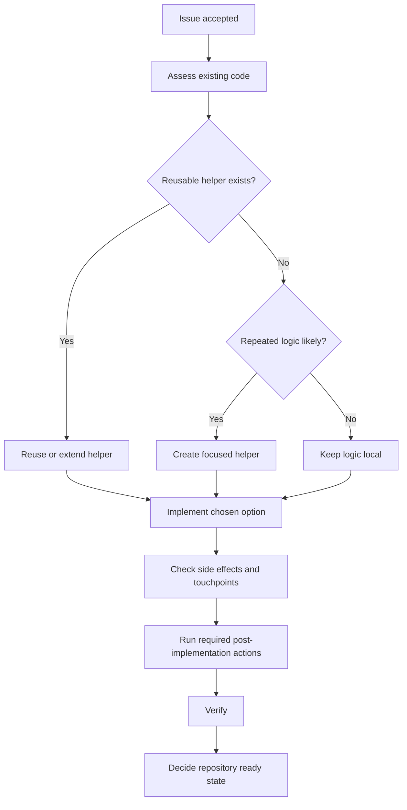
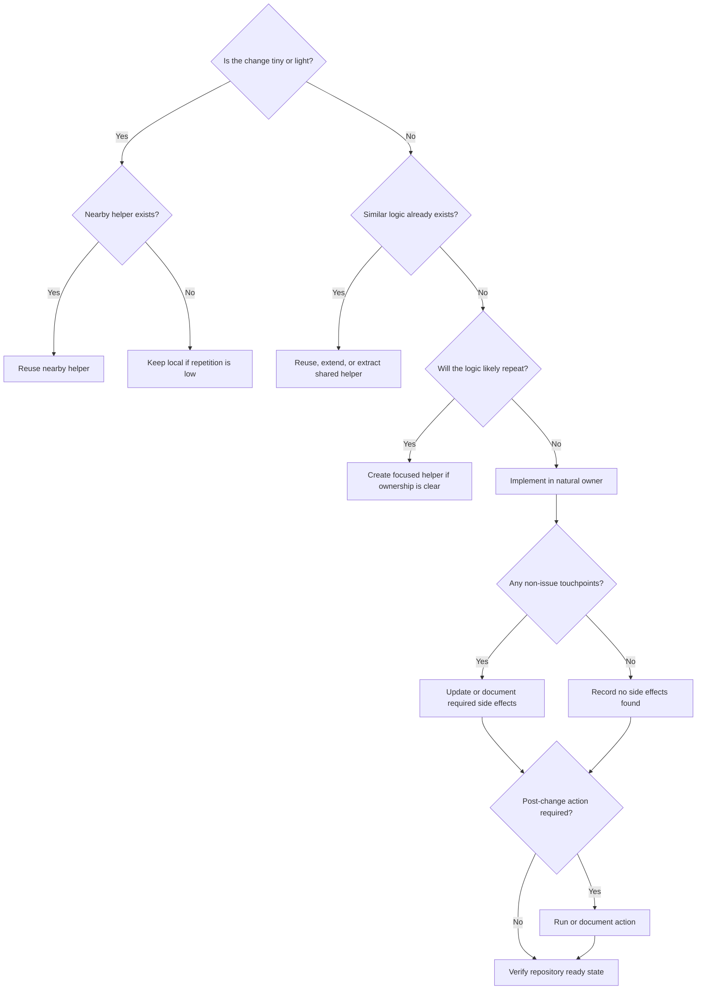

# Project Implementation Framework V0.8

Version: V0.8
Purpose: A readable Markdown framework for turning a defined issue into a fitting implementation decision inside an existing codebase.

Scope: Implementation planning, implementation decision-making, implementation side-effect control, and repository ready-state validation.

This framework guides coding agents and human implementers through:

1. Separate implementation decision documents.
2. Codebase assessment.
3. Existing function, helper, support utility, fixture, and reuse checks.
4. Repetition and duplicate-logic checks.
5. Workflow and logic-tree modeling when useful.
6. Multiple neutral implementation options.
7. Neutral implementation fit assessment.
8. Recommendation of one implementation path.
9. Implementation planning and verification planning.
10. Side-effect, touchpoint, and follow-up update checks outside the issue itself.
11. Repository ready-state reasoning for test, prerelease, or release-candidate branch movement.

The issue framework answers:

```text
What should be solved, why does it matter, and which issue option is recommended?
```

This implementation framework answers:

```text
How should the chosen issue be implemented in this codebase, which implementation path fits best, what else must be updated because of the change, and when is the repository ready to move toward test or prerelease?
```

The goal is not only:

```text
Does the change work?
```

The better question is:

```text
Does the change work, belong, reuse what exists, avoid repetition, handle its side effects, and leave the repository in a ready state?
```

A good implementation works.
A better implementation belongs.
A complete implementation also accounts for its side effects.
A release-aware implementation explains why the repository is ready after the issue is implemented and verified.

---

# 0. Required Output Artifact

This framework is not only advisory guidance.

When an agent or implementer is asked to use this framework, the expected result is a filled-out Markdown implementation decision document.

Do not append implementation planning to the existing issue Markdown.
Do not rewrite or mutate the original issue document unless explicitly asked for issue-document maintenance.

The issue document remains the source issue.
The implementation document is the execution decision artifact.

---

## 0.1 Required Document File

Before implementation, create or return:

```text
implementation-<issue-slug>.md
```

Optional discovery or mapping work may use:

```text
implementation-discovery-<issue-slug>.md
```

Recommended naming examples:

```text
implementation-resolver-error-message-ownership.md
implementation-installer-removal-rules.md
implementation-discovery-package-resolution-flow.md
```

Use a stable, readable slug derived from the issue title.

Do not include timestamps in the filename unless the repository already uses timestamped decision records.

---

## 0.2 Required Artifact Behavior

The required artifact is:

```text
Filled-out Markdown Implementation Decision Document
```

Do not answer only with prose.
Do not answer only with a checklist.
Do not answer only with code.
Do not skip the document unless explicitly asked for a lighter response.

The document should preserve the headings, icons, ratings, option structure, recommendation line, decision fields, side-effect fields, and ready-state fields defined by this framework.

The document is the control surface for review.
The code change is the implementation result.
Both are useful, but they are not the same thing.

---

## 0.3 Linking Back to the Issue

Each implementation document should identify the source issue.

Use this lightweight metadata block near the top:

```markdown
Source Issue:
- Title: <issue title>
- Issue File: <relative path or identifier>
- Issue Recommendation: <chosen issue option, if known>
```

If no issue file exists, write:

```markdown
Source Issue:
- Title: <issue title>
- Issue File: Not available
- Issue Recommendation: Not available
```

Do not copy the full issue document into the implementation document.
Only restate the required outcome and relevant constraints.

---

## 0.4 Breaking Standalone Rule

This framework is standalone.

Do not reference earlier framework versions when using this document.
Do not instruct an agent to compare against an earlier version.
Do not require knowledge of earlier framework wording.

When this framework is used, the version to apply is:

```text
Project Implementation Framework V0.8
```

---

# 1. Overall Workflow

Use this framework as a full implementation decision workflow.

```text
1. Start with an actual issue.
2. Create a separate implementation document.
3. Read the issue outcome and constraints.
4. Assess the existing codebase.
5. Check existing functions, helpers, support utilities, fixtures, patterns, and tests.
6. Check whether a general-purpose function or shared helper would make sense.
7. Check for repetitive coding or duplicate logic risk.
8. Identify reuse, placement, growth, workflow, logic-tree, stakeholder technical requirements, and repository touchpoints.
9. Create neutral implementation options.
10. Assess the options neutrally.
11. Recommend one option.
12. Define the final placement decision.
13. Define the implementation plan.
14. Define the verification plan.
15. Define side effects, touchpoints, follow-up updates, and post-implementation actions.
16. Define repository ready-state reasoning.
17. Use the chosen implementation plan for the coding work.
```

The important sequence is:

```text
Assess before options.
Options before recommendation.
Recommendation before implementation.
Side effects before ready-state.
Ready-state before release movement.
Separate document throughout.
```

Do not jump directly from issue to code unless the change is tiny or light and the natural placement is obvious.

Even for tiny or light changes, do not skip side-effect thinking entirely.
A small issue may still require a README update, generated artifact refresh, migration note, changelog entry, build step, or test-data update.

---

# 2. Neutrality Rule

Options and assessments are neutral decision-support sections.

Options may compare facts.
Options may show tradeoffs.
Options may show ratings.
Options may show risks and later costs.
Options may show that one path has higher alignment, lower growth, lower risk, stronger reuse, or fewer side effects.

Options must not tell the reader which option to choose.

The Implementation Fit Assessment compares options.
The Implementation Recommendation chooses one option.

Do not write recommendation language inside:

* Implementation Statement
* Stakeholder Technical Requirements
* Codebase Assessment
* Reuse Map
* Shared Helper / Generalization Check
* Repetition Check
* Workflow / Logic Model
* Side Effects / Touchpoints / Follow-Up Updates
* Repository Ready-State Check
* Implementation Options
* Implementation Fit Assessment

Avoid phrases before Recommendation such as:

```text
Best option
Preferred option
Recommended path
Should choose
Clearly the right approach
Use this option
```

Allowed neutral phrases:

```text
Higher alignment
Lower growth impact
More local
More reusable
More expensive
More reversible
Higher release risk
Better supported by existing code
Leaves more work open
More touchpoints
Fewer downstream updates
Requires generated files to be refreshed
Requires release-note handling
```

The Recommendation section is the first place where preference is stated.

---

# 3. Visual Style

Use a small visual system.

```text
▰ filled meter segment
▱ empty meter segment
```

Examples:

```text
1/4 ▰▱▱▱
2/4 ▰▰▱▱
3/4 ▰▰▰▱
4/4 ▰▰▰▰
```

Semantic chips:

```text
🟢 Good / fitting / ready / favorable
🟡 Acceptable / partial / watch
🟠 Caution / debt / needs adjustment
🔴 Blocked / reject / high risk
🔵 Discovery / local / informational
🟣 Strategic / architectural / decision
⚪ Neutral / deferred
🧩 Split / extraction / structuring
🚀 Release / prerelease / ready-state
🧯 Side effect / touchpoint / follow-up
⚙️ Generated / build / post-change action
📚 Documentation / README / usage guidance
```

Section icons:

```text
📌 Implementation title
🏷 Rating
📝 Statement
📄 Artifact Rule
🧭 Codebase Assessment
🔎 Existing Code Found
♻️ Reuse Map
🧰 Shared Helper / Generalization Check
🔁 Repetition Check
🧬 Codebase Alignment
🗺 Workflow Model
🌳 Logic Tree
👥 Stakeholder Technical Lens
🧩 Implementation Options
💶 Implementation Fit Assessment
🏁 Implementation Recommendation
📍 Placement Decision
🌊 Churn
📏 Growth Impact
🔮 Future Impact
🧯 Side Effects / Touchpoints / Follow-Up Updates
📚 Documentation Touchpoints
⚙️ Post-Implementation Actions
🚀 Repository Ready State
🛠 Implementation Plan
🧪 Verification Plan
🤖 Agent Instructions
🌱 Extracted Work
```

---

# 4. Implementation Workflow States

Use these workflow states to show where the implementation decision currently is.

```text
🚧 Implementation Workflow State:
🔵 Assessment Needed
🧰 Helper / Reuse Check Needed
🧩 Options Needed
🟣 Recommendation Needed
🟢 Ready To Implement
🛠 Implementation In Progress
🧯 Side-Effect Check Needed
⚙️ Post-Implementation Action Needed
🚀 Ready-State Check Needed
🧹 Adjustment Needed
🏁 Implementation Decision Complete
🔴 Rework Required
```

Use 🔵 Assessment Needed when the issue is known but the codebase has not been inspected.

Use 🧰 Helper / Reuse Check Needed when the main uncertainty is whether existing helpers, general-purpose functions, or shared support utilities already solve part of the work.

Use 🧩 Options Needed when the codebase is understood enough to compare implementation paths.

Use 🟣 Recommendation Needed when options exist but no implementation path has been selected.

Use 🟢 Ready To Implement when one option is recommended and the implementation plan is clear.

Use 🛠 Implementation In Progress when the chosen option is being implemented.

Use 🧯 Side-Effect Check Needed when the issue implementation is understood but the possible non-issue touchpoints have not been reviewed.

Use ⚙️ Post-Implementation Action Needed when the code change requires a command, generator, build tool, migration, formatting step, fixture update, asset refresh, or other internal action before the repository can be considered ready.

Use 🚀 Ready-State Check Needed when implementation and verification information exists but the repository has not yet been judged ready for test, prerelease, or release-candidate movement.

Use 🧹 Adjustment Needed when the implementation decision document needs correction before coding.

Use 🏁 Implementation Decision Complete when the implementation decision is ready to guide coding and includes side-effect and ready-state handling.

Use 🔴 Rework Required when the implementation decision is not usable.

---

# 5. Implementation Rating

Use this rating block before implementation.

```markdown
- 🏷 Implementation Rating
  - 🚧 Workflow State: 🔵 Assessment Needed
  - 🌊 Churn: 2/4 Normal ▰▰▱▱
  - 🧭 Assessment Depth: 2/4 Focused Mapping ▰▰▱▱
  - ♻️ Reuse Need: 2/4 Explicit ▰▰▱▱
  - 🧰 Helper / Generalization Need: 2/4 Check Useful ▰▰▱▱
  - 🔁 Repetition Risk: 2/4 Watch ▰▰▱▱
  - 📍 Placement Risk: 2/4 Watch ▰▰▱▱
  - 🧬 Codebase Alignment: 0/4 Unknown ▱▱▱▱
  - 📏 Growth Pressure: 2/4 Noticeable ▰▰▱▱
  - 🧯 Side-Effect Scope: 2/4 Touchpoints Likely ▰▰▱▱
  - ⚙️ Post-Implementation Action Need: 1/4 Check ▰▱▱▱
  - 🚀 Ready-State Confidence: 0/4 Unknown ▱▱▱▱
  - 👥 Stakeholder Technical Lens: 🔧 Maintainer / 🧪 Test / 🚚 Release
  - 🧭 Diagram Need: 🗺 Workflow Useful
  - 🤖 Agent Suitability: 2/4 Guided ▰▰▱▱
  - 🚧 Implementation Readiness: 🟠 Needs Mapping
```

Do not add the numbers together.
They are classification signals, not a score.

---

# 6. Core Dimensions

## 6.1 🌊 Churn

Churn describes how much change pressure the implementation creates.

```text
🌊 Churn:
0/4 Tiny       ▱▱▱▱
1/4 Light      ▰▱▱▱
2/4 Normal     ▰▰▱▱
3/4 Structural ▰▰▰▱
4/4 Hard       ▰▰▰▰
```

Use 0/4 Tiny for a one-line or very small local edit.

Policy:

* Make the smallest local change.
* Do not create new files.
* Do not refactor.
* A full helper/generalization check is not required unless obvious repetition already exists.
* Still check whether a small non-code update is required.

Use 1/4 Light for a small local behavior change.

Policy:

* Prefer local change.
* Follow nearby patterns.
* Avoid new abstractions.
* Check nearby helpers and functions when practical.
* Check nearby docs, examples, tests, generated files, and local build steps when practical.

Use 2/4 Normal for an extension of an existing workflow, component, or behavior.

Policy:

* Search existing related code.
* Reuse existing structure.
* Check whether existing helpers or general-purpose functions apply.
* Compare at least one implementation path.
* Watch file and function growth.
* Check side effects, touchpoints, and post-implementation actions explicitly.

Use 3/4 Structural when the work changes ownership, responsibility, or boundaries.

Policy:

* Assess the codebase first.
* Create implementation options.
* Check shared helpers, support utilities, and repeated logic explicitly.
* Prefer focused extraction over broad redesign.
* Require human review.
* Require explicit side-effect and ready-state handling.

Use 4/4 Hard when the current structure cannot responsibly absorb the work.

Policy:

* Do not treat as a normal coding-agent task.
* Use discovery, decision, split, or design work first.
* Human-led implementation is expected.
* Do not claim repository ready state without reviewed implementation, verification, and release-readiness evidence.

---

## 6.2 🧭 Assessment Depth

Assessment Depth describes how much codebase assessment is needed before implementation options can be trusted.

```text
🧭 Assessment Depth:
0/4 None             ▱▱▱▱
1/4 Local Scan       ▰▱▱▱
2/4 Focused Mapping  ▰▰▱▱
3/4 Broad Mapping    ▰▰▰▱
4/4 Discovery First  ▰▰▰▰
```

Use 0/4 None when the change is tiny and the location is obvious.

Use 1/4 Local Scan when nearby files, tests, and patterns should be checked.

Use 2/4 Focused Mapping when one module, workflow, or subsystem must be understood.

Use 3/4 Broad Mapping when several modules, layers, or workflows may contain related behavior.

Use 4/4 Discovery First when implementation should not start until ownership, behavior, constraints, and likely side effects are mapped.

Assessment rule:

```text
No meaningful implementation option should be recommended before the relevant codebase has been assessed.
```

Exception:

```text
Tiny or light churn may use a short local scan instead of a full assessment.
```

---

## 6.3 ♻️ Reuse Need

Reuse Need describes how strongly the implementer must search for existing code before adding new code.

```text
♻️ Reuse Need:
0/4 Minimal          ▱▱▱▱
1/4 Nearby Pattern   ▰▱▱▱
2/4 Explicit         ▰▰▱▱
3/4 Broad Reuse Map  ▰▰▰▱
4/4 Reuse First      ▰▰▰▰
```

Use 0/4 Minimal when reuse is obvious or irrelevant.

Use 1/4 Nearby Pattern when the agent should check nearby files and tests.

Use 2/4 Explicit when the agent must search related helpers, services, tests, models, config, naming, and conventions.

Use 3/4 Broad Reuse Map when several modules may already contain related behavior.

Use 4/4 Reuse First when new code should not be written until reuse options have been explicitly ruled out.

Encouragement rule:

```text
The implementer is encouraged to find and reuse existing code.
For tiny or light churn, this can be a quick local check.
For normal, structural, or hard churn, the search should be explicit and reported.
```

---

## 6.4 🧰 Helper / Generalization Need

Helper / Generalization Need describes whether an existing function, support helper, utility, service, fixture, or general-purpose abstraction should be checked or created.

```text
🧰 Helper / Generalization Need:
0/4 Not Needed        ▱▱▱▱
1/4 Nearby Check      ▰▱▱▱
2/4 Check Useful      ▰▰▱▱
3/4 Strong Candidate  ▰▰▰▱
4/4 Required First    ▰▰▰▰
```

Use 0/4 Not Needed when the change is tiny, local, and not repetitive.

Use 1/4 Nearby Check when nearby functions or helpers should be checked before adding logic.

Use 2/4 Check Useful when a shared helper might already exist or might reduce duplication.

Use 3/4 Strong Candidate when repeated logic exists or the same logic will likely be needed in multiple places.

Use 4/4 Required First when implementing locally would clearly duplicate behavior, spread repeated logic, or create a second ownership model.

Helper / Generalization rule:

```text
Before adding repeated logic, check whether an existing function, helper, service, support utility, extension method, test fixture, or shared abstraction already fits.
```

Do not create a new general-purpose helper automatically.

A helper is justified when:

* The logic is repeated or likely to repeat.
* The helper names a real concept.
* The helper has a clear owner.
* The helper improves testing or readability.
* The helper fits existing project style.

A helper is not justified when:

* The change is tiny and one-off.
* The abstraction hides complexity without naming a real concept.
* The helper would have one trivial caller.
* The helper creates indirection that makes the code harder to read.
* Existing style intentionally keeps this logic local.

---

## 6.5 🔁 Repetition Risk

Repetition Risk describes whether the implementation may repeat the same logic again and again.

```text
🔁 Repetition Risk:
0/4 None       ▱▱▱▱
1/4 Low        ▰▱▱▱
2/4 Watch      ▰▰▱▱
3/4 High       ▰▰▰▱
4/4 Duplicated ▰▰▰▰
```

Use 0/4 None when there is no meaningful repetition.

Use 1/4 Low when repetition is unlikely or harmless.

Use 2/4 Watch when similar logic may already exist or may be introduced in more than one place.

Use 3/4 High when repeated conditions, mapping, formatting, validation, conversion, error handling, logging, or test setup are likely.

Use 4/4 Duplicated when the implementation would knowingly duplicate existing behavior.

Repetition check examples:

* Same validation rule in multiple places.
* Same mapping logic repeated in handlers.
* Same error-message formatting repeated in branches.
* Same parsing or normalization logic repeated in commands.
* Same test setup duplicated across test files.
* Same logging or diagnostic pattern manually rebuilt.
* Same compatibility check repeated instead of centralized.

Rule:

```text
If the same logic appears for the second time, watch it.
If it appears for the third time, strongly consider a named helper, shared function, fixture, or extracted owner.
```

Exception:

```text
For tiny or light churn, small local repetition may be acceptable when abstraction would cost more than it saves.
```

---

## 6.6 📍 Placement Risk

Placement Risk describes how likely code is to land in the wrong file, function, module, or layer.

```text
📍 Placement Risk:
1/4 Low       ▰▱▱▱
2/4 Watch     ▰▰▱▱
3/4 High      ▰▰▰▱
4/4 Critical  ▰▰▰▰
```

Use 1/4 Low when the natural location is obvious.

Use 2/4 Watch when several plausible locations exist.

Use 3/4 High when the change crosses modules, layers, or responsibilities.

Use 4/4 Critical when wrong placement creates long-term coupling, duplicated ownership, or architectural damage.

Placement principle:

```text
Nearest placement is not always native placement.
```

The implementation must answer:

```text
Why does this code belong here?
```

Not only:

```text
Why does this code work?
```

---

## 6.7 🧬 Codebase Alignment

Codebase Alignment describes how well an implementation path fits the current repository structure, ownership model, naming, conventions, helper patterns, tests, technical style, and required follow-up actions.

```text
🧬 Codebase Alignment:
0/4 Unknown      ▱▱▱▱
1/4 Conflicting  ▰▱▱▱
2/4 Tolerable    ▰▰▱▱
3/4 Compatible   ▰▰▰▱
4/4 Native       ▰▰▰▰
```

Use 0/4 Unknown when the codebase has not been assessed enough to judge alignment.

Use 1/4 Conflicting when the option fights the current architecture, creates a second ownership model, ignores existing helpers, duplicates conventions, skips required generated steps, or places behavior in the wrong layer.

Use 2/4 Tolerable when the option works and can be accepted, but feels somewhat bolted on, temporary, or not fully aligned with existing structure.

Use 3/4 Compatible when the option fits the current codebase and does not create meaningful friction for maintainers.

Use 4/4 Native when the option feels like it belongs in the repository: correct owner, correct style, correct helper usage, correct tests, correct placement, correct side-effect handling, and low surprise for future maintainers.

Alignment judgement questions:

* Would a future maintainer expect the code to be here?
* Does the option follow existing ownership boundaries?
* Does it reuse existing helpers, services, fixtures, and conventions?
* Does it avoid creating a parallel implementation style?
* Does it fit naming, logging, error handling, testing, and dependency patterns?
* Does it update the right documentation, examples, generated artifacts, or internal workflows when needed?
* Does it feel like part of the codebase rather than an agent patch?

Codebase Alignment is not the same as Future Impact, Growth Impact, or Ready-State Confidence.

```text
🧬 Codebase Alignment = Does this fit the current repository?
📏 Growth Impact = Does this make files, functions, or classes larger or worse?
🔮 Future Impact = What does this do to future work?
🚀 Ready-State Confidence = Can the repo responsibly move toward test or prerelease after this issue is implemented and verified?
```

---

## 6.8 📏 Growth Pressure / Growth Impact

Growth Pressure describes expected risk before implementation.
Growth Impact describes actual or option-level effect on file, function, class, or module size and responsibility.

```text
📏 Growth Impact:
0/4 None        ▱▱▱▱
1/4 Small       ▰▱▱▱
2/4 Noticeable  ▰▰▱▱
3/4 Heavy       ▰▰▰▱
4/4 Harmful     ▰▰▰▰
```

Use 0/4 None when code size and responsibility do not materially grow.

Use 1/4 Small when growth is harmless.

Use 2/4 Noticeable when growth is visible but still coherent.

Use 3/4 Heavy when readability, ownership, or testing starts to suffer.

Use 4/4 Harmful when the result would turn a file or function into a dumping ground.

Growth warnings:

* A file grows by more than about 15–20%.
* A file exceeds about 400–600 lines and is not naturally repetitive.
* A function exceeds about 40–80 lines.
* Nesting becomes hard to follow.
* A class gains another unrelated responsibility.
* Validation, orchestration, mapping, IO, logging, and business logic are mixed together.

These are warnings, not automatic failures.

Tiny or light churn may ignore small growth.
Normal or structural churn should not ignore growth pressure casually.

---

## 6.9 🔮 Future Impact

Future Impact describes what an implementation path does to future work.

```text
🔮 Future Impact:
🟢 -2 Simplifies
🟢 -1 Improves
⚪  0 Neutral
🟠 +1 Adds Debt
🔴 +2 Rewrite Risk
```

Use 🟢 -2 Simplifies when the option strongly reduces future complexity, coupling, duplicate logic, migration cost, or release friction.

Use 🟢 -1 Improves when the option slightly improves future work.

Use ⚪ 0 Neutral when the option does not meaningfully affect future work.

Use 🟠 +1 Adds Debt when the option is acceptable but leaves cleanup, inconsistency, missing documentation, skipped generated updates, or known later cost.

Use 🔴 +2 Rewrite Risk when the option is likely to cause rework, migration pain, incompatible design, release friction, or throwaway implementation.

Future Impact should be described factually before Recommendation.

Good neutral phrasing:

```text
This option simplifies future validation changes by creating one owner for the rule.
```

Bad pre-recommendation phrasing:

```text
This is the best option because it simplifies future validation changes.
```

---

## 6.10 🧯 Side-Effect Scope

Side-Effect Scope describes how many non-issue touchpoints may need attention because the implementation changes the repository.

This section is about the possible side effects of the issue, not the issue itself.

```text
🧯 Side-Effect Scope:
0/4 None                 ▱▱▱▱
1/4 Local Touchpoint      ▰▱▱▱
2/4 Touchpoints Likely    ▰▰▱▱
3/4 Cross-Cutting         ▰▰▰▱
4/4 Release-Sensitive     ▰▰▰▰
```

Use 0/4 None when the implementation is fully local and does not affect docs, tests, generated files, commands, workflows, packaging, migration, examples, release notes, or internal actions.

Use 1/4 Local Touchpoint when one nearby doc, test, example, config, or command may need update.

Use 2/4 Touchpoints Likely when README, docs, examples, tests, changelog, generated files, build output, fixtures, configuration, or internal actions should be checked.

Use 3/4 Cross-Cutting when several parts of the repository or workflow may need coordinated updates.

Use 4/4 Release-Sensitive when the side effects affect release notes, migrations, public contracts, deployment, packaging, generated outputs, compatibility, or prerelease readiness.

Side-effect examples:

* README or usage documentation.
* Developer guide or internal documentation.
* Changelog or release notes.
* Generated clients, schemas, lockfiles, snapshots, assets, or manifests.
* Test fixtures, golden files, snapshots, seed data, or baselines.
* Build scripts, packaging scripts, install scripts, task runners, or local tooling.
* CI configuration or verification matrix.
* Migration files, compatibility adapters, or version metadata.
* Local commands that must be run after code changes.
* Documentation comments, examples, or API usage snippets.
* Internal support, troubleshooting, or operations notes.

Rule:

```text
Side-effect review is not a second implementation issue.
It is a readiness check for what else must be updated because this issue changed the repository.
```

---

## 6.11 ⚙️ Post-Implementation Action Need

Post-Implementation Action Need describes whether something must be run or performed after the code change for the repository to be usable.

```text
⚙️ Post-Implementation Action Need:
0/4 None       ▱▱▱▱
1/4 Check      ▰▱▱▱
2/4 Required   ▰▰▱▱
3/4 Sequenced  ▰▰▰▱
4/4 Blocking   ▰▰▰▰
```

Use 0/4 None when no follow-up command or internal action is needed.

Use 1/4 Check when nearby commands, generated files, formatters, tests, or tool outputs should be inspected.

Use 2/4 Required when a command, generator, formatter, migration, snapshot update, build tool, or fixture update must be performed.

Use 3/4 Sequenced when the post-change actions must happen in a specific order.

Use 4/4 Blocking when the repository cannot work correctly until a post-implementation action is completed.

Examples:

```text
Run formatter
Run code generator
Regenerate schema
Update snapshots
Run migration script
Refresh lockfile
Update package metadata
Run build tool
Run test fixture generator
Update generated documentation
Refresh CLI help output
Rebuild assets
Update internal registry
```

Post-implementation action rule:

```text
If the repository requires a generated, built, migrated, formatted, or registered artifact after the code change, the implementation is not complete until that action is performed or explicitly deferred with a reason.
```

---

## 6.12 🚀 Ready-State Confidence

Ready-State Confidence describes whether the repository is ready to move toward test, prerelease, release-candidate, or equivalent branch state after the issue is implemented.

```text
🚀 Ready-State Confidence:
0/4 Unknown              ▱▱▱▱
1/4 Low                  ▰▱▱▱
2/4 Conditional          ▰▰▱▱
3/4 Ready for Test       ▰▰▰▱
4/4 Ready for Prerelease ▰▰▰▰
```

Use 0/4 Unknown when implementation, verification, or side-effect status is not yet known.

Use 1/4 Low when important checks are missing or likely incomplete.

Use 2/4 Conditional when the repository can become ready after named checks or post-implementation actions are completed.

Use 3/4 Ready for Test when the implementation is complete enough for a test branch, QA branch, or integration test pass.

Use 4/4 Ready for Prerelease when the implementation is complete, verified, side effects are handled, post-implementation actions are complete, and no known release-blocking work remains for this issue.

Ready-state rule:

```text
An issue being implemented is not enough by itself.
Repository ready state is achieved when implementation, verification, required touchpoint updates, and required post-implementation actions are complete or intentionally documented as not needed.
```

Required ready-state statement:

```text
The implementation document must explain why completing this issue leaves the repository ready for test, prerelease, or release-candidate movement, or must state what prevents that state.
```

---

## 6.13 🧭 Diagram Need

Diagram Need describes whether an implementation option should include a Mermaid workflow, a Mermaid logic tree, both, or neither.

```text
🧭 Diagram Need:
⚪ Not Needed
🗺 Workflow Useful
🌳 Logic Tree Useful
🧩 Workflow + Logic Tree Useful
🔴 Required Before Implementation
```

Use ⚪ Not Needed when the option is simple, local, and understandable from prose.

Use 🗺 Workflow Useful when the option changes or depends on a sequence of steps, data flow, command flow, request flow, build flow, deployment flow, post-implementation action flow, or processing pipeline.

Use 🌳 Logic Tree Useful when the option depends on branching rules, conditions, selection logic, fallback behavior, error handling, policy decisions, compatibility rules, side-effect decisions, or if/else-heavy behavior.

Use 🧩 Workflow + Logic Tree Useful when both are relevant: the option has an important process flow and important branching rules inside that flow.

Use 🔴 Required Before Implementation when the workflow or decision logic is too unclear to implement safely without a diagram first.

Practical rule:

```text
Use a workflow diagram when order matters.
Use a logic tree when decisions matter.
Use both when order and decisions both matter.
```

---

## 6.14 🗺 Workflow Clarity

Workflow Clarity describes whether the process or sequence of the implementation option is understandable.

```text
🗺 Workflow Clarity:
0/4 Not Applicable ▱▱▱▱
1/4 Unclear        ▰▱▱▱
2/4 Understandable ▰▰▱▱
3/4 Clear          ▰▰▰▱
4/4 Diagram-Clear  ▰▰▰▰
```

Use 0/4 Not Applicable when the option does not involve meaningful workflow, sequence, data flow, or process flow.

Use 1/4 Unclear when the order of operations, ownership handoff, data movement, execution path, or post-implementation action order is difficult to understand.

Use 2/4 Understandable when prose is enough, but a reader must still think carefully.

Use 3/4 Clear when the workflow is easy to understand from the option text.

Use 4/4 Diagram-Clear when the workflow is represented with a Mermaid diagram and the process is easy to follow.

Workflow clarity applies to:

* Request flow.
* Command flow.
* Resolver flow.
* Build or deployment flow.
* Validation flow.
* Event flow.
* Data transformation flow.
* Error handling flow.
* Migration flow.
* Test setup flow.
* Generated artifact flow.
* Post-implementation action flow.
* Release-readiness flow.

When Workflow Clarity is 1/4 Unclear for normal, structural, or hard churn, add a Mermaid workflow before implementation.

---

## 6.15 🌳 Logic Tree Clarity

Logic Tree Clarity describes whether branching, conditional behavior, selection rules, and fallback logic are understandable.

```text
🌳 Logic Tree Clarity:
0/4 Not Applicable ▱▱▱▱
1/4 Unclear        ▰▱▱▱
2/4 Understandable ▰▰▱▱
3/4 Clear          ▰▰▰▱
4/4 Tree-Clear     ▰▰▰▰
```

Use 0/4 Not Applicable when the option has no meaningful branching or decision logic.

Use 1/4 Unclear when conditions, branches, fallbacks, policy choices, side-effect handling, ready-state checks, or error cases are hard to reason about.

Use 2/4 Understandable when prose is enough, but the rules require careful reading.

Use 3/4 Clear when the decision logic is obvious from the option text.

Use 4/4 Tree-Clear when the logic is represented with a Mermaid logic tree and the decision path is easy to follow.

Logic tree clarity applies to:

* If/else behavior.
* Strategy selection.
* Feature flag behavior.
* Compatibility rules.
* Fallback behavior.
* Validation rules.
* Error classification.
* Retry or recovery decisions.
* Security or permission gates.
* Migration decision paths.
* “Use existing helper vs create new helper vs keep local” decisions.
* “Update docs vs not needed” decisions.
* “Run generator vs not needed” decisions.
* “Ready for test vs prerelease vs blocked” decisions.

When Logic Tree Clarity is 1/4 Unclear for normal, structural, or hard churn, add a Mermaid logic tree before implementation.

---

## 6.16 👥 Stakeholder Technical Lens

Stakeholder Technical Lens describes which technical stakeholders or code-related concerns are affected.

This is not a business stakeholder list.
It is a technical requirement lens.

```text
👥 Stakeholder Technical Lens:
🔧 Maintainer
🧑‍💻 Developer Experience
🧪 Test / QA
🛟 Support / Diagnostics
📡 Operations / Observability
🚚 Release / Rollout
🔁 Compatibility / Migration
🛡 Security / Trust
⚡ Performance / Cost
👥 User-Facing Behavior
📚 Documentation / Usage
⚙️ Tooling / Generated Artifacts
```

Use 🔧 Maintainer when structure, readability, ownership, or future change cost matters.

Use 🧑‍💻 Developer Experience when commands, local workflow, APIs, examples, errors, or documentation affect developers.

Use 🧪 Test / QA when testability, fixtures, regression coverage, or verification workflow matters.

Use 🛟 Support / Diagnostics when logs, error messages, troubleshooting, or escalation reduction matters.

Use 📡 Operations / Observability when runtime behavior, monitoring, recovery, deployment, or incidents matter.

Use 🚚 Release / Rollout when rollout safety, packaging, flags, rollback, prerelease branch readiness, or release timing matters.

Use 🔁 Compatibility / Migration when public contracts, schemas, persisted data, imports, exports, or versioning matter.

Use 🛡 Security / Trust when permissions, integrity, auditability, policy, secrets, or safe adoption matter.

Use ⚡ Performance / Cost when latency, memory, throughput, startup time, storage, or recurring cost matters.

Use 👥 User-Facing Behavior when visible behavior, workflow, or product expectations change.

Use 📚 Documentation / Usage when README, docs, examples, CLI help, API docs, usage snippets, or internal guides must stay consistent with the implementation.

Use ⚙️ Tooling / Generated Artifacts when build tools, generators, snapshots, lockfiles, generated code, package metadata, or internal registries may need an action after the code change.

Most implementation documents should name one to four lenses.
Do not list every lens unless all are genuinely affected.

---

## 6.17 🤖 Agent Suitability

Agent Suitability describes how safely a coding agent can perform the work.

```text
🤖 Agent Suitability:
1/4 Routine    ▰▱▱▱
2/4 Guided     ▰▰▱▱
3/4 Strong     ▰▰▰▱
4/4 Human-Led  ▰▰▰▰
```

Use 1/4 Routine for clear, local, low-risk edits.

Use 2/4 Guided when the agent can implement with precise instructions and review.

Use 3/4 Strong when the work needs deeper repository understanding and careful review.

Use 4/4 Human-Led when architecture, security, migration, public contracts, release readiness, or long-term direction are involved.

---

## 6.18 🚧 Implementation Readiness

Implementation Readiness describes whether coding can start responsibly.

```text
🚧 Implementation Readiness:
🟢 Ready
🟠 Needs Mapping
🧰 Needs Helper / Reuse Check
🧩 Needs Options
🟣 Needs Decision
🧯 Needs Side-Effect Check
⚙️ Needs Post-Implementation Action Definition
🚀 Needs Ready-State Definition
🔴 Blocked
```

Use 🟢 Ready when scope, placement, option choice, constraints, and required side-effect checks are clear enough.

Use 🟠 Needs Mapping when the repository must be inspected first.

Use 🧰 Needs Helper / Reuse Check when the main missing work is checking existing functions, helpers, support utilities, or duplicate logic.

Use 🧩 Needs Options when multiple implementation paths must be compared.

Use 🟣 Needs Decision when a design, scope, product, security, release, or compatibility decision is needed.

Use 🧯 Needs Side-Effect Check when implementation is clear but non-issue touchpoints have not been assessed.

Use ⚙️ Needs Post-Implementation Action Definition when required build, generation, formatting, migration, fixture, or internal action steps are unknown.

Use 🚀 Needs Ready-State Definition when the document does not yet explain whether the repository can move to test, prerelease, or release-candidate branch state after this issue.

Use 🔴 Blocked when implementation cannot proceed because of an external dependency or missing fact.

---

# 7. Codebase Assessment

Codebase Assessment happens before implementation options are recommended.

It answers:

```text
What already exists, what should be reused, where does this change belong, what repeated logic exists, what constraints does the codebase impose, and what side effects may result from the implementation?
```

Use this section for normal, structural, hard, or uncertain implementation work.

For tiny or light churn, a short local assessment is enough.

---

## 7.1 Codebase Assessment Format

```markdown
### 🧭 Codebase Assessment

Assessment Depth:
- <None / Local Scan / Focused Mapping / Broad Mapping / Discovery First>

Areas Inspected:
- <Files, folders, modules, tests, docs, configs, schemas, commands, workflows, or services inspected.>

Ownership Signals:
- <Which file, module, class, service, or layer appears to own the behavior?>

Existing Patterns:
- <Relevant naming, logging, error handling, dependency, validation, testing, placement, documentation, or generated-artifact patterns.>

Reusable Assets:
- <Helpers, services, fixtures, types, config, tests, docs, examples, or support utilities that can be reused.>

Existing Functions / Helpers Checked:
- <Functions, helpers, support utilities, extension methods, base classes, test fixtures, or shared services checked.>

General-Purpose Candidate:
- <Whether a general-purpose function, helper, or extracted owner would make sense.>

Repetition Signals:
- <Repeated validation, mapping, formatting, conversion, parsing, logging, diagnostics, setup, or branching found.>

Workflow Signals:
- <Sequence, handoff, data flow, or process flow that may need a workflow diagram.>

Logic Signals:
- <Branching, fallback, policy, or decision logic that may need a logic tree.>

Side-Effect Signals:
- <README, docs, changelog, examples, generated artifacts, build tools, snapshots, fixtures, config, migration, release notes, or internal actions that may be touched by the implementation.>

Alignment Signals:
- <Signals that show whether the implementation would fit or conflict with the current codebase.>

Constraints Found:
- <Architecture, compatibility, migration, release, security, performance, operational, tooling, generated-artifact, or test constraints.>

Debt / Risk Signals:
- <Large files, duplicated logic, unclear ownership, fragile tests, missing coverage, coupling, stale docs, missing generated updates, or confusing structure.>

Unknowns:
- <Facts still missing.>

Assessment Judgement:
<Neutral explanation of what the codebase suggests. Do not recommend an option here.>
```

---

## 7.2 Assessment Rules

If Assessment Depth is 0/4 None:

* Only acceptable for tiny, obvious changes.
* Side-effect scope should still be marked as None or Local Touchpoint.

If Assessment Depth is 1/4 Local Scan:

* Nearby files and tests should be checked.
* Nearby helpers and functions should be checked when practical.
* Nearby docs, examples, generated files, or command outputs should be checked when practical.

If Assessment Depth is 2/4 Focused Mapping:

* The relevant module or workflow should be inspected.
* Existing functions, helpers, support utilities, and tests should be checked.
* Related documentation, config, generated artifacts, and build or tooling steps should be checked.

If Assessment Depth is 3/4 Broad Mapping:

* Multiple modules or layers should be inspected before choosing an option.
* Repetition and shared-helper opportunities should be explicitly assessed.
* Workflow and logic-tree needs should be assessed.
* Cross-cutting side effects and release-readiness touchpoints should be explicitly assessed.

If Assessment Depth is 4/4 Discovery First:

* Do not implement yet.
* Produce a discovery result or mapping document first.
* Create or recommend a Discovery Implementation Option.
* Include known side-effect and ready-state unknowns.

---

# 8. Reuse, Helper, and Repetition Checks

This section is mandatory for normal, structural, hard, or uncertain implementation work.

It may be shortened for tiny or light churn.

---

## 8.1 Reuse Map

```markdown
### ♻️ Reuse Map

Reuse Directly:
- <Existing code, helper, service, model, fixture, test, config, docs, example, or convention to use as-is.>

Extend:
- <Existing code that can be extended safely.>

Compose:
- <Existing pieces that can be composed instead of writing new logic.>

Avoid Duplicating:
- <Existing behavior, helper, service, type, config, test utility, docs pattern, generated process, or tooling step that must not be reimplemented.>

Not Suitable:
- <Existing code that looks relevant but should not be reused.>
  Reason: <Why it does not fit.>

Reuse Judgement:
<Neutral explanation of reuse options. Do not recommend an option here.>
```

---

## 8.2 Shared Helper / Generalization Check

```markdown
### 🧰 Shared Helper / Generalization Check

Existing Functions Checked:
- <Function or helper checked.>
  Result: <Reuse / Extend / Not suitable / Unclear.>

Support Helpers Checked:
- <Support utility, fixture, extension, base class, service, or shared module checked.>
  Result: <Reuse / Extend / Not suitable / Unclear.>

General-Purpose Function Candidate:
- <Yes / No / Maybe>

Candidate Responsibility:
- <If yes or maybe, what concept would the function/helper own?>

Candidate Location:
- <Where the helper would naturally belong.>

Why Generalize:
- <Why shared logic would improve reuse, readability, testing, support, or future changes.>

Why Keep Local:
- <Why local implementation is better, especially for tiny or light churn.>

Decision:
- <Reuse existing / Extend existing / Create focused helper / Keep local / Discovery needed>

Neutrality Note:
- <State the helper tradeoff without recommending an option.>
```

---

## 8.3 Repetition Check

```markdown
### 🔁 Repetition Check

Repeated Logic Found:
- <Validation, mapping, formatting, conversion, parsing, logging, diagnostics, setup, branching, docs snippets, generated update patterns, or other repeated logic.>

Potential Duplicate Implementation:
- <Logic that the planned change may duplicate.>

Second-Time / Third-Time Rule:
- <Is this the first, second, or third occurrence of similar logic?>

Recommended Handling:
- <Keep local / Reuse existing / Extract helper / Create fixture / Defer cleanup / Discovery needed>

Reason:
<Explain why repetition is acceptable or should be reduced without choosing an implementation option yet.>
```

---

# 9. Workflow and Logic Modeling

Use workflow and logic modeling when it makes implementation options easier to judge.

Workflow diagrams and logic trees are not decoration.
They clarify implementation risk, sequence, branching, ownership, side effects, readiness, or conditions.

---

## 9.1 Mermaid Workflow Format

Use a Mermaid workflow when order, flow, or handoff matters.

````markdown
Workflow:


````

Use workflow diagrams sparingly.
They should clarify execution order, not decorate the option.

---

## 9.2 Mermaid Logic Tree Format

Use a Mermaid logic tree when decision conditions matter.

````markdown
Logic Tree:


````

Use logic trees for branching rules, fallback behavior, helper decisions, compatibility paths, side-effect checks, ready-state decisions, or policy-like logic.

---

## 9.3 Diagram Rules

If Diagram Need is ⚪ Not Needed:

* Do not add Mermaid just for decoration.

If Diagram Need is 🗺 Workflow Useful:

* Add a Mermaid workflow unless the prose is already very clear and the churn is tiny or light.

If Diagram Need is 🌳 Logic Tree Useful:

* Add a Mermaid logic tree unless the decision logic is trivial.

If Diagram Need is 🧩 Workflow + Logic Tree Useful:

* Add both, but keep each diagram small.
* The workflow should show order.
* The logic tree should show decisions.

If Diagram Need is 🔴 Required Before Implementation:

* Do not implement before the diagram or logic tree is written and reviewed.

If Workflow Clarity is 1/4 Unclear:

* Add or improve the workflow diagram before implementation.

If Logic Tree Clarity is 1/4 Unclear:

* Add or improve the logic tree before implementation.

If both Workflow Clarity and Logic Tree Clarity are low:

* The option is not ready for implementation.
* Use a Discovery Option or Decision Option first.

---

# 10. Side Effects, Touchpoints, and Post-Implementation Actions

This section is mandatory for all normal, structural, hard, or uncertain implementation work.
For tiny or light churn, this section may be short, but it should not be ignored.

This section is about the possible side effects of the issue.
It is not about the issue itself.

The purpose is to ask:

```text
After the issue is implemented, what else may need to be updated so the repository is actually coherent and usable?
```

---

## 10.1 Side-Effect Requirement

Every implementation decision document must include a side-effect section.

The section must explicitly identify whether the implementation affects:

* README files.
* User-facing documentation.
* Developer documentation.
* Internal documentation.
* API examples or usage snippets.
* CLI help text.
* Changelog or release notes.
* Test fixtures, snapshots, baselines, seed data, or golden files.
* Generated files or schemas.
* Build tools or task runners.
* Package metadata, manifests, lockfiles, or install scripts.
* CI configuration.
* Migration files or compatibility notes.
* Local setup instructions.
* Support, troubleshooting, diagnostics, or operations notes.
* Internal actions required after the code change.

If none are affected, state that explicitly.

---

## 10.2 Side-Effect Section Format

```markdown
### 🧯 Side Effects, Touchpoints, and Follow-Up Updates

Purpose:
This section is about possible side effects of the implementation, not about the issue itself.

Side-Effect Scope:
- <None / Local Touchpoint / Touchpoints Likely / Cross-Cutting / Release-Sensitive>

Documentation Touchpoints:
- README: <Update needed / Not needed / Unknown>
- User Docs: <Update needed / Not needed / Unknown>
- Developer Docs: <Update needed / Not needed / Unknown>
- Internal Docs: <Update needed / Not needed / Unknown>
- API / CLI Examples: <Update needed / Not needed / Unknown>
- Changelog / Release Notes: <Update needed / Not needed / Unknown>

Repository Touchpoints:
- Tests / Fixtures / Snapshots: <Update needed / Not needed / Unknown>
- Generated Files / Schemas: <Update needed / Not needed / Unknown>
- Build Tools / Task Runners: <Update needed / Not needed / Unknown>
- Package Metadata / Manifests / Lockfiles: <Update needed / Not needed / Unknown>
- CI / Workflow Configuration: <Update needed / Not needed / Unknown>
- Migration / Compatibility Notes: <Update needed / Not needed / Unknown>

Internal Post-Implementation Actions:
- <Command, build tool, generator, formatter, migration, fixture update, registry update, or manual action that must happen after the code change.>
- <Write "None identified" if no action is needed.>

Side-Effect Notes:
- <Explain why these touchpoints are or are not affected.>

Required Follow-Up Updates:
- <Concrete non-issue update required before the repository is ready.>
- <Write "None" if no follow-up update is required.>

Deferred Follow-Up Updates:
- <Update intentionally deferred.>
  Reason: <Why deferral is acceptable.>

Side-Effect Readiness:
- <Ready / Ready after named updates / Blocked / Unknown>
```

---

## 10.3 Side-Effect Rules

A side effect is not a new implementation option by itself.

A side effect may become part of an implementation option when it is required for the option to be complete.

Examples:

```text
If an API signature changes, the implementation option should include updating docs and examples.
If a schema changes, the implementation option should include regenerating schema artifacts.
If a CLI message changes, the implementation option should include updating snapshots or help text.
If installer behavior changes, the implementation option should include packaging or uninstall documentation checks.
```

Do not treat docs, generated files, or build actions as optional when they are required for repository coherence.

Do not mark repository ready state as ready when required side effects are unknown.

---

# 11. Implementation Options

Implementation Options describe possible ways to implement the issue inside the existing codebase.

Options are not fragments.
Each option must be independently selectable.
Each option must be neutral.

Bad option structure:

```text
Option A — Add helper
Option B — Add tests
Option C — Update docs
```

This is fragmented because the final recommendation becomes:

```text
A + B + C
```

Good option structure:

```text
Option A — Extend existing validator, update docs, and add local tests
Option B — Extract shared validation rule before adding behavior and refresh generated schema
Option C — Map validation ownership before implementation
```

Each option is a coherent implementation path.

If documentation updates, generated files, migrations, or build-tool actions are required to make the implementation complete, they belong inside the coherent option.

---

## 11.1 Implementation Option Kinds

Use one of these option kinds in the option heading.

```text
Implementation Option Kinds:
Direct Implementation Option
Reuse / Extension Option
Helper / Generalization Option
Extraction Option
Refactor-Then-Implement Option
Adapter / Compatibility Option
Side-Effect Completion Option
Release-Readiness Option
Discovery Option
Decision Option
Split Option
Defer Option
Reject Option
```

### Direct Implementation Option

Use when the change can be made directly in the existing natural location.

Typical use:

* Tiny or light churn.
* Low placement risk.
* Low growth pressure.
* No meaningful repetition risk.
* No meaningful side-effect scope or only a small local touchpoint.

### Reuse / Extension Option

Use when existing code can absorb the behavior through extension or composition.

Typical use:

* Existing helper, service, type, pattern, fixture, or config exists.
* Reuse is clearly valuable.

### Helper / Generalization Option

Use when a general-purpose function, helper, support utility, fixture, or shared owner should be introduced or extended.

Typical use:

* Repeated logic exists.
* Same logic will likely be needed again.
* A helper names a real concept.
* Existing local logic should become a reusable unit.
* Tests become clearer through a focused helper.

This option must explain why a helper is different from keeping the logic local.

### Extraction Option

Use when code should be extracted into a focused unit before or during implementation.

Typical use:

* Existing file or function would become too large.
* Logic is shared.
* Testing becomes easier with extraction.
* Responsibility needs a clearer owner.

### Refactor-Then-Implement Option

Use when the existing structure must be cleaned or reshaped before the new behavior can be safely added.

Typical use:

* Existing code is too tangled to extend safely.
* Tests are hard to write without structure change.
* New behavior would worsen debt if appended directly.

### Adapter / Compatibility Option

Use when the implementation must preserve existing contracts while adding or changing behavior.

Typical use:

* Public API.
* CLI output.
* Schema.
* Migration.
* Plugin behavior.
* Backward compatibility.
* Release safety.

### Side-Effect Completion Option

Use when the implementation itself is small or already clear, but repository coherence depends mainly on completing the surrounding touchpoints.

Typical use:

* README, docs, examples, generated files, snapshots, changelog, build scripts, package metadata, or internal actions are the main remaining work.
* The issue behavior is implemented or straightforward, but the repository is not ready until side effects are handled.

### Release-Readiness Option

Use when the implementation path must explicitly prepare the repository for test, prerelease, release-candidate, or rollout movement.

Typical use:

* The change is release-sensitive.
* Verification, side effects, and post-implementation actions must be completed in a known sequence.
* The result must justify a ready-state statement.

### Discovery Option

Use when implementation should not start until facts are gathered.

Typical use:

* Code ownership unclear.
* Reuse opportunities unknown.
* Existing helpers unknown.
* Behavior not mapped.
* Side effects unknown.
* Tests or downstream dependencies unknown.

### Decision Option

Use when a technical or product decision must be made before implementation.

Typical use:

* Public behavior choice.
* Compatibility policy.
* Security boundary.
* Release path.
* Performance tradeoff.
* Scope boundary.

### Split Option

Use when the issue is too bundled and should become smaller implementation issues.

Typical use:

* Several owners.
* Several acceptance conditions.
* Mixed technical lenses.
* Feature work mixed with cleanup.
* Implementation work mixed with broad documentation, migration, or release tasks that need separate tracking.

### Defer Option

Use when implementation should intentionally wait.

Typical use:

* Low value now.
* Dependency pending.
* Better future timing.
* Risk not worth current effort.

### Reject Option

Use when the implementation should not be pursued.

Typical use:

* Issue is invalid.
* Existing behavior is intentional.
* Cost exceeds value.
* Proposed change conflicts with architecture or policy.

---

## 11.2 Implementation Option Key Fit Set

Every substantial implementation option should include this fit set:

```text
🧬 Codebase Alignment
📏 Growth Impact
🔮 Future Impact
🧯 Side-Effect Scope
⚙️ Post-Implementation Action Need
🚀 Ready-State Confidence
```

These fields are intentionally separate.

```text
🧬 Codebase Alignment = Does this fit the current repository?
📏 Growth Impact = Does this make files, functions, or classes larger or worse?
🔮 Future Impact = What does this do to future work?
🧯 Side-Effect Scope = What else may need to be updated because of the implementation?
⚙️ Post-Implementation Action Need = What must be run or performed after the code change?
🚀 Ready-State Confidence = Can the repository move toward test or prerelease after completion?
```

Example:

```text
🧬 Codebase Alignment: 4/4 Native ▰▰▰▰
📏 Growth Impact: 2/4 Noticeable ▰▰▱▱
🔮 Future Impact: 🟢 -1 Improves
🧯 Side-Effect Scope: 2/4 Touchpoints Likely ▰▰▱▱
⚙️ Post-Implementation Action Need: 2/4 Required ▰▰▱▱
🚀 Ready-State Confidence: 3/4 Ready for Test ▰▰▰▱
```

Meaning:

* The option fits the repository well.
* It grows code visibly but not harmfully.
* It improves future work.
* It likely requires non-code touchpoint updates.
* It requires at least one post-change action.
* It can become ready for test once implementation, updates, and verification are complete.

This fit set is evidence for the later recommendation.
It does not automatically determine the recommendation.

---

## 11.3 Implementation Option Profile

Each implementation option should include this profile.

```markdown
- 🧾 Implementation Option Profile
  - 🧭 Resolution: <resolution>
  - 🛠 Option Effort: <effort>
  - 🧠 Option Complexity: <complexity>
  - ♻️ Reuse Fit: <reuse fit>
  - 🧰 Helper Fit: <helper fit>
  - 🔁 Repetition Control: <repetition control>
  - 🧬 Codebase Alignment: <alignment rating>
  - 📏 Growth Impact: <growth impact>
  - 🔮 Future Impact: <future impact>
  - 🧯 Side-Effect Scope: <side-effect scope>
  - ⚙️ Post-Implementation Action Need: <post-implementation action need>
  - 🚀 Ready-State Confidence: <ready-state confidence>
  - 🧭 Diagram Need: <diagram need>
  - 🗺 Workflow Clarity: <workflow clarity>
  - 🌳 Logic Tree Clarity: <logic tree clarity>
  - 📍 Placement Fit: <placement fit>
  - 👥 Stakeholder Fit: <stakeholder fit>
  - ↩️ Reversibility: <reversibility>
  - 🤖 Agent Difficulty: <agent difficulty>
```

Resolution values:

```text
🧭 Resolution:
🟢 Full
🟡 Partial
🟠 Mitigation
🔵 Discovery
🟣 Decision
🧩 Split
⚪ Defer
🔴 Reject
```

Option Effort:

```text
🛠 Option Effort:
1/4 Trivial     ▰▱▱▱
2/4 Moderate    ▰▰▱▱
3/4 Substantial ▰▰▰▱
4/4 Major       ▰▰▰▰
```

Option Complexity:

```text
🧠 Option Complexity:
1/5 Simple  ▰▱▱▱▱
2/5 Normal  ▰▰▱▱▱
3/5 Complex ▰▰▰▱▱
4/5 Hard    ▰▰▰▰▱
5/5 Extreme ▰▰▰▰▰
```

Reuse Fit:

```text
♻️ Reuse Fit:
0/4 Unknown      ▱▱▱▱
1/4 Weak         ▰▱▱▱
2/4 Partial      ▰▰▱▱
3/4 Good         ▰▰▰▱
4/4 Strong       ▰▰▰▰
```

Helper Fit:

```text
🧰 Helper Fit:
0/4 Not Relevant       ▱▱▱▱
1/4 Local Better       ▰▱▱▱
2/4 Possible           ▰▰▱▱
3/4 Useful             ▰▰▰▱
4/4 Strongly Justified ▰▰▰▰
```

Repetition Control:

```text
🔁 Repetition Control:
0/4 Not Relevant   ▱▱▱▱
1/4 Acceptable     ▰▱▱▱
2/4 Watch          ▰▰▱▱
3/4 Reduced        ▰▰▰▱
4/4 Eliminated     ▰▰▰▰
```

Codebase Alignment:

```text
🧬 Codebase Alignment:
0/4 Unknown      ▱▱▱▱
1/4 Conflicting  ▰▱▱▱
2/4 Tolerable    ▰▰▱▱
3/4 Compatible   ▰▰▰▱
4/4 Native       ▰▰▰▰
```

Growth Impact:

```text
📏 Growth Impact:
0/4 None        ▱▱▱▱
1/4 Small       ▰▱▱▱
2/4 Noticeable  ▰▰▱▱
3/4 Heavy       ▰▰▰▱
4/4 Harmful     ▰▰▰▰
```

Future Impact:

```text
🔮 Future Impact:
🟢 -2 Simplifies
🟢 -1 Improves
⚪  0 Neutral
🟠 +1 Adds Debt
🔴 +2 Rewrite Risk
```

Side-Effect Scope:

```text
🧯 Side-Effect Scope:
0/4 None                 ▱▱▱▱
1/4 Local Touchpoint      ▰▱▱▱
2/4 Touchpoints Likely    ▰▰▱▱
3/4 Cross-Cutting         ▰▰▰▱
4/4 Release-Sensitive     ▰▰▰▰
```

Post-Implementation Action Need:

```text
⚙️ Post-Implementation Action Need:
0/4 None       ▱▱▱▱
1/4 Check      ▰▱▱▱
2/4 Required   ▰▰▱▱
3/4 Sequenced  ▰▰▰▱
4/4 Blocking   ▰▰▰▰
```

Ready-State Confidence:

```text
🚀 Ready-State Confidence:
0/4 Unknown              ▱▱▱▱
1/4 Low                  ▰▱▱▱
2/4 Conditional          ▰▰▱▱
3/4 Ready for Test       ▰▰▰▱
4/4 Ready for Prerelease ▰▰▰▰
```

Diagram Need:

```text
🧭 Diagram Need:
⚪ Not Needed
🗺 Workflow Useful
🌳 Logic Tree Useful
🧩 Workflow + Logic Tree Useful
🔴 Required Before Implementation
```

Workflow Clarity:

```text
🗺 Workflow Clarity:
0/4 Not Applicable ▱▱▱▱
1/4 Unclear        ▰▱▱▱
2/4 Understandable ▰▰▱▱
3/4 Clear          ▰▰▰▱
4/4 Diagram-Clear  ▰▰▰▰
```

Logic Tree Clarity:

```text
🌳 Logic Tree Clarity:
0/4 Not Applicable ▱▱▱▱
1/4 Unclear        ▰▱▱▱
2/4 Understandable ▰▰▱▱
3/4 Clear          ▰▰▰▱
4/4 Tree-Clear     ▰▰▰▰
```

Placement Fit:

```text
📍 Placement Fit:
0/4 Wrong       ▱▱▱▱
1/4 Weak        ▰▱▱▱
2/4 Acceptable  ▰▰▱▱
3/4 Good        ▰▰▰▱
4/4 Native      ▰▰▰▰
```

Stakeholder Fit:

```text
👥 Stakeholder Fit:
🟢 Satisfied
🟡 Partial
🟠 Risk / Debt
🔴 Not Satisfied
⚪ Not Applicable
```

Reversibility:

```text
↩️ Reversibility:
🟢 Easy
🟡 Moderate
🟠 Hard
🔴 Irreversible
```

Agent Difficulty:

```text
🤖 Agent Difficulty:
1/4 Routine    ▰▱▱▱
2/4 Guided     ▰▰▱▱
3/4 Strong     ▰▰▰▱
4/4 Human-Led  ▰▰▰▰
```

---

## 11.4 Implementation Option Format

```markdown
#### Option A — <Short option name> (<Implementation Option Kind>)

- 🧾 Implementation Option Profile
  - 🧭 Resolution: <resolution>
  - 🛠 Option Effort: <option effort>
  - 🧠 Option Complexity: <option complexity>
  - ♻️ Reuse Fit: <reuse fit>
  - 🧰 Helper Fit: <helper fit>
  - 🔁 Repetition Control: <repetition control>
  - 🧬 Codebase Alignment: <alignment rating>
  - 📏 Growth Impact: <growth impact>
  - 🔮 Future Impact: <future impact>
  - 🧯 Side-Effect Scope: <side-effect scope>
  - ⚙️ Post-Implementation Action Need: <post-implementation action need>
  - 🚀 Ready-State Confidence: <ready-state confidence>
  - 🧭 Diagram Need: <diagram need>
  - 🗺 Workflow Clarity: <workflow clarity>
  - 🌳 Logic Tree Clarity: <logic tree clarity>
  - 📍 Placement Fit: <placement fit>
  - 👥 Stakeholder Fit: <stakeholder fit>
  - ↩️ Reversibility: <reversibility>
  - 🤖 Agent Difficulty: <agent difficulty>

Description:
<Explain the implementation path in plain language. Say what this option changes, why someone might choose it, and what tradeoff it makes. Keep the wording neutral.>

Codebase Basis:
<Explain which codebase facts support this option.>

Placement:
<Where would the code go, and why does it belong there?>

Reuse:
<What existing code, tests, helpers, services, config, or conventions would be reused?>

Helper / Generalization:
<Would an existing or new general-purpose function, helper, support utility, fixture, or shared owner make sense?>

Repetition Control:
<How this option avoids repeating the same logic again and again, or why local repetition is acceptable.>

Workflow / Logic Model:
- 🧭 Diagram Need: <diagram need>
- 🗺 Workflow Clarity: <workflow clarity>
- 🌳 Logic Tree Clarity: <logic tree clarity>

Workflow:
<Include a Mermaid workflow when workflow is useful or required. Write "Not applicable" when not needed.>

Logic Tree:
<Include a Mermaid logic tree when branching logic is useful or required. Write "Not applicable" when not needed.>

Codebase Alignment:
- 🧬 Codebase Alignment: <alignment rating>

Alignment Reason:
<Explain how well this option fits the current codebase structure, conventions, ownership, helpers, tests, style, and side-effect patterns. Keep the wording neutral.>

Growth and Future Impact:
- 📏 Growth Impact: <growth impact>
- 🔮 Future Impact: <future impact>

Impact Reason:
<Explain code growth and future impact factually. Do not recommend here.>

Side Effects and Follow-Up Updates:
- 🧯 Side-Effect Scope: <side-effect scope>
- ⚙️ Post-Implementation Action Need: <post-implementation action need>

Touchpoints:
- <README, docs, generated files, tests, fixtures, build tools, migration notes, release notes, or internal actions affected by this option.>

Side-Effect Reason:
<Explain which non-issue touchpoints are affected by this option and why. Make clear that this is about side effects of the implementation, not the issue itself.>

Repository Ready-State:
- 🚀 Ready-State Confidence: <ready-state confidence>

Ready-State Reason:
<Explain whether this option can leave the repository ready for test, prerelease, or release-candidate movement after implementation, verification, required updates, and post-implementation actions.>

Stakeholder Technical Fit:
<Explain how this option satisfies relevant technical stakeholder requirements.>

Solves:
- <What this option solves.>

Leaves Open:
- <What this option does not solve.>

Risks:
- <What could go wrong.>

Later Cost:
- <What this option may make harder later.>
```

---

# 12. Implementation Fit Assessment

Implementation Fit Assessment compares the implementation options.

It is similar to Value Assessment in the issue framework, but focused on codebase fit.

It answers:

```text
How do the options compare across reuse, helper/generalization, repetition control, codebase alignment, growth impact, future impact, side-effect scope, post-implementation actions, ready-state confidence, workflow clarity, logic clarity, placement, stakeholder technical fit, and verification?
```

It does not answer:

```text
Which option should be chosen?
```

The Recommendation section answers that later.

---

## 12.1 Implementation Fit Assessment Format

```markdown
### 💶 Implementation Fit Assessment

- 💎 Fit Type: <primary fit type>
- 🧭 Fit Direction: <fit direction>
- 🧾 Fit Mechanism: <how one or more options improve codebase fit, avoid technical waste, handle side effects, or improve repository readiness>
- ⚖️ Option Fit Summary:
  - Option A — <short option name> (<option kind>)
    - 🧭 Resolution: <resolution>
    - 🛠 Option Effort: <option effort>
    - 🧠 Option Complexity: <option complexity>
    - ♻️ Reuse Fit: <reuse fit>
    - 🧰 Helper Fit: <helper fit>
    - 🔁 Repetition Control: <repetition control>
    - 🧬 Codebase Alignment: <alignment rating>
    - 📏 Growth Impact: <growth impact>
    - 🔮 Future Impact: <future impact>
    - 🧯 Side-Effect Scope: <side-effect scope>
    - ⚙️ Post-Implementation Action Need: <post-implementation action need>
    - 🚀 Ready-State Confidence: <ready-state confidence>
    - 🧭 Diagram Need: <diagram need>
    - 🗺 Workflow Clarity: <workflow clarity>
    - 🌳 Logic Tree Clarity: <logic tree clarity>
    - 📍 Placement Fit: <placement fit>
    - 👥 Stakeholder Fit: <stakeholder fit>
    - 🤖 Agent Difficulty: <agent difficulty>
    - 🧾 Decision Note: <short neutral fit and tradeoff judgement>
  - Option B — <short option name> (<option kind>)
    - 🧭 Resolution: <resolution>
    - 🛠 Option Effort: <option effort>
    - 🧠 Option Complexity: <option complexity>
    - ♻️ Reuse Fit: <reuse fit>
    - 🧰 Helper Fit: <helper fit>
    - 🔁 Repetition Control: <repetition control>
    - 🧬 Codebase Alignment: <alignment rating>
    - 📏 Growth Impact: <growth impact>
    - 🔮 Future Impact: <future impact>
    - 🧯 Side-Effect Scope: <side-effect scope>
    - ⚙️ Post-Implementation Action Need: <post-implementation action need>
    - 🚀 Ready-State Confidence: <ready-state confidence>
    - 🧭 Diagram Need: <diagram need>
    - 🗺 Workflow Clarity: <workflow clarity>
    - 🌳 Logic Tree Clarity: <logic tree clarity>
    - 📍 Placement Fit: <placement fit>
    - 👥 Stakeholder Fit: <stakeholder fit>
    - 🤖 Agent Difficulty: <agent difficulty>
    - 🧾 Decision Note: <short neutral fit and tradeoff judgement>
- ✅ Good Implementation Result: <what would make the implementation worthwhile, fitting, complete, side-effect-aware, and ready-state coherent across acceptable paths>
```

---

## 12.2 Fit Type

Fit Type describes the main implementation value.

```text
💎 Fit Type:
♻️ Reuse Improved
🧰 Helper / Generalization Improved
🔁 Repetition Reduced
🧬 Codebase Alignment Improved
📍 Ownership Clarified
📏 Growth Controlled
🔮 Future Work Improved
🧯 Side Effects Controlled
⚙️ Post-Implementation Action Clarified
🚀 Repository Readiness Improved
🗺 Workflow Clarified
🌳 Logic Clarified
🧩 Structure Improved
🧪 Testability Improved
🛟 Diagnostics Improved
🚚 Release Risk Reduced
🔁 Compatibility Protected
🛡 Trust Boundary Protected
⚡ Performance Protected
🔎 Better Technical Decision
```

Use ♻️ Reuse Improved when the main value is avoiding duplicate implementation.

Use 🧰 Helper / Generalization Improved when the main value is using or creating a good shared function, helper, fixture, service, or support utility.

Use 🔁 Repetition Reduced when the main value is avoiding repeated logic.

Use 🧬 Codebase Alignment Improved when the main value is fitting the existing repository better.

Use 📍 Ownership Clarified when the main value is placing behavior in the right owner.

Use 📏 Growth Controlled when the main value is preventing large files or functions from getting worse.

Use 🔮 Future Work Improved when the main value is reducing future complexity, migration cost, release friction, or rework.

Use 🧯 Side Effects Controlled when the main value is ensuring non-issue touchpoints are identified and handled.

Use ⚙️ Post-Implementation Action Clarified when the main value is defining required commands, generators, build steps, migrations, formatting, fixtures, or internal actions.

Use 🚀 Repository Readiness Improved when the main value is making the repository ready for test, prerelease, release-candidate, or rollout movement.

Use 🗺 Workflow Clarified when the main value is making process flow easier to understand.

Use 🌳 Logic Clarified when the main value is making branching or decision logic easier to understand.

Use 🧩 Structure Improved when the main value is cleaner boundaries or responsibilities.

Use 🧪 Testability Improved when the main value is easier and safer verification.

Use 🛟 Diagnostics Improved when the main value is easier support or troubleshooting.

Use 🚚 Release Risk Reduced when the main value is safer rollout or rollback.

Use 🔁 Compatibility Protected when the main value is avoiding schema, API, CLI, data, or migration breakage.

Use 🛡 Trust Boundary Protected when the main value is preserving security, integrity, policy, or auditability.

Use ⚡ Performance Protected when the main value is avoiding unacceptable latency, memory, throughput, or cost impact.

Use 🔎 Better Technical Decision when the main value is learning before committing implementation effort.

---

## 12.3 Fit Direction

Fit Direction describes the broad implementation lens.

```text
🧭 Fit Direction:
💰 Efficiency / Less Waste
🧱 Maintainability / Structure
🛡 Risk / Protection
🚀 Capability / Improvement
🔎 Decision / Learning
```

Use 💰 Efficiency / Less Waste when the option avoids duplicate work, rework, unnecessary implementation, or missed post-change actions.

Use 🧱 Maintainability / Structure when the option improves readability, ownership, helpers, tests, docs consistency, or future change cost.

Use 🛡 Risk / Protection when the option reduces release, security, compatibility, operational, generated-artifact, documentation, or trust risk.

Use 🚀 Capability / Improvement when the option adds useful behavior with acceptable codebase impact and a clear ready-state path.

Use 🔎 Decision / Learning when the option gathers facts before implementation.

---

## 12.4 Fit Assessment Neutrality Rules

Implementation Fit Assessment must remain neutral.

Good neutral decision notes:

```text
Higher codebase alignment and lower repetition risk, with moderate effort.
Lower effort and small growth, but weaker alignment and more later cleanup.
Clear workflow, but branch behavior still needs a logic tree before implementation.
Strong helper fit, but introduces a new shared owner that requires review.
Lower side-effect scope, but generated artifact impact is still unknown.
Ready for test after named verification and snapshot refresh.
```

Bad decision notes before Recommendation:

```text
Best option.
Choose this.
This is clearly the right path.
Recommended because it is cleaner.
```

If a decision note sounds like a recommendation, move that wording to the Recommendation section.

---

# 13. Implementation Recommendation

Recommendation chooses one implementation option.

The recommendation must reference one option.
Do not recommend option bundles like `A + C + E`.

If several actions must happen together, create one coherent option.

Use this format:

```markdown
### 🏁 Implementation Recommendation

- [YYYY-MM-DD HH:mm | Author: <required author name> | Recommendation: <Prefer Option X or Choose Option X> | Support: <support level>]

Reasoning:
<Explain why this implementation option is currently recommended. Mention the tradeoff honestly.>

Required Checks:
<State what must be checked before implementation starts or before this becomes final.>

Side-Effect Requirement:
<State what non-issue touchpoints must be updated or confirmed not affected.>

Ready-State Statement:
<State why completing the implementation, verification, required touchpoint updates, and post-implementation actions will make the repository ready for test, prerelease, or release-candidate movement. If it will not, state what blocks that state.>
```

Support level:

```text
Support:
1/3 Thin           ▰▱▱
2/3 Reasoned       ▰▰▱
3/3 Well Supported ▰▰▰
```

Use 1/3 Thin when important facts are missing.

Use 2/3 Reasoned when the recommendation has a clear argument and known tradeoffs.

Use 3/3 Well Supported when codebase assessment, reuse, helper/generalization, repetition, codebase alignment, workflow clarity, logic clarity, placement, growth impact, future impact, side-effect scope, post-implementation actions, ready-state confidence, stakeholder requirements, risks, and verification are well understood.

---

# 14. Full Implementation Decision Document Template

Use this before coding for normal, structural, hard, or uncertain implementation work.

File name:

```text
implementation-<issue-slug>.md
```

Template:

```markdown
---
---

# 📌 Implementation Decision — <Issue Title>

Source Issue:
- Title: <issue title>
- Issue File: <relative path or identifier>
- Issue Recommendation: <chosen issue option, if known>

Output Artifact:
- Document Type: Implementation Decision
- File Name: implementation-<issue-slug>.md
- Rule: This document is separate from the issue document and must not be appended to it.

- 🏷 Implementation Rating
  - 🚧 Workflow State: <state>
  - 🌊 Churn: <rating>
  - 🧭 Assessment Depth: <rating>
  - ♻️ Reuse Need: <rating>
  - 🧰 Helper / Generalization Need: <rating>
  - 🔁 Repetition Risk: <rating>
  - 📍 Placement Risk: <rating>
  - 🧬 Codebase Alignment: <rating>
  - 📏 Growth Pressure: <rating>
  - 🧯 Side-Effect Scope: <rating>
  - ⚙️ Post-Implementation Action Need: <rating>
  - 🚀 Ready-State Confidence: <rating>
  - 👥 Stakeholder Technical Lens: <one to four lenses>
  - 🧭 Diagram Need: <diagram need>
  - 🤖 Agent Suitability: <rating>
  - 🚧 Implementation Readiness: <state>

### 📝 Implementation Statement

<Describe what should be implemented, corrected, integrated, removed, or clarified.>

Required Outcome:
<Restate the required outcome from the issue in implementation-facing language.>

Non-Goals:
- <What this implementation should not solve.>

### 👥 Stakeholder Technical Requirements

Maintainer / Structure:
- <What must remain readable, maintainable, or easy to change?>

Developer Experience:
- <Any command, API, local workflow, error, documentation, or usage impact?>

Test / QA:
- <What must be testable or regression-covered?>

Support / Diagnostics:
- <Any logging, error message, troubleshooting, or escalation requirement?>

Release / Rollout:
- <Any rollout, rollback, feature flag, packaging, deployment, prerelease branch, or release safety requirement?>

Compatibility / Migration:
- <Any public contract, schema, data, versioning, import/export, or migration concern?>

Security / Trust:
- <Any permission, integrity, auditability, policy, secret, or safety boundary?>

Performance / Cost:
- <Any latency, throughput, memory, startup time, storage, or recurring cost concern?>

User-Facing Behavior:
- <Any visible workflow, output, message, or behavior expectation?>

Documentation / Usage:
- <Any README, docs, examples, CLI help, API comments, or internal guide requirement?>

Tooling / Generated Artifacts:
- <Any generator, formatter, build tool, snapshot, fixture, schema, lockfile, or generated artifact requirement?>

### 🧭 Codebase Assessment

Assessment Depth:
- <None / Local Scan / Focused Mapping / Broad Mapping / Discovery First>

Areas Inspected:
- <Files, folders, modules, tests, docs, configs, schemas, commands, workflows, or services inspected.>

Ownership Signals:
- <Which file, module, class, service, or layer appears to own the behavior?>

Existing Patterns:
- <Relevant naming, logging, error handling, dependency, validation, testing, placement, documentation, or generated-artifact patterns.>

Reusable Assets:
- <Helpers, services, fixtures, types, config, tests, docs, examples, or support utilities that can be reused.>

Existing Functions / Helpers Checked:
- <Functions, helpers, support utilities, extension methods, base classes, test fixtures, or shared services checked.>

General-Purpose Candidate:
- <Whether a general-purpose function, helper, or extracted owner would make sense.>

Repetition Signals:
- <Repeated validation, mapping, formatting, conversion, parsing, logging, diagnostics, setup, or branching found.>

Workflow Signals:
- <Sequence, handoff, data flow, or process flow that may need a workflow diagram.>

Logic Signals:
- <Branching, fallback, policy, or decision logic that may need a logic tree.>

Side-Effect Signals:
- <README, docs, changelog, examples, generated artifacts, build tools, snapshots, fixtures, config, migration, release notes, or internal actions that may be touched by the implementation.>

Alignment Signals:
- <Signals that show whether the implementation would fit or conflict with the current codebase.>

Constraints Found:
- <Architecture, compatibility, migration, release, security, performance, operational, tooling, generated-artifact, or test constraints.>

Debt / Risk Signals:
- <Large files, duplicated logic, unclear ownership, fragile tests, missing coverage, coupling, stale docs, missing generated updates, or confusing structure.>

Unknowns:
- <Facts still missing.>

Assessment Judgement:
<Neutral explanation of what the codebase suggests. Do not recommend an option here.>

### ♻️ Reuse Map

Reuse Directly:
- <Existing code, helper, service, model, fixture, test, config, docs, example, or convention to use as-is.>

Extend:
- <Existing code that can be extended safely.>

Compose:
- <Existing pieces that can be composed instead of writing new logic.>

Avoid Duplicating:
- <Existing behavior, helper, service, type, config, test utility, docs pattern, generated process, or tooling step that must not be reimplemented.>

Not Suitable:
- <Existing code that looks relevant but should not be reused.>
  Reason: <Why it does not fit.>

Reuse Judgement:
<Neutral explanation of reuse options. Do not recommend an option here.>

### 🧰 Shared Helper / Generalization Check

Existing Functions Checked:
- <Function or helper checked.>
  Result: <Reuse / Extend / Not suitable / Unclear.>

Support Helpers Checked:
- <Support utility, fixture, extension, base class, service, or shared module checked.>
  Result: <Reuse / Extend / Not suitable / Unclear.>

General-Purpose Function Candidate:
- <Yes / No / Maybe>

Candidate Responsibility:
- <If yes or maybe, what concept would the function/helper own?>

Candidate Location:
- <Where the helper would naturally belong.>

Why Generalize:
- <Why shared logic would improve reuse, readability, testing, support, or future changes.>

Why Keep Local:
- <Why local implementation is better, especially for tiny or light churn.>

Decision:
- <Reuse existing / Extend existing / Create focused helper / Keep local / Discovery needed>

Neutrality Note:
- <State the helper tradeoff without recommending an option.>

### 🔁 Repetition Check

Repeated Logic Found:
- <Validation, mapping, formatting, conversion, parsing, logging, diagnostics, setup, branching, docs snippets, generated update patterns, or other repeated logic.>

Potential Duplicate Implementation:
- <Logic that the planned change may duplicate.>

Second-Time / Third-Time Rule:
- <Is this the first, second, or third occurrence of similar logic?>

Recommended Handling:
- <Keep local / Reuse existing / Extract helper / Create fixture / Defer cleanup / Discovery needed>

Reason:
<Explain why repetition is acceptable or should be reduced without choosing an implementation option yet.>

---

### 🧩 Implementation Options

#### Option A — <Short option name> (<Implementation Option Kind>)

- 🧾 Implementation Option Profile
  - 🧭 Resolution: <resolution>
  - 🛠 Option Effort: <option effort>
  - 🧠 Option Complexity: <option complexity>
  - ♻️ Reuse Fit: <reuse fit>
  - 🧰 Helper Fit: <helper fit>
  - 🔁 Repetition Control: <repetition control>
  - 🧬 Codebase Alignment: <alignment rating>
  - 📏 Growth Impact: <growth impact>
  - 🔮 Future Impact: <future impact>
  - 🧯 Side-Effect Scope: <side-effect scope>
  - ⚙️ Post-Implementation Action Need: <post-implementation action need>
  - 🚀 Ready-State Confidence: <ready-state confidence>
  - 🧭 Diagram Need: <diagram need>
  - 🗺 Workflow Clarity: <workflow clarity>
  - 🌳 Logic Tree Clarity: <logic tree clarity>
  - 📍 Placement Fit: <placement fit>
  - 👥 Stakeholder Fit: <stakeholder fit>
  - ↩️ Reversibility: <reversibility>
  - 🤖 Agent Difficulty: <agent difficulty>

Description:
<Explain the implementation path in plain language. Say what this option changes, why someone might choose it, and what tradeoff it makes. Keep the wording neutral.>

Codebase Basis:
<Explain which codebase facts support this option.>

Placement:
<Where would the code go, and why does it belong there?>

Reuse:
<What existing code, tests, helpers, services, config, or conventions would be reused?>

Helper / Generalization:
<Would an existing or new general-purpose function, helper, support utility, fixture, or shared owner make sense?>

Repetition Control:
<How this option avoids repeating the same logic again and again, or why local repetition is acceptable.>

Workflow / Logic Model:
- 🧭 Diagram Need: <diagram need>
- 🗺 Workflow Clarity: <workflow clarity>
- 🌳 Logic Tree Clarity: <logic tree clarity>

Workflow:
<Include a Mermaid workflow when workflow is useful or required. Write "Not applicable" when not needed.>

Logic Tree:
<Include a Mermaid logic tree when branching logic is useful or required. Write "Not applicable" when not needed.>

Codebase Alignment:
- 🧬 Codebase Alignment: <alignment rating>

Alignment Reason:
<Explain how well this option fits the current codebase structure, conventions, ownership, helpers, tests, style, and side-effect patterns. Keep the wording neutral.>

Growth and Future Impact:
- 📏 Growth Impact: <growth impact>
- 🔮 Future Impact: <future impact>

Impact Reason:
<Explain code growth and future impact factually. Do not recommend here.>

Side Effects and Follow-Up Updates:
- 🧯 Side-Effect Scope: <side-effect scope>
- ⚙️ Post-Implementation Action Need: <post-implementation action need>

Touchpoints:
- <README, docs, generated files, tests, fixtures, build tools, migration notes, release notes, or internal actions affected by this option.>

Side-Effect Reason:
<Explain which non-issue touchpoints are affected by this option and why. Make clear that this is about side effects of the implementation, not the issue itself.>

Repository Ready-State:
- 🚀 Ready-State Confidence: <ready-state confidence>

Ready-State Reason:
<Explain whether this option can leave the repository ready for test, prerelease, or release-candidate movement after implementation, verification, required updates, and post-implementation actions.>

Stakeholder Technical Fit:
<Explain how this option satisfies relevant technical stakeholder requirements.>

Solves:
- <What this option solves.>

Leaves Open:
- <What this option does not solve.>

Risks:
- <What could go wrong.>

Later Cost:
- <What this option may make harder later.>

---

#### Option B — <Short option name> (<Implementation Option Kind>)

- 🧾 Implementation Option Profile
  - 🧭 Resolution: <resolution>
  - 🛠 Option Effort: <option effort>
  - 🧠 Option Complexity: <option complexity>
  - ♻️ Reuse Fit: <reuse fit>
  - 🧰 Helper Fit: <helper fit>
  - 🔁 Repetition Control: <repetition control>
  - 🧬 Codebase Alignment: <alignment rating>
  - 📏 Growth Impact: <growth impact>
  - 🔮 Future Impact: <future impact>
  - 🧯 Side-Effect Scope: <side-effect scope>
  - ⚙️ Post-Implementation Action Need: <post-implementation action need>
  - 🚀 Ready-State Confidence: <ready-state confidence>
  - 🧭 Diagram Need: <diagram need>
  - 🗺 Workflow Clarity: <workflow clarity>
  - 🌳 Logic Tree Clarity: <logic tree clarity>
  - 📍 Placement Fit: <placement fit>
  - 👥 Stakeholder Fit: <stakeholder fit>
  - ↩️ Reversibility: <reversibility>
  - 🤖 Agent Difficulty: <agent difficulty>

Description:
<Explain the implementation path in plain language. Say what this option changes, why someone might choose it, and what tradeoff it makes. Keep the wording neutral.>

Codebase Basis:
<Explain which codebase facts support this option.>

Placement:
<Where would the code go, and why does it belong there?>

Reuse:
<What existing code, tests, helpers, services, config, or conventions would be reused?>

Helper / Generalization:
<Would an existing or new general-purpose function, helper, support utility, fixture, or shared owner make sense?>

Repetition Control:
<How this option avoids repeating the same logic again and again, or why local repetition is acceptable.>

Workflow / Logic Model:
- 🧭 Diagram Need: <diagram need>
- 🗺 Workflow Clarity: <workflow clarity>
- 🌳 Logic Tree Clarity: <logic tree clarity>

Workflow:
<Include a Mermaid workflow when workflow is useful or required. Write "Not applicable" when not needed.>

Logic Tree:
<Include a Mermaid logic tree when branching logic is useful or required. Write "Not applicable" when not needed.>

Codebase Alignment:
- 🧬 Codebase Alignment: <alignment rating>

Alignment Reason:
<Explain how well this option fits the current codebase structure, conventions, ownership, helpers, tests, style, and side-effect patterns. Keep the wording neutral.>

Growth and Future Impact:
- 📏 Growth Impact: <growth impact>
- 🔮 Future Impact: <future impact>

Impact Reason:
<Explain code growth and future impact factually. Do not recommend here.>

Side Effects and Follow-Up Updates:
- 🧯 Side-Effect Scope: <side-effect scope>
- ⚙️ Post-Implementation Action Need: <post-implementation action need>

Touchpoints:
- <README, docs, generated files, tests, fixtures, build tools, migration notes, release notes, or internal actions affected by this option.>

Side-Effect Reason:
<Explain which non-issue touchpoints are affected by this option and why. Make clear that this is about side effects of the implementation, not the issue itself.>

Repository Ready-State:
- 🚀 Ready-State Confidence: <ready-state confidence>

Ready-State Reason:
<Explain whether this option can leave the repository ready for test, prerelease, or release-candidate movement after implementation, verification, required updates, and post-implementation actions.>

Stakeholder Technical Fit:
<Explain how this option satisfies relevant technical stakeholder requirements.>

Solves:
- <What this option solves.>

Leaves Open:
- <What this option does not solve.>

Risks:
- <What could go wrong.>

Later Cost:
- <What this option may make harder later.>

---

### 💶 Implementation Fit Assessment

- 💎 Fit Type: <primary fit type>
- 🧭 Fit Direction: <fit direction>
- 🧾 Fit Mechanism: <how one or more options improve codebase fit, avoid technical waste, handle side effects, or improve repository readiness>
- ⚖️ Option Fit Summary:
  - Option A — <short option name> (<option kind>)
    - 🧭 Resolution: <resolution>
    - 🛠 Option Effort: <option effort>
    - 🧠 Option Complexity: <option complexity>
    - ♻️ Reuse Fit: <reuse fit>
    - 🧰 Helper Fit: <helper fit>
    - 🔁 Repetition Control: <repetition control>
    - 🧬 Codebase Alignment: <alignment rating>
    - 📏 Growth Impact: <growth impact>
    - 🔮 Future Impact: <future impact>
    - 🧯 Side-Effect Scope: <side-effect scope>
    - ⚙️ Post-Implementation Action Need: <post-implementation action need>
    - 🚀 Ready-State Confidence: <ready-state confidence>
    - 🧭 Diagram Need: <diagram need>
    - 🗺 Workflow Clarity: <workflow clarity>
    - 🌳 Logic Tree Clarity: <logic tree clarity>
    - 📍 Placement Fit: <placement fit>
    - 👥 Stakeholder Fit: <stakeholder fit>
    - 🤖 Agent Difficulty: <agent difficulty>
    - 🧾 Decision Note: <short neutral fit and tradeoff judgement>
  - Option B — <short option name> (<option kind>)
    - 🧭 Resolution: <resolution>
    - 🛠 Option Effort: <option effort>
    - 🧠 Option Complexity: <option complexity>
    - ♻️ Reuse Fit: <reuse fit>
    - 🧰 Helper Fit: <helper fit>
    - 🔁 Repetition Control: <repetition control>
    - 🧬 Codebase Alignment: <alignment rating>
    - 📏 Growth Impact: <growth impact>
    - 🔮 Future Impact: <future impact>
    - 🧯 Side-Effect Scope: <side-effect scope>
    - ⚙️ Post-Implementation Action Need: <post-implementation action need>
    - 🚀 Ready-State Confidence: <ready-state confidence>
    - 🧭 Diagram Need: <diagram need>
    - 🗺 Workflow Clarity: <workflow clarity>
    - 🌳 Logic Tree Clarity: <logic tree clarity>
    - 📍 Placement Fit: <placement fit>
    - 👥 Stakeholder Fit: <stakeholder fit>
    - 🤖 Agent Difficulty: <agent difficulty>
    - 🧾 Decision Note: <short neutral fit and tradeoff judgement>
- ✅ Good Implementation Result: <what would make the implementation worthwhile, fitting, complete, side-effect-aware, and ready-state coherent across acceptable paths>

---

### 🏁 Implementation Recommendation

- [YYYY-MM-DD HH:mm | Author: <required author name> | Recommendation: <Prefer Option X or Choose Option X> | Support: <support level>]

Reasoning:
<Explain why this implementation option is currently recommended. Mention the tradeoff honestly.>

Required Checks:
<State what must be checked before implementation starts or before this becomes final.>

Side-Effect Requirement:
<State what non-issue touchpoints must be updated or confirmed not affected.>

Ready-State Statement:
<State why completing the implementation, verification, required touchpoint updates, and post-implementation actions will make the repository ready for test, prerelease, or release-candidate movement. If it will not, state what blocks that state.>

### 📍 Final Placement Decision

Chosen Placement:
- <File, folder, class, function, module, or layer.>

Reason:
<Explain why the code belongs there.>

Rejected Placement:
- <Nearby or tempting location that should not be used.>
  Reason: <Why it would be poor placement.>

New Files:
- <Yes / No>

New File Reason:
<Explain why a new file is or is not appropriate.>

### 🌊 Churn and 📏 Growth Control

Churn Classification:
- <Tiny, Light, Normal, Structural, or Hard>

Growth Watch:
- <Files, functions, classes, or modules that may become too large or responsibility-dense.>

Extraction Trigger:
- <Condition where implementation should stop and extract or propose restructuring.>

Allowed Growth:
- <Growth that is acceptable for this issue.>

Not Allowed:
- <Growth, coupling, or responsibility mixing that should not happen.>

### 🧯 Side Effects, Touchpoints, and Follow-Up Updates

Purpose:
This section is about possible side effects of the implementation, not about the issue itself.

Side-Effect Scope:
- <None / Local Touchpoint / Touchpoints Likely / Cross-Cutting / Release-Sensitive>

Documentation Touchpoints:
- README: <Update needed / Not needed / Unknown>
- User Docs: <Update needed / Not needed / Unknown>
- Developer Docs: <Update needed / Not needed / Unknown>
- Internal Docs: <Update needed / Not needed / Unknown>
- API / CLI Examples: <Update needed / Not needed / Unknown>
- Changelog / Release Notes: <Update needed / Not needed / Unknown>

Repository Touchpoints:
- Tests / Fixtures / Snapshots: <Update needed / Not needed / Unknown>
- Generated Files / Schemas: <Update needed / Not needed / Unknown>
- Build Tools / Task Runners: <Update needed / Not needed / Unknown>
- Package Metadata / Manifests / Lockfiles: <Update needed / Not needed / Unknown>
- CI / Workflow Configuration: <Update needed / Not needed / Unknown>
- Migration / Compatibility Notes: <Update needed / Not needed / Unknown>

Internal Post-Implementation Actions:
- <Command, build tool, generator, formatter, migration, fixture update, registry update, or manual action that must happen after the code change.>
- <Write "None identified" if no action is needed.>

Side-Effect Notes:
- <Explain why these touchpoints are or are not affected.>

Required Follow-Up Updates:
- <Concrete non-issue update required before the repository is ready.>
- <Write "None" if no follow-up update is required.>

Deferred Follow-Up Updates:
- <Update intentionally deferred.>
  Reason: <Why deferral is acceptable.>

Side-Effect Readiness:
- <Ready / Ready after named updates / Blocked / Unknown>

### ⚙️ Post-Implementation Actions

Required Actions After Code Change:
- <Run formatter / run generator / update snapshots / rebuild assets / update lockfile / run migration / refresh docs / other required action.>

Action Order:
1. <First post-change action.>
2. <Second post-change action.>

Action Owner:
- <Agent / Human implementer / Maintainer / Release owner / Unknown>

Blocking Actions:
- <Actions that block repository ready state until completed.>

Action Verification:
- <How to verify the action was completed correctly.>

No-Action Reason:
- <If no post-implementation action is required, explain why.>

### 🧪 Verification Plan

Automated Checks:
- <Unit tests, integration tests, regression tests, snapshot tests, static analysis, linting, formatting, build, generator validation, or CI jobs.>

Manual Checks:
- <Manual behavior, workflow, documentation, release, or compatibility checks.>

Regression Coverage:
- <Which behavior must not break.>

Side-Effect Verification:
- <How README, docs, examples, generated files, fixtures, build outputs, package metadata, or internal actions are verified.>

Ready-State Verification:
- <Which checks must pass before the repository is considered ready for test, prerelease, or release-candidate movement.>

Not Verified:
- <What cannot be verified and why.>

### 🚀 Repository Ready-State and Release Readiness

Ready-State Target:
- <Ready for local test / Ready for integration test / Ready for test branch / Ready for prerelease branch / Ready for release candidate / Not ready>

Ready-State Confidence:
- <Unknown / Low / Conditional / Ready for Test / Ready for Prerelease>

Why This Issue Reaches Ready State:
<Explain why, once this issue is implemented, verified, and its required side effects and post-implementation actions are complete, the repository is in a ready state. This should connect the issue outcome to repository coherence, not only to code correctness.>

Required Before Test Branch:
- <Checks, updates, or actions required before moving to a test branch.>

Required Before Prerelease Branch:
- <Checks, updates, or actions required before moving to a prerelease branch.>

Known Release Blockers:
- <Blockers that prevent test or prerelease movement. Write "None known" if none are known.>

Release / Prerelease Notes:
- <Changelog, migration note, release note, or communication needed. Write "Not needed" if not applicable.>

Rollback / Reversal Notes:
- <How this implementation can be reverted or disabled if testing fails.>

Final Ready-State Statement:
<One clear statement: "After the implementation, verification, required touchpoint updates, and post-implementation actions listed above are complete, the repository is ready for <target> because <reason>." If not ready, state what prevents readiness.>

### 🛠 Implementation Plan

Steps:
1. <Implementation step.>
2. <Implementation step.>
3. <Implementation step.>

Touchpoint Steps:
1. <Documentation, generated artifact, fixture, build, migration, or internal action step.>
2. <Write "None" if no touchpoint step is needed.>

Stop Conditions:
- <When implementation should stop and ask for review or decision.>

### 🤖 Agent Instructions

Do:
- <Instruction.>

Do Not:
- <Instruction.>

Before Coding:
- <Assessment, reuse, helper, side-effect, and placement checks required.>

During Coding:
- <Implementation constraints.>

After Coding:
- <Verification, post-implementation actions, side-effect updates, and ready-state checks required.>

Review Notes:
- <What reviewer should pay attention to.>

### 🌱 Extracted Work

Follow-Up Issue Candidates:
- <Work that should be split out and not hidden inside this implementation.>

Deferred Cleanup:
- <Cleanup intentionally not included.>

Reason Deferred:
- <Why deferral is acceptable.>
```

---

# 15. Small Implementation Document Template

Use this for tiny or light churn when a full decision document would be too heavy.

Do not use the small document when:

* Placement is unclear.
* Reuse or helper decisions are material.
* Repetition risk is high.
* Side-effect scope is cross-cutting or release-sensitive.
* Post-implementation actions are blocking.
* Ready-state confidence is unknown for a release-sensitive change.
* The issue affects public contracts, migration, security, release, or architecture.

File name:

```text
implementation-<issue-slug>.md
```

Template:

```markdown
---
---

# 📌 Implementation Decision — <Issue Title>

Source Issue:
- Title: <issue title>
- Issue File: <relative path or identifier>
- Issue Recommendation: <chosen issue option, if known>

- 🏷 Implementation Rating
  - 🚧 Workflow State: 🟢 Ready To Implement
  - 🌊 Churn: <0/4 Tiny or 1/4 Light>
  - 🧭 Assessment Depth: <0/4 None or 1/4 Local Scan>
  - ♻️ Reuse Need: <0/4 Minimal or 1/4 Nearby Pattern>
  - 🧰 Helper / Generalization Need: <0/4 Not Needed or 1/4 Nearby Check>
  - 🔁 Repetition Risk: <0/4 None or 1/4 Low>
  - 📍 Placement Risk: <1/4 Low>
  - 🧬 Codebase Alignment: <3/4 Compatible or 4/4 Native>
  - 📏 Growth Pressure: <0/4 None or 1/4 Small>
  - 🧯 Side-Effect Scope: <0/4 None or 1/4 Local Touchpoint>
  - ⚙️ Post-Implementation Action Need: <0/4 None or 1/4 Check>
  - 🚀 Ready-State Confidence: <2/4 Conditional or higher>
  - 👥 Stakeholder Technical Lens: <one to three lenses>
  - 🧭 Diagram Need: ⚪ Not Needed
  - 🤖 Agent Suitability: 1/4 Routine ▰▱▱▱
  - 🚧 Implementation Readiness: 🟢 Ready

### 📝 Implementation Statement

<Brief statement of what will change.>

Required Outcome:
<Implementation-facing result.>

### 🧭 Local Codebase Check

Files / Areas Checked:
- <Nearby files, tests, docs, commands, or configs checked.>

Placement:
- <Where the change belongs and why.>

Existing Pattern:
- <Nearby pattern to follow.>

### 🧰 Helper / Repetition Note

<Why no helper is needed, or which helper will be reused. Explain why any small local repetition is acceptable.>

### 🧯 Side Effects and Touchpoints

Purpose:
This section is about possible side effects of the implementation, not about the issue itself.

Touchpoints Checked:
- README: <Update needed / Not needed / Unknown>
- Docs / Examples: <Update needed / Not needed / Unknown>
- Tests / Fixtures / Snapshots: <Update needed / Not needed / Unknown>
- Generated Files / Build Tools: <Update needed / Not needed / Unknown>
- Changelog / Release Notes: <Update needed / Not needed / Unknown>

Post-Implementation Actions:
- <Required action or "None identified".>

Side-Effect Readiness:
- <Ready / Ready after named updates / Blocked / Unknown>

### 🛠 Plan

Steps:
1. <Small step.>
2. <Small step.>

Verification:
- <Simple verification.>

### 🚀 Repository Ready-State

Ready-State Target:
- <Ready for local test / Ready for test branch / Ready for prerelease branch / Not ready>

Ready-State Statement:
<Explain why the repository is ready after the implementation, verification, touchpoint updates, and post-implementation actions are complete. If not ready, state what blocks readiness.>

### 🚫 Boundaries

- Do not create new files unless the existing project pattern clearly requires it.
- Do not refactor unrelated code.
- Do not introduce a new abstraction.
- Do not append this document to the issue Markdown.
- Do not skip required documentation, generated artifact, fixture, build, or internal action updates when the implementation causes them.
```

---

# 16. Implementation Decision Values

Use one of these values when the implementation document needs a decision state.

```text
Implementation Decision:
Choose Option A
Choose Option B
Choose Option C
Prefer Option A
Prefer Option B
Prefer Option C
Need Discovery Option
Need Decision Option
Need Split Option
Need Side-Effect Completion Option
Need Release-Readiness Option
Defer Implementation
Reject Implementation
```

Use Choose Option X when the implementation path is decided.

Use Prefer Option X when the implementation path is favored but still needs checks.

Use Need Discovery Option when the codebase assessment is insufficient.

Use Need Decision Option when a design, scope, release, compatibility, security, or product decision is required.

Use Need Split Option when the issue is too bundled for implementation.

Use Need Side-Effect Completion Option when the issue behavior is clear or implemented but non-issue touchpoints must be completed before the repository is coherent.

Use Need Release-Readiness Option when implementation planning must focus on test, prerelease, release-candidate, or rollout readiness.

Use Defer Implementation when implementation should intentionally wait.

Use Reject Implementation when implementation should not be pursued.

Support level:

```text
Support:
1/3 Thin           ▰▱▱
2/3 Reasoned       ▰▰▱
3/3 Well Supported ▰▰▰
```

Use 1/3 Thin when important facts are missing.

Use 2/3 Reasoned when the recommendation has a clear argument and known tradeoffs.

Use 3/3 Well Supported when codebase assessment, reuse, helper/generalization, repetition, alignment, workflow clarity, logic clarity, placement, growth impact, future impact, side-effect scope, post-implementation actions, ready-state confidence, stakeholder requirements, and verification plan are well understood.

---

# 17. Agent Prompt — Before Coding

Use this prompt when giving an agent an actual issue and this framework.

```text
Use the Project Implementation Framework V0.8.

Do not implement immediately.

First, read the issue and assess the repository.

Create or return a separate filled-out Markdown Implementation Decision Document named:

implementation-<issue-slug>.md

Do not append the implementation document to the existing issue Markdown.
Do not modify the issue Markdown unless explicitly asked.

The document must include:
- Source Issue
- Output Artifact rule
- Implementation Rating
- Stakeholder Technical Requirements
- Codebase Assessment
- Reuse Map
- Shared Helper / Generalization Check
- Repetition Check
- Workflow and Logic Modeling when applicable
- Implementation Options
- Implementation Fit Assessment
- Implementation Recommendation
- Final Placement Decision
- Churn and Growth Control
- Side Effects, Touchpoints, and Follow-Up Updates
- Post-Implementation Actions
- Verification Plan
- Repository Ready-State and Release Readiness
- Implementation Plan
- Agent Instructions

Important:
Assess the codebase before recommending implementation.
Check existing functions, helpers, support utilities, fixtures, tests, and existing repeated logic.
Check whether a general-purpose function or shared helper would make sense.
Check whether workflow or logic-tree diagrams are useful.
Create implementation options unless the change is tiny or light and the natural path is obvious.

Keep options and implementation fit assessment neutral.
Do not state a preferred option before the Implementation Recommendation section.

Use these fields as separate evidence:
- 🧬 Codebase Alignment
- 📏 Growth Impact
- 🔮 Future Impact
- 🧯 Side-Effect Scope
- ⚙️ Post-Implementation Action Need
- 🚀 Ready-State Confidence

You are encouraged to find existing code and reuse it.
For tiny or light churn, a quick local check may be enough.
For normal, structural, or hard churn, the search must be explicit.

Do not create new files, helpers, services, abstractions, models, configuration mechanisms, or test utilities unless the document justifies why existing structure is insufficient.

Do not place code in the nearest file unless it is also the natural responsibility owner.

Do not repeat the same logic again and again when a reusable function, helper, fixture, support utility, or existing pattern would fit.

Do not grow existing files or functions blindly.

Do not skip the side-effect section.
That section is about the possible side effects of the implementation, not about the issue itself.

Check what else may need to be updated besides the issue:
- README
- User documentation
- Developer documentation
- Internal documentation
- Examples
- CLI or API help
- Changelog or release notes
- Tests, fixtures, snapshots, baselines, or golden files
- Generated files or schemas
- Build tools, package metadata, manifests, lockfiles, or task runners
- CI workflow configuration
- Migration or compatibility notes
- Internal actions after the change

If a build tool, generator, formatter, migration, fixture updater, snapshot updater, registry updater, or other internal action must be called to make the repository work correctly, document it and include it in the implementation plan.

After coding, explain why the repository is ready for the intended next state:
- local test
- integration test
- test branch
- prerelease branch
- release-candidate branch

If the repository is not ready, state exactly what blocks readiness.

The goal is not only that the change works.
The goal is that the change belongs, its side effects are handled, and the repository reaches a clear ready state.
```

---

# 18. Practical Rules

If Churn is Tiny or Light:

* Prefer minimal local change.
* Use the small implementation document.
* Do not create new files unless clearly required by existing pattern.
* Do not refactor unrelated code.
* Follow nearby patterns.
* Check nearby helpers when practical.
* Small local repetition may be acceptable.
* Diagrams are usually unnecessary.
* Check whether a README, example, fixture, snapshot, generated file, or simple command needs update.
* Include a short ready-state statement.

If Churn is Normal:

* Assess existing related code.
* Check existing functions, helpers, support utilities, tests, and repeated logic.
* Create at least two implementation paths unless one path is clearly dominant.
* Reuse existing structure.
* Watch file and function growth.
* Assess Codebase Alignment, Growth Impact, Future Impact, Side-Effect Scope, Post-Implementation Action Need, and Ready-State Confidence.
* Use workflow or logic-tree diagrams when useful.
* New files are allowed only when they clarify ownership or follow an existing pattern.
* Check docs, generated files, fixtures, build tools, and release notes explicitly.

If Churn is Structural:

* Require codebase assessment.
* Require implementation options.
* Require explicit helper/generalization and repetition checks.
* Require explicit Codebase Alignment, Growth Impact, Future Impact, Side-Effect Scope, Post-Implementation Action Need, and Ready-State Confidence assessment.
* Require workflow or logic-tree diagrams when sequence, branching, side effects, or ready-state decisions are non-trivial.
* Require explicit placement and structure decisions.
* Prefer focused extraction over broad redesign.
* Require human review.
* Require explicit repository ready-state reasoning.

If Churn is Hard:

* Do not treat the issue as a normal coding-agent task.
* Use discovery, decision, split, or design work first.
* Human-led implementation is expected.
* Do not claim ready-state confidence without implementation, verification, side-effect, and release-readiness evidence.

If Assessment Depth is Discovery First:

* Do not implement yet.
* Recommend a Discovery Option.

If Reuse Need is Explicit or higher:

* The agent must report what existing code was found.
* The agent must report what existing code was not suitable and why.

If Helper / Generalization Need is Check Useful or higher:

* The agent must check existing helpers, support utilities, fixtures, services, extension methods, or shared modules.
* The agent must explain whether to reuse, extend, create a focused helper, keep local, or perform discovery.

If Repetition Risk is Watch or higher:

* The agent must report repeated logic signals.
* The agent must explain how duplication is controlled.

If Placement Risk is Watch or higher:

* The agent must explain why the chosen placement is the natural responsibility owner.
* The agent must name tempting rejected placement when useful.

If Codebase Alignment is Unknown:

* Do not claim the implementation path is ready.
* Assess the codebase first.

If Growth Impact is Heavy or Harmful:

* Consider extraction, split, refactor-then-implement, or discovery before coding.

If Side-Effect Scope is Touchpoints Likely or higher:

* The agent must check docs, tests, generated files, build/tooling, release notes, and internal actions.
* The implementation plan must include required follow-up updates.

If Post-Implementation Action Need is Required or higher:

* The implementation is not complete until the required action is run or explicitly deferred with a reason.
* The verification plan must include how the action result is checked.

If Ready-State Confidence is Unknown or Low:

* Do not claim that the repository is ready for test or prerelease.
* State what is missing.

If Ready-State Confidence is Conditional:

* Name the exact checks or actions that must be completed before repository movement.

If Ready-State Confidence is Ready for Test:

* The repository may move to a test, QA, or integration branch after the named checks pass.

If Ready-State Confidence is Ready for Prerelease:

* The repository may move to a prerelease or release-candidate branch after implementation, verification, side-effect updates, and post-implementation actions are complete.

---

# 19. Final Quality Bar

A complete implementation decision is acceptable when it answers:

```text
What is being implemented?
Where does it belong?
What existing code was checked?
What can be reused?
What repetition is avoided?
What option is chosen?
Why is that option chosen?
What side effects does the implementation create?
What else must be updated besides the issue itself?
What post-implementation actions must be run?
How will the implementation be verified?
Why is the repository ready for test, prerelease, or the next intended branch state after this issue is complete?
```

A weak implementation decision usually fails because it:

* Jumps to code before assessment.
* Chooses an option before comparing paths.
* Places code where it is near, not where it belongs.
* Reimplements existing behavior.
* Adds repeated logic without checking helper options.
* Grows a file or function without a growth watch.
* Ignores docs, examples, generated files, fixtures, build tools, or release notes.
* Does not state required post-change actions.
* Claims readiness without verification.
* Treats issue completion as repository readiness without checking side effects.

The final rule:

```text
The implementation is not done when the code compiles.
The implementation is done when the code belongs, the required side effects are handled, the required actions are complete, the checks pass, and the repository has a defensible ready-state statement.
```