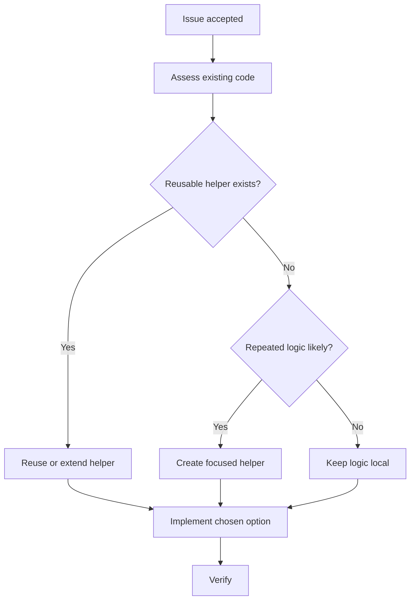
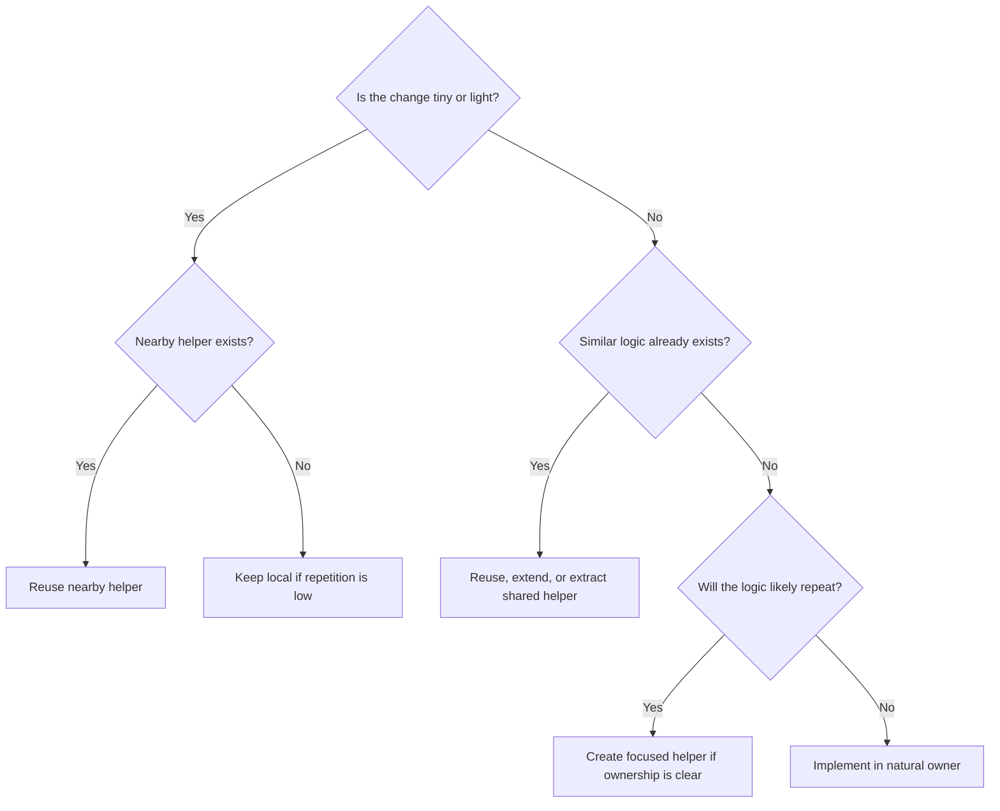

# Project Implementation Framework V0.7

Version: V0.7
Purpose: A readable Markdown framework for turning a defined issue into a fitting implementation decision inside an existing codebase.

Scope: Implementation planning and implementation decision-making.

This framework guides coding agents and human implementers through:

1. Separate implementation decision documents.
2. Codebase assessment.
3. Existing function, helper, support utility, fixture, and reuse checks.
4. Repetition and duplicate-logic checks.
5. Workflow and logic-tree modeling when useful.
6. Multiple neutral implementation options.
7. Neutral implementation fit assessment.
8. Recommendation of one implementation path.
9. Implementation planning and verification planning.

The issue framework answers:

```text
What should be solved, why does it matter, and which issue option is recommended?
```

This implementation framework answers:

```text
How should the chosen issue be implemented in this codebase, which implementation path fits best, and what plan should be followed?
```

The goal is not only:

```text
Does the change work?
```

The better question is:

```text
Does the change work, belong, reuse what exists, avoid repetition, and remain maintainable?
```

A good implementation works.
A better implementation belongs.
A planned implementation has a clear fit before code is changed.

---

# 0. Required Output Artifact

This framework is not only advisory guidance.

When an agent or implementer is asked to use this framework, the expected result is a filled-out Markdown implementation decision document.

Do not append implementation planning to the existing issue Markdown.
Do not rewrite or mutate the original issue document unless explicitly asked for issue-document maintenance.

The issue document remains the source issue.
The implementation document is the execution decision artifact.

---

## 0.1 Required Document File

Before implementation, create or return:

```text
implementation-<issue-slug>.md
```

Optional discovery or mapping work may use:

```text
implementation-discovery-<issue-slug>.md
```

Recommended naming examples:

```text
implementation-resolver-error-message-ownership.md
implementation-installer-removal-rules.md
implementation-discovery-package-resolution-flow.md
```

Use a stable, readable slug derived from the issue title.

Do not include timestamps in the filename unless the repository already uses timestamped decision records.

---

## 0.2 Required Artifact Behavior

The required artifact is:

```text
Filled-out Markdown Implementation Decision Document
```

Do not answer only with prose.
Do not answer only with a checklist.
Do not answer only with code.
Do not skip the document unless explicitly asked for a lighter response.

The document should preserve the headings, icons, ratings, option structure, recommendation line, and decision fields defined by this framework.

The document is the control surface for review.
The code change is the implementation result.
Both are useful, but they are not the same thing.

---

## 0.3 Linking Back to the Issue

Each implementation document should identify the source issue.

Use this lightweight metadata block near the top:

```markdown
Source Issue:
- Title: <issue title>
- Issue File: <relative path or identifier>
- Issue Recommendation: <chosen issue option, if known>
```

If no issue file exists, write:

```markdown
Source Issue:
- Title: <issue title>
- Issue File: Not available
- Issue Recommendation: Not available
```

Do not copy the full issue document into the implementation document.
Only restate the required outcome and relevant constraints.

---

# 1. Overall Workflow

Use this framework as a full implementation decision workflow.

```text
1. Start with an actual issue.
2. Create a separate implementation document.
3. Read the issue outcome and constraints.
4. Assess the existing codebase.
5. Check existing functions, helpers, support utilities, fixtures, patterns, and tests.
6. Check whether a general-purpose function or shared helper would make sense.
7. Check for repetitive coding or duplicate logic risk.
8. Identify reuse, placement, growth, workflow, logic-tree, and stakeholder technical requirements.
9. Create neutral implementation options.
10. Assess the options neutrally.
11. Recommend one option.
12. Define the final placement decision.
13. Define the implementation plan.
14. Define the verification plan.
15. Use the chosen implementation plan for the coding work.
```

The important sequence is:

```text
Assess before options.
Options before recommendation.
Recommendation before implementation.
Separate document throughout.
```

Do not jump directly from issue to code unless the change is tiny or light and the natural placement is obvious.

---

# 2. Neutrality Rule

Options and assessments are neutral decision-support sections.

Options may compare facts.
Options may show tradeoffs.
Options may show ratings.
Options may show risks and later costs.
Options may show that one path has higher alignment, lower growth, lower risk, or stronger reuse.

Options must not tell the reader which option to choose.

The Implementation Fit Assessment compares options.
The Implementation Recommendation chooses one option.

Do not write recommendation language inside:

* Implementation Statement
* Stakeholder Technical Requirements
* Codebase Assessment
* Reuse Map
* Shared Helper / Generalization Check
* Repetition Check
* Workflow / Logic Model
* Implementation Options
* Implementation Fit Assessment

Avoid phrases before Recommendation such as:

```text
Best option
Preferred option
Recommended path
Should choose
Clearly the right approach
Use this option
```

Allowed neutral phrases:

```text
Higher alignment
Lower growth impact
More local
More reusable
More expensive
More reversible
Higher release risk
Better supported by existing code
Leaves more work open
```

The Recommendation section is the first place where preference is stated.

---

# 3. Visual Style

Use a small visual system.

```text
▰ filled meter segment
▱ empty meter segment
```

Examples:

```text
1/4 ▰▱▱▱
2/4 ▰▰▱▱
3/4 ▰▰▰▱
4/4 ▰▰▰▰
```

Semantic chips:

```text
🟢 Good / fitting / ready / favorable
🟡 Acceptable / partial / watch
🟠 Caution / debt / needs adjustment
🔴 Blocked / reject / high risk
🔵 Discovery / local / informational
🟣 Strategic / architectural / decision
⚪ Neutral / deferred
🧩 Split / extraction / structuring
```

Section icons:

```text
📌 Implementation title
🏷 Rating
📝 Statement
📄 Artifact Rule
🧭 Codebase Assessment
🔎 Existing Code Found
♻️ Reuse Map
🧰 Shared Helper / Generalization Check
🔁 Repetition Check
🧬 Codebase Alignment
🗺 Workflow Model
🌳 Logic Tree
👥 Stakeholder Technical Lens
🧩 Implementation Options
💶 Implementation Fit Assessment
🏁 Implementation Recommendation
📍 Placement Decision
🌊 Churn
📏 Growth Impact
🔮 Future Impact
🛠 Implementation Plan
🧪 Verification Plan
🤖 Agent Instructions
🌱 Extracted Work
```

---

# 4. Implementation Workflow States

Use these workflow states to show where the implementation decision currently is.

```text
🚧 Implementation Workflow State:
🔵 Assessment Needed
🧰 Helper / Reuse Check Needed
🧩 Options Needed
🟣 Recommendation Needed
🟢 Ready To Implement
🛠 Implementation In Progress
🧹 Adjustment Needed
🏁 Implementation Decision Complete
🔴 Rework Required
```

Use 🔵 Assessment Needed when the issue is known but the codebase has not been inspected.

Use 🧰 Helper / Reuse Check Needed when the main uncertainty is whether existing helpers, general-purpose functions, or shared support utilities already solve part of the work.

Use 🧩 Options Needed when the codebase is understood enough to compare implementation paths.

Use 🟣 Recommendation Needed when options exist but no implementation path has been selected.

Use 🟢 Ready To Implement when one option is recommended and the implementation plan is clear.

Use 🛠 Implementation In Progress when the chosen option is being implemented.

Use 🧹 Adjustment Needed when the implementation decision document needs correction before coding.

Use 🏁 Implementation Decision Complete when the implementation decision is ready to guide coding.

Use 🔴 Rework Required when the implementation decision is not usable.

---

# 5. Implementation Rating

Use this rating block before implementation.

```markdown
- 🏷 Implementation Rating
  - 🚧 Workflow State: 🔵 Assessment Needed
  - 🌊 Churn: 2/4 Normal ▰▰▱▱
  - 🧭 Assessment Depth: 2/4 Focused Mapping ▰▰▱▱
  - ♻️ Reuse Need: 2/4 Explicit ▰▰▱▱
  - 🧰 Helper / Generalization Need: 2/4 Check Useful ▰▰▱▱
  - 🔁 Repetition Risk: 2/4 Watch ▰▰▱▱
  - 📍 Placement Risk: 2/4 Watch ▰▰▱▱
  - 🧬 Codebase Alignment: 0/4 Unknown ▱▱▱▱
  - 📏 Growth Pressure: 2/4 Noticeable ▰▰▱▱
  - 👥 Stakeholder Technical Lens: 🔧 Maintainer / 🧪 Test / 🚚 Release
  - 🧭 Diagram Need: 🗺 Workflow Useful
  - 🤖 Agent Suitability: 2/4 Guided ▰▰▱▱
  - 🚧 Implementation Readiness: 🟠 Needs Mapping
```

Do not add the numbers together.
They are classification signals, not a score.

---

# 6. Core Dimensions

## 6.1 🌊 Churn

Churn describes how much change pressure the implementation creates.

```text
🌊 Churn:
0/4 Tiny       ▱▱▱▱
1/4 Light      ▰▱▱▱
2/4 Normal     ▰▰▱▱
3/4 Structural ▰▰▰▱
4/4 Hard       ▰▰▰▰
```

Use 0/4 Tiny for a one-line or very small local edit.

Policy:

* Make the smallest local change.
* Do not create new files.
* Do not refactor.
* A full helper/generalization check is not required unless obvious repetition already exists.

Use 1/4 Light for a small local behavior change.

Policy:

* Prefer local change.
* Follow nearby patterns.
* Avoid new abstractions.
* Check nearby helpers and functions when practical.

Use 2/4 Normal for an extension of an existing workflow, component, or behavior.

Policy:

* Search existing related code.
* Reuse existing structure.
* Check whether existing helpers or general-purpose functions apply.
* Compare at least one implementation path.
* Watch file and function growth.

Use 3/4 Structural when the work changes ownership, responsibility, or boundaries.

Policy:

* Assess the codebase first.
* Create implementation options.
* Check shared helpers, support utilities, and repeated logic explicitly.
* Prefer focused extraction over broad redesign.
* Require human review.

Use 4/4 Hard when the current structure cannot responsibly absorb the work.

Policy:

* Do not treat as a normal coding-agent task.
* Use discovery, decision, split, or design work first.
* Human-led implementation is expected.

---

## 6.2 🧭 Assessment Depth

Assessment Depth describes how much codebase assessment is needed before implementation options can be trusted.

```text
🧭 Assessment Depth:
0/4 None             ▱▱▱▱
1/4 Local Scan       ▰▱▱▱
2/4 Focused Mapping  ▰▰▱▱
3/4 Broad Mapping    ▰▰▰▱
4/4 Discovery First  ▰▰▰▰
```

Use 0/4 None when the change is tiny and the location is obvious.

Use 1/4 Local Scan when nearby files, tests, and patterns should be checked.

Use 2/4 Focused Mapping when one module, workflow, or subsystem must be understood.

Use 3/4 Broad Mapping when several modules, layers, or workflows may contain related behavior.

Use 4/4 Discovery First when implementation should not start until ownership, behavior, and constraints are mapped.

Assessment rule:

```text
No meaningful implementation option should be recommended before the relevant codebase has been assessed.
```

Exception:

```text
Tiny or light churn may use a short local scan instead of a full assessment.
```

---

## 6.3 ♻️ Reuse Need

Reuse Need describes how strongly the implementer must search for existing code before adding new code.

```text
♻️ Reuse Need:
0/4 Minimal          ▱▱▱▱
1/4 Nearby Pattern   ▰▱▱▱
2/4 Explicit         ▰▰▱▱
3/4 Broad Reuse Map  ▰▰▰▱
4/4 Reuse First      ▰▰▰▰
```

Use 0/4 Minimal when reuse is obvious or irrelevant.

Use 1/4 Nearby Pattern when the agent should check nearby files and tests.

Use 2/4 Explicit when the agent must search related helpers, services, tests, models, config, naming, and conventions.

Use 3/4 Broad Reuse Map when several modules may already contain related behavior.

Use 4/4 Reuse First when new code should not be written until reuse options have been explicitly ruled out.

Encouragement rule:

```text
The implementer is encouraged to find and reuse existing code.
For tiny or light churn, this can be a quick local check.
For normal, structural, or hard churn, the search should be explicit and reported.
```

---

## 6.4 🧰 Helper / Generalization Need

Helper / Generalization Need describes whether an existing function, support helper, utility, service, fixture, or general-purpose abstraction should be checked or created.

```text
🧰 Helper / Generalization Need:
0/4 Not Needed        ▱▱▱▱
1/4 Nearby Check      ▰▱▱▱
2/4 Check Useful      ▰▰▱▱
3/4 Strong Candidate  ▰▰▰▱
4/4 Required First    ▰▰▰▰
```

Use 0/4 Not Needed when the change is tiny, local, and not repetitive.

Use 1/4 Nearby Check when nearby functions or helpers should be checked before adding logic.

Use 2/4 Check Useful when a shared helper might already exist or might reduce duplication.

Use 3/4 Strong Candidate when repeated logic exists or the same logic will likely be needed in multiple places.

Use 4/4 Required First when implementing locally would clearly duplicate behavior, spread repeated logic, or create a second ownership model.

Helper / Generalization rule:

```text
Before adding repeated logic, check whether an existing function, helper, service, support utility, extension method, test fixture, or shared abstraction already fits.
```

Do not create a new general-purpose helper automatically.

A helper is justified when:

* The logic is repeated or likely to repeat.
* The helper names a real concept.
* The helper has a clear owner.
* The helper improves testing or readability.
* The helper fits existing project style.

A helper is not justified when:

* The change is tiny and one-off.
* The abstraction hides complexity without naming a real concept.
* The helper would have one trivial caller.
* The helper creates indirection that makes the code harder to read.
* Existing style intentionally keeps this logic local.

---

## 6.5 🔁 Repetition Risk

Repetition Risk describes whether the implementation may repeat the same logic again and again.

```text
🔁 Repetition Risk:
0/4 None       ▱▱▱▱
1/4 Low        ▰▱▱▱
2/4 Watch      ▰▰▱▱
3/4 High       ▰▰▰▱
4/4 Duplicated ▰▰▰▰
```

Use 0/4 None when there is no meaningful repetition.

Use 1/4 Low when repetition is unlikely or harmless.

Use 2/4 Watch when similar logic may already exist or may be introduced in more than one place.

Use 3/4 High when repeated conditions, mapping, formatting, validation, conversion, error handling, logging, or test setup are likely.

Use 4/4 Duplicated when the implementation would knowingly duplicate existing behavior.

Repetition check examples:

* Same validation rule in multiple places.
* Same mapping logic repeated in handlers.
* Same error-message formatting repeated in branches.
* Same parsing or normalization logic repeated in commands.
* Same test setup duplicated across test files.
* Same logging or diagnostic pattern manually rebuilt.
* Same compatibility check repeated instead of centralized.

Rule:

```text
If the same logic appears for the second time, watch it.
If it appears for the third time, strongly consider a named helper, shared function, fixture, or extracted owner.
```

Exception:

```text
For tiny or light churn, small local repetition may be acceptable when abstraction would cost more than it saves.
```

---

## 6.6 📍 Placement Risk

Placement Risk describes how likely code is to land in the wrong file, function, module, or layer.

```text
📍 Placement Risk:
1/4 Low       ▰▱▱▱
2/4 Watch     ▰▰▱▱
3/4 High      ▰▰▰▱
4/4 Critical  ▰▰▰▰
```

Use 1/4 Low when the natural location is obvious.

Use 2/4 Watch when several plausible locations exist.

Use 3/4 High when the change crosses modules, layers, or responsibilities.

Use 4/4 Critical when wrong placement creates long-term coupling, duplicated ownership, or architectural damage.

Placement principle:

```text
Nearest placement is not always native placement.
```

The implementation must answer:

```text
Why does this code belong here?
```

Not only:

```text
Why does this code work?
```

---

## 6.7 🧬 Codebase Alignment

Codebase Alignment describes how well an implementation path fits the current repository structure, ownership model, naming, conventions, helper patterns, tests, and technical style.

```text
🧬 Codebase Alignment:
0/4 Unknown      ▱▱▱▱
1/4 Conflicting  ▰▱▱▱
2/4 Tolerable    ▰▰▱▱
3/4 Compatible   ▰▰▰▱
4/4 Native       ▰▰▰▰
```

Use 0/4 Unknown when the codebase has not been assessed enough to judge alignment.

Use 1/4 Conflicting when the option fights the current architecture, creates a second ownership model, ignores existing helpers, duplicates conventions, or places behavior in the wrong layer.

Use 2/4 Tolerable when the option works and can be accepted, but feels somewhat bolted on, temporary, or not fully aligned with existing structure.

Use 3/4 Compatible when the option fits the current codebase and does not create meaningful friction for maintainers.

Use 4/4 Native when the option feels like it belongs in the repository: correct owner, correct style, correct helper usage, correct tests, correct placement, and low surprise for future maintainers.

Alignment judgement questions:

* Would a future maintainer expect the code to be here?
* Does the option follow existing ownership boundaries?
* Does it reuse existing helpers, services, fixtures, and conventions?
* Does it avoid creating a parallel implementation style?
* Does it fit naming, logging, error handling, testing, and dependency patterns?
* Does it feel like part of the codebase rather than an agent patch?

Codebase Alignment is not the same as Future Impact or Growth Impact.

```text
🧬 Codebase Alignment = Does this fit the current repository?
📏 Growth Impact = Does this make files, functions, or classes larger or worse?
🔮 Future Impact = What does this do to future work?
```

---

## 6.8 📏 Growth Pressure / Growth Impact

Growth Pressure describes expected risk before implementation.
Growth Impact describes actual or option-level effect on file, function, class, or module size and responsibility.

```text
📏 Growth Impact:
0/4 None        ▱▱▱▱
1/4 Small       ▰▱▱▱
2/4 Noticeable  ▰▰▱▱
3/4 Heavy       ▰▰▰▱
4/4 Harmful     ▰▰▰▰
```

Use 0/4 None when code size and responsibility do not materially grow.

Use 1/4 Small when growth is harmless.

Use 2/4 Noticeable when growth is visible but still coherent.

Use 3/4 Heavy when readability, ownership, or testing starts to suffer.

Use 4/4 Harmful when the result would turn a file or function into a dumping ground.

Growth warnings:

* A file grows by more than about 15–20%.
* A file exceeds about 400–600 lines and is not naturally repetitive.
* A function exceeds about 40–80 lines.
* Nesting becomes hard to follow.
* A class gains another unrelated responsibility.
* Validation, orchestration, mapping, IO, logging, and business logic are mixed together.

These are warnings, not automatic failures.

Tiny or light churn may ignore small growth.
Normal or structural churn should not ignore growth pressure casually.

---

## 6.9 🔮 Future Impact

Future Impact describes what an implementation path does to future work.

```text
🔮 Future Impact:
🟢 -2 Simplifies
🟢 -1 Improves
⚪  0 Neutral
🟠 +1 Adds Debt
🔴 +2 Rewrite Risk
```

Use 🟢 -2 Simplifies when the option strongly reduces future complexity, coupling, duplicate logic, or migration cost.

Use 🟢 -1 Improves when the option slightly improves future work.

Use ⚪ 0 Neutral when the option does not meaningfully affect future work.

Use 🟠 +1 Adds Debt when the option is acceptable but leaves cleanup, inconsistency, or known later cost.

Use 🔴 +2 Rewrite Risk when the option is likely to cause rework, migration pain, incompatible design, or throwaway implementation.

Future Impact should be described factually before Recommendation.

Good neutral phrasing:

```text
This option simplifies future validation changes by creating one owner for the rule.
```

Bad pre-recommendation phrasing:

```text
This is the best option because it simplifies future validation changes.
```

---

## 6.10 🧭 Diagram Need

Diagram Need describes whether an implementation option should include a Mermaid workflow, a Mermaid logic tree, both, or neither.

```text
🧭 Diagram Need:
⚪ Not Needed
🗺 Workflow Useful
🌳 Logic Tree Useful
🧩 Workflow + Logic Tree Useful
🔴 Required Before Implementation
```

Use ⚪ Not Needed when the option is simple, local, and understandable from prose.

Use 🗺 Workflow Useful when the option changes or depends on a sequence of steps, data flow, command flow, request flow, build flow, deployment flow, or processing pipeline.

Use 🌳 Logic Tree Useful when the option depends on branching rules, conditions, selection logic, fallback behavior, error handling, policy decisions, compatibility rules, or if/else-heavy behavior.

Use 🧩 Workflow + Logic Tree Useful when both are relevant: the option has an important process flow and important branching rules inside that flow.

Use 🔴 Required Before Implementation when the workflow or decision logic is too unclear to implement safely without a diagram first.

Practical rule:

```text
Use a workflow diagram when order matters.
Use a logic tree when decisions matter.
Use both when order and decisions both matter.
```

---

## 6.11 🗺 Workflow Clarity

Workflow Clarity describes whether the process or sequence of the implementation option is understandable.

```text
🗺 Workflow Clarity:
0/4 Not Applicable ▱▱▱▱
1/4 Unclear        ▰▱▱▱
2/4 Understandable ▰▰▱▱
3/4 Clear          ▰▰▰▱
4/4 Diagram-Clear  ▰▰▰▰
```

Use 0/4 Not Applicable when the option does not involve meaningful workflow, sequence, data flow, or process flow.

Use 1/4 Unclear when the order of operations, ownership handoff, data movement, or execution path is difficult to understand.

Use 2/4 Understandable when prose is enough, but a reader must still think carefully.

Use 3/4 Clear when the workflow is easy to understand from the option text.

Use 4/4 Diagram-Clear when the workflow is represented with a Mermaid diagram and the process is easy to follow.

Workflow clarity applies to:

* Request flow.
* Command flow.
* Resolver flow.
* Build or deployment flow.
* Validation flow.
* Event flow.
* Data transformation flow.
* Error handling flow.
* Migration flow.
* Test setup flow.

When Workflow Clarity is 1/4 Unclear for normal, structural, or hard churn, add a Mermaid workflow before implementation.

---

## 6.12 🌳 Logic Tree Clarity

Logic Tree Clarity describes whether branching, conditional behavior, selection rules, and fallback logic are understandable.

```text
🌳 Logic Tree Clarity:
0/4 Not Applicable ▱▱▱▱
1/4 Unclear        ▰▱▱▱
2/4 Understandable ▰▰▱▱
3/4 Clear          ▰▰▰▱
4/4 Tree-Clear     ▰▰▰▰
```

Use 0/4 Not Applicable when the option has no meaningful branching or decision logic.

Use 1/4 Unclear when conditions, branches, fallbacks, policy choices, or error cases are hard to reason about.

Use 2/4 Understandable when prose is enough, but the rules require careful reading.

Use 3/4 Clear when the decision logic is obvious from the option text.

Use 4/4 Tree-Clear when the logic is represented with a Mermaid logic tree and the decision path is easy to follow.

Logic tree clarity applies to:

* If/else behavior.
* Strategy selection.
* Feature flag behavior.
* Compatibility rules.
* Fallback behavior.
* Validation rules.
* Error classification.
* Retry or recovery decisions.
* Security or permission gates.
* Migration decision paths.
* “Use existing helper vs create new helper vs keep local” decisions.

When Logic Tree Clarity is 1/4 Unclear for normal, structural, or hard churn, add a Mermaid logic tree before implementation.

---

## 6.13 👥 Stakeholder Technical Lens

Stakeholder Technical Lens describes which technical stakeholders or code-related concerns are affected.

This is not a business stakeholder list.
It is a technical requirement lens.

```text
👥 Stakeholder Technical Lens:
🔧 Maintainer
🧑‍💻 Developer Experience
🧪 Test / QA
🛟 Support / Diagnostics
📡 Operations / Observability
🚚 Release / Rollout
🔁 Compatibility / Migration
🛡 Security / Trust
⚡ Performance / Cost
👥 User-Facing Behavior
```

Use 🔧 Maintainer when structure, readability, ownership, or future change cost matters.

Use 🧑‍💻 Developer Experience when commands, local workflow, APIs, examples, errors, or documentation affect developers.

Use 🧪 Test / QA when testability, fixtures, regression coverage, or verification workflow matters.

Use 🛟 Support / Diagnostics when logs, error messages, troubleshooting, or escalation reduction matters.

Use 📡 Operations / Observability when runtime behavior, monitoring, recovery, deployment, or incidents matter.

Use 🚚 Release / Rollout when rollout safety, packaging, flags, rollback, or release timing matters.

Use 🔁 Compatibility / Migration when public contracts, schemas, persisted data, imports, exports, or versioning matter.

Use 🛡 Security / Trust when permissions, integrity, auditability, policy, secrets, or safe adoption matter.

Use ⚡ Performance / Cost when latency, memory, throughput, startup time, storage, or recurring cost matters.

Use 👥 User-Facing Behavior when visible behavior, workflow, or product expectations change.

Most implementation documents should name one to three lenses.
Do not list every lens unless all are genuinely affected.

---

## 6.14 🤖 Agent Suitability

Agent Suitability describes how safely a coding agent can perform the work.

```text
🤖 Agent Suitability:
1/4 Routine    ▰▱▱▱
2/4 Guided     ▰▰▱▱
3/4 Strong     ▰▰▰▱
4/4 Human-Led  ▰▰▰▰
```

Use 1/4 Routine for clear, local, low-risk edits.

Use 2/4 Guided when the agent can implement with precise instructions and review.

Use 3/4 Strong when the work needs deeper repository understanding and careful review.

Use 4/4 Human-Led when architecture, security, migration, public contracts, or long-term direction are involved.

---

## 6.15 🚧 Implementation Readiness

Implementation Readiness describes whether coding can start responsibly.

```text
🚧 Implementation Readiness:
🟢 Ready
🟠 Needs Mapping
🧰 Needs Helper / Reuse Check
🧩 Needs Options
🟣 Needs Decision
🔴 Blocked
```

Use 🟢 Ready when scope, placement, option choice, and constraints are clear enough.

Use 🟠 Needs Mapping when the repository must be inspected first.

Use 🧰 Needs Helper / Reuse Check when the main missing work is checking existing functions, helpers, support utilities, or duplicate logic.

Use 🧩 Needs Options when multiple implementation paths must be compared.

Use 🟣 Needs Decision when a design, scope, product, security, release, or compatibility decision is needed.

Use 🔴 Blocked when implementation cannot proceed because of an external dependency or missing fact.

---

# 7. Codebase Assessment

Codebase Assessment happens before implementation options are recommended.

It answers:

```text
What already exists, what should be reused, where does this change belong, what repeated logic exists, and what constraints does the codebase impose?
```

Use this section for normal, structural, hard, or uncertain implementation work.

For tiny or light churn, a short local assessment is enough.

---

## 7.1 Codebase Assessment Format

```markdown
### 🧭 Codebase Assessment

Assessment Depth:
- <None / Local Scan / Focused Mapping / Broad Mapping / Discovery First>

Areas Inspected:
- <Files, folders, modules, tests, docs, configs, schemas, commands, workflows, or services inspected.>

Ownership Signals:
- <Which file, module, class, service, or layer appears to own the behavior?>

Existing Patterns:
- <Relevant naming, logging, error handling, dependency, validation, testing, or placement patterns.>

Reusable Assets:
- <Helpers, services, fixtures, types, config, tests, docs, examples, or support utilities that can be reused.>

Existing Functions / Helpers Checked:
- <Functions, helpers, support utilities, extension methods, base classes, test fixtures, or shared services checked.>

General-Purpose Candidate:
- <Whether a general-purpose function, helper, or extracted owner would make sense.>

Repetition Signals:
- <Repeated validation, mapping, formatting, conversion, parsing, logging, diagnostics, setup, or branching found.>

Workflow Signals:
- <Sequence, handoff, data flow, or process flow that may need a workflow diagram.>

Logic Signals:
- <Branching, fallback, policy, or decision logic that may need a logic tree.>

Alignment Signals:
- <Signals that show whether the implementation would fit or conflict with the current codebase.>

Constraints Found:
- <Architecture, compatibility, migration, release, security, performance, operational, or test constraints.>

Debt / Risk Signals:
- <Large files, duplicated logic, unclear ownership, fragile tests, missing coverage, coupling, or confusing structure.>

Unknowns:
- <Facts still missing.>

Assessment Judgement:
<Neutral explanation of what the codebase suggests. Do not recommend an option here.>
```

---

## 7.2 Assessment Rules

If Assessment Depth is 0/4 None:

* Only acceptable for tiny, obvious changes.

If Assessment Depth is 1/4 Local Scan:

* Nearby files and tests should be checked.
* Nearby helpers and functions should be checked when practical.

If Assessment Depth is 2/4 Focused Mapping:

* The relevant module or workflow should be inspected.
* Existing functions, helpers, support utilities, and tests should be checked.

If Assessment Depth is 3/4 Broad Mapping:

* Multiple modules or layers should be inspected before choosing an option.
* Repetition and shared-helper opportunities should be explicitly assessed.
* Workflow and logic-tree needs should be assessed.

If Assessment Depth is 4/4 Discovery First:

* Do not implement yet.
* Produce a discovery result or mapping document first.
* Create or recommend a Discovery Implementation Option.

---

# 8. Reuse, Helper, and Repetition Checks

This section is mandatory for normal, structural, hard, or uncertain implementation work.

It may be shortened for tiny or light churn.

---

## 8.1 Reuse Map

```markdown
### ♻️ Reuse Map

Reuse Directly:
- <Existing code, helper, service, model, fixture, test, config, or convention to use as-is.>

Extend:
- <Existing code that can be extended safely.>

Compose:
- <Existing pieces that can be composed instead of writing new logic.>

Avoid Duplicating:
- <Existing behavior, helper, service, type, config, or test utility that must not be reimplemented.>

Not Suitable:
- <Existing code that looks relevant but should not be reused.>
  Reason: <Why it does not fit.>

Reuse Judgement:
<Neutral explanation of reuse options. Do not recommend an option here.>
```

---

## 8.2 Shared Helper / Generalization Check

```markdown
### 🧰 Shared Helper / Generalization Check

Existing Functions Checked:
- <Function or helper checked.>
  Result: <Reuse / Extend / Not suitable / Unclear.>

Support Helpers Checked:
- <Support utility, fixture, extension, base class, service, or shared module checked.>
  Result: <Reuse / Extend / Not suitable / Unclear.>

General-Purpose Function Candidate:
- <Yes / No / Maybe>

Candidate Responsibility:
- <If yes or maybe, what concept would the function/helper own?>

Candidate Location:
- <Where the helper would naturally belong.>

Why Generalize:
- <Why shared logic would improve reuse, readability, testing, support, or future changes.>

Why Keep Local:
- <Why local implementation is better, especially for tiny or light churn.>

Decision:
- <Reuse existing / Extend existing / Create focused helper / Keep local / Discovery needed>

Neutrality Note:
- <State the helper tradeoff without recommending an option.>
```

---

## 8.3 Repetition Check

```markdown
### 🔁 Repetition Check

Repeated Logic Found:
- <Validation, mapping, formatting, conversion, parsing, logging, diagnostics, setup, branching, or other repeated logic.>

Potential Duplicate Implementation:
- <Logic that the planned change may duplicate.>

Second-Time / Third-Time Rule:
- <Is this the first, second, or third occurrence of similar logic?>

Recommended Handling:
- <Keep local / Reuse existing / Extract helper / Create fixture / Defer cleanup / Discovery needed>

Reason:
<Explain why repetition is acceptable or should be reduced without choosing an implementation option yet.>
```

---

# 9. Workflow and Logic Modeling

Use workflow and logic modeling when it makes implementation options easier to judge.

Workflow diagrams and logic trees are not decoration.
They clarify implementation risk, sequence, branching, ownership, or conditions.

---

## 9.1 Mermaid Workflow Format

Use a Mermaid workflow when order, flow, or handoff matters.

````markdown
Workflow:


````

Use workflow diagrams sparingly.
They should clarify execution order, not decorate the option.

---

## 9.2 Mermaid Logic Tree Format

Use a Mermaid logic tree when decision conditions matter.

````markdown
Logic Tree:


````

Use logic trees for branching rules, fallback behavior, helper decisions, compatibility paths, or policy-like logic.

---

## 9.3 Diagram Rules

If Diagram Need is ⚪ Not Needed:

* Do not add Mermaid just for decoration.

If Diagram Need is 🗺 Workflow Useful:

* Add a Mermaid workflow unless the prose is already very clear and the churn is tiny or light.

If Diagram Need is 🌳 Logic Tree Useful:

* Add a Mermaid logic tree unless the decision logic is trivial.

If Diagram Need is 🧩 Workflow + Logic Tree Useful:

* Add both, but keep each diagram small.
* The workflow should show order.
* The logic tree should show decisions.

If Diagram Need is 🔴 Required Before Implementation:

* Do not implement before the diagram or logic tree is written and reviewed.

If Workflow Clarity is 1/4 Unclear:

* Add or improve the workflow diagram before implementation.

If Logic Tree Clarity is 1/4 Unclear:

* Add or improve the logic tree before implementation.

If both Workflow Clarity and Logic Tree Clarity are low:

* The option is not ready for implementation.
* Use a Discovery Option or Decision Option first.

---

# 10. Implementation Options

Implementation Options describe possible ways to implement the issue inside the existing codebase.

Options are not fragments.
Each option must be independently selectable.
Each option must be neutral.

Bad option structure:

```text
Option A — Add helper
Option B — Add tests
Option C — Update docs
```

This is fragmented because the final recommendation becomes:

```text
A + B + C
```

Good option structure:

```text
Option A — Extend existing validator and add local tests
Option B — Extract shared validation rule before adding behavior
Option C — Map validation ownership before implementation
```

Each option is a coherent implementation path.

---

## 10.1 Implementation Option Kinds

Use one of these option kinds in the option heading.

```text
Implementation Option Kinds:
Direct Implementation Option
Reuse / Extension Option
Helper / Generalization Option
Extraction Option
Refactor-Then-Implement Option
Adapter / Compatibility Option
Discovery Option
Decision Option
Split Option
Defer Option
Reject Option
```

### Direct Implementation Option

Use when the change can be made directly in the existing natural location.

Typical use:

* Tiny or light churn.
* Low placement risk.
* Low growth pressure.
* No meaningful repetition risk.

### Reuse / Extension Option

Use when existing code can absorb the behavior through extension or composition.

Typical use:

* Existing helper, service, type, pattern, fixture, or config exists.
* Reuse is clearly valuable.

### Helper / Generalization Option

Use when a general-purpose function, helper, support utility, fixture, or shared owner should be introduced or extended.

Typical use:

* Repeated logic exists.
* Same logic will likely be needed again.
* A helper names a real concept.
* Existing local logic should become a reusable unit.
* Tests become clearer through a focused helper.

This option must explain why a helper is different from keeping the logic local.

### Extraction Option

Use when code should be extracted into a focused unit before or during implementation.

Typical use:

* Existing file or function would become too large.
* Logic is shared.
* Testing becomes easier with extraction.
* Responsibility needs a clearer owner.

### Refactor-Then-Implement Option

Use when the existing structure must be cleaned or reshaped before the new behavior can be safely added.

Typical use:

* Existing code is too tangled to extend safely.
* Tests are hard to write without structure change.
* New behavior would worsen debt if appended directly.

### Adapter / Compatibility Option

Use when the implementation must preserve existing contracts while adding or changing behavior.

Typical use:

* Public API.
* CLI output.
* Schema.
* Migration.
* Plugin behavior.
* Backward compatibility.
* Release safety.

### Discovery Option

Use when implementation should not start until facts are gathered.

Typical use:

* Code ownership unclear.
* Reuse opportunities unknown.
* Existing helpers unknown.
* Behavior not mapped.
* Tests or downstream dependencies unknown.

### Decision Option

Use when a technical or product decision must be made before implementation.

Typical use:

* Public behavior choice.
* Compatibility policy.
* Security boundary.
* Release path.
* Performance tradeoff.
* Scope boundary.

### Split Option

Use when the issue is too bundled and should become smaller implementation issues.

Typical use:

* Several owners.
* Several acceptance conditions.
* Mixed technical lenses.
* Feature work mixed with cleanup.

### Defer Option

Use when implementation should intentionally wait.

Typical use:

* Low value now.
* Dependency pending.
* Better future timing.
* Risk not worth current effort.

### Reject Option

Use when the implementation should not be pursued.

Typical use:

* Issue is invalid.
* Existing behavior is intentional.
* Cost exceeds value.
* Proposed change conflicts with architecture or policy.

---

## 10.2 Implementation Option Key Fit Trio

Every substantial implementation option should include this trio:

```text
🧬 Codebase Alignment
📏 Growth Impact
🔮 Future Impact
```

These three fields are intentionally separate.

```text
🧬 Codebase Alignment = Does this fit the current repository?
📏 Growth Impact = Does this make files, functions, or classes larger or worse?
🔮 Future Impact = What does this do to future work?
```

Examples:

```text
🧬 Codebase Alignment: 4/4 Native ▰▰▰▰
📏 Growth Impact: 2/4 Noticeable ▰▰▱▱
🔮 Future Impact: 🟢 -1 Improves
```

Meaning:

* The option fits the repository well.
* It grows code visibly but not harmfully.
* It improves future work.

Another example:

```text
🧬 Codebase Alignment: 2/4 Tolerable ▰▰▱▱
📏 Growth Impact: 1/4 Small ▰▱▱▱
🔮 Future Impact: 🟠 +1 Adds Debt
```

Meaning:

* The option is acceptable but not very native.
* It is small now.
* It likely leaves later cleanup.

This trio is evidence for the later recommendation.
It does not automatically determine the recommendation.

---

## 10.3 Implementation Option Profile

Each implementation option should include this profile.

```markdown
- 🧾 Implementation Option Profile
  - 🧭 Resolution: <resolution>
  - 🛠 Option Effort: <effort>
  - 🧠 Option Complexity: <complexity>
  - ♻️ Reuse Fit: <reuse fit>
  - 🧰 Helper Fit: <helper fit>
  - 🔁 Repetition Control: <repetition control>
  - 🧬 Codebase Alignment: <alignment rating>
  - 📏 Growth Impact: <growth impact>
  - 🔮 Future Impact: <future impact>
  - 🧭 Diagram Need: <diagram need>
  - 🗺 Workflow Clarity: <workflow clarity>
  - 🌳 Logic Tree Clarity: <logic tree clarity>
  - 📍 Placement Fit: <placement fit>
  - 👥 Stakeholder Fit: <stakeholder fit>
  - ↩️ Reversibility: <reversibility>
  - 🤖 Agent Difficulty: <agent difficulty>
```

Resolution values:

```text
🧭 Resolution:
🟢 Full
🟡 Partial
🟠 Mitigation
🔵 Discovery
🟣 Decision
🧩 Split
⚪ Defer
🔴 Reject
```

Option Effort:

```text
🛠 Option Effort:
1/4 Trivial     ▰▱▱▱
2/4 Moderate    ▰▰▱▱
3/4 Substantial ▰▰▰▱
4/4 Major       ▰▰▰▰
```

Option Complexity:

```text
🧠 Option Complexity:
1/5 Simple  ▰▱▱▱▱
2/5 Normal  ▰▰▱▱▱
3/5 Complex ▰▰▰▱▱
4/5 Hard    ▰▰▰▰▱
5/5 Extreme ▰▰▰▰▰
```

Reuse Fit:

```text
♻️ Reuse Fit:
0/4 Unknown      ▱▱▱▱
1/4 Weak         ▰▱▱▱
2/4 Partial      ▰▰▱▱
3/4 Good         ▰▰▰▱
4/4 Strong       ▰▰▰▰
```

Helper Fit:

```text
🧰 Helper Fit:
0/4 Not Relevant       ▱▱▱▱
1/4 Local Better       ▰▱▱▱
2/4 Possible           ▰▰▱▱
3/4 Useful             ▰▰▰▱
4/4 Strongly Justified ▰▰▰▰
```

Repetition Control:

```text
🔁 Repetition Control:
0/4 Not Relevant   ▱▱▱▱
1/4 Acceptable     ▰▱▱▱
2/4 Watch          ▰▰▱▱
3/4 Reduced        ▰▰▰▱
4/4 Eliminated     ▰▰▰▰
```

Codebase Alignment:

```text
🧬 Codebase Alignment:
0/4 Unknown      ▱▱▱▱
1/4 Conflicting  ▰▱▱▱
2/4 Tolerable    ▰▰▱▱
3/4 Compatible   ▰▰▰▱
4/4 Native       ▰▰▰▰
```

Growth Impact:

```text
📏 Growth Impact:
0/4 None        ▱▱▱▱
1/4 Small       ▰▱▱▱
2/4 Noticeable  ▰▰▱▱
3/4 Heavy       ▰▰▰▱
4/4 Harmful     ▰▰▰▰
```

Future Impact:

```text
🔮 Future Impact:
🟢 -2 Simplifies
🟢 -1 Improves
⚪  0 Neutral
🟠 +1 Adds Debt
🔴 +2 Rewrite Risk
```

Diagram Need:

```text
🧭 Diagram Need:
⚪ Not Needed
🗺 Workflow Useful
🌳 Logic Tree Useful
🧩 Workflow + Logic Tree Useful
🔴 Required Before Implementation
```

Workflow Clarity:

```text
🗺 Workflow Clarity:
0/4 Not Applicable ▱▱▱▱
1/4 Unclear        ▰▱▱▱
2/4 Understandable ▰▰▱▱
3/4 Clear          ▰▰▰▱
4/4 Diagram-Clear  ▰▰▰▰
```

Logic Tree Clarity:

```text
🌳 Logic Tree Clarity:
0/4 Not Applicable ▱▱▱▱
1/4 Unclear        ▰▱▱▱
2/4 Understandable ▰▰▱▱
3/4 Clear          ▰▰▰▱
4/4 Tree-Clear     ▰▰▰▰
```

Placement Fit:

```text
📍 Placement Fit:
0/4 Wrong       ▱▱▱▱
1/4 Weak        ▰▱▱▱
2/4 Acceptable  ▰▰▱▱
3/4 Good        ▰▰▰▱
4/4 Native      ▰▰▰▰
```

Stakeholder Fit:

```text
👥 Stakeholder Fit:
🟢 Satisfied
🟡 Partial
🟠 Risk / Debt
🔴 Not Satisfied
⚪ Not Applicable
```

Reversibility:

```text
↩️ Reversibility:
🟢 Easy
🟡 Moderate
🟠 Hard
🔴 Irreversible
```

Agent Difficulty:

```text
🤖 Agent Difficulty:
1/4 Routine    ▰▱▱▱
2/4 Guided     ▰▰▱▱
3/4 Strong     ▰▰▰▱
4/4 Human-Led  ▰▰▰▰
```

---

## 10.4 Implementation Option Format

```markdown
#### Option A — <Short option name> (<Implementation Option Kind>)

- 🧾 Implementation Option Profile
  - 🧭 Resolution: <resolution>
  - 🛠 Option Effort: <option effort>
  - 🧠 Option Complexity: <option complexity>
  - ♻️ Reuse Fit: <reuse fit>
  - 🧰 Helper Fit: <helper fit>
  - 🔁 Repetition Control: <repetition control>
  - 🧬 Codebase Alignment: <alignment rating>
  - 📏 Growth Impact: <growth impact>
  - 🔮 Future Impact: <future impact>
  - 🧭 Diagram Need: <diagram need>
  - 🗺 Workflow Clarity: <workflow clarity>
  - 🌳 Logic Tree Clarity: <logic tree clarity>
  - 📍 Placement Fit: <placement fit>
  - 👥 Stakeholder Fit: <stakeholder fit>
  - ↩️ Reversibility: <reversibility>
  - 🤖 Agent Difficulty: <agent difficulty>

Description:
<Explain the implementation path in plain language. Say what this option changes, why someone might choose it, and what tradeoff it makes. Keep the wording neutral.>

Codebase Basis:
<Explain which codebase facts support this option.>

Placement:
<Where would the code go, and why does it belong there?>

Reuse:
<What existing code, tests, helpers, services, config, or conventions would be reused?>

Helper / Generalization:
<Would an existing or new general-purpose function, helper, support utility, fixture, or shared owner make sense?>

Repetition Control:
<How this option avoids repeating the same logic again and again, or why local repetition is acceptable.>

Workflow / Logic Model:
- 🧭 Diagram Need: <diagram need>
- 🗺 Workflow Clarity: <workflow clarity>
- 🌳 Logic Tree Clarity: <logic tree clarity>

Workflow:
<Include a Mermaid workflow when workflow is useful or required. Write "Not applicable" when not needed.>

Logic Tree:
<Include a Mermaid logic tree when branching logic is useful or required. Write "Not applicable" when not needed.>

Codebase Alignment:
- 🧬 Codebase Alignment: <alignment rating>

Alignment Reason:
<Explain how well this option fits the current codebase structure, conventions, ownership, helpers, tests, and style. Keep the wording neutral.>

Growth and Future Impact:
- 📏 Growth Impact: <growth impact>
- 🔮 Future Impact: <future impact>

Impact Reason:
<Explain code growth and future impact factually. Do not recommend here.>

Stakeholder Technical Fit:
<Explain how this option satisfies relevant technical stakeholder requirements.>

Solves:
- <What this option solves.>

Leaves Open:
- <What this option does not solve.>

Risks:
- <What could go wrong.>

Later Cost:
- <What this option may make harder later.>
```

---

# 11. Implementation Fit Assessment

Implementation Fit Assessment compares the implementation options.

It is similar to Value Assessment in the issue framework, but focused on codebase fit.

It answers:

```text
How do the options compare across reuse, helper/generalization, repetition control, codebase alignment, growth impact, future impact, workflow clarity, logic clarity, placement, stakeholder technical fit, and verification?
```

It does not answer:

```text
Which option should be chosen?
```

The Recommendation section answers that later.

---

## 11.1 Implementation Fit Assessment Format

```markdown
### 💶 Implementation Fit Assessment

- 💎 Fit Type: <primary fit type>
- 🧭 Fit Direction: <fit direction>
- 🧾 Fit Mechanism: <how one or more options improve codebase fit or avoid technical waste>
- ⚖️ Option Fit Summary:
  - Option A — <short option name> (<option kind>)
    - 🧭 Resolution: <resolution>
    - 🛠 Option Effort: <option effort>
    - 🧠 Option Complexity: <option complexity>
    - ♻️ Reuse Fit: <reuse fit>
    - 🧰 Helper Fit: <helper fit>
    - 🔁 Repetition Control: <repetition control>
    - 🧬 Codebase Alignment: <alignment rating>
    - 📏 Growth Impact: <growth impact>
    - 🔮 Future Impact: <future impact>
    - 🧭 Diagram Need: <diagram need>
    - 🗺 Workflow Clarity: <workflow clarity>
    - 🌳 Logic Tree Clarity: <logic tree clarity>
    - 📍 Placement Fit: <placement fit>
    - 👥 Stakeholder Fit: <stakeholder fit>
    - 🤖 Agent Difficulty: <agent difficulty>
    - 🧾 Decision Note: <short neutral fit and tradeoff judgement>
  - Option B — <short option name> (<option kind>)
    - 🧭 Resolution: <resolution>
    - 🛠 Option Effort: <option effort>
    - 🧠 Option Complexity: <option complexity>
    - ♻️ Reuse Fit: <reuse fit>
    - 🧰 Helper Fit: <helper fit>
    - 🔁 Repetition Control: <repetition control>
    - 🧬 Codebase Alignment: <alignment rating>
    - 📏 Growth Impact: <growth impact>
    - 🔮 Future Impact: <future impact>
    - 🧭 Diagram Need: <diagram need>
    - 🗺 Workflow Clarity: <workflow clarity>
    - 🌳 Logic Tree Clarity: <logic tree clarity>
    - 📍 Placement Fit: <placement fit>
    - 👥 Stakeholder Fit: <stakeholder fit>
    - 🤖 Agent Difficulty: <agent difficulty>
    - 🧾 Decision Note: <short neutral fit and tradeoff judgement>
- ✅ Good Implementation Result: <what would make the implementation worthwhile and fitting across acceptable paths>
```

---

## 11.2 Fit Type

Fit Type describes the main implementation value.

```text
💎 Fit Type:
♻️ Reuse Improved
🧰 Helper / Generalization Improved
🔁 Repetition Reduced
🧬 Codebase Alignment Improved
📍 Ownership Clarified
📏 Growth Controlled
🔮 Future Work Improved
🗺 Workflow Clarified
🌳 Logic Clarified
🧩 Structure Improved
🧪 Testability Improved
🛟 Diagnostics Improved
🚚 Release Risk Reduced
🔁 Compatibility Protected
🛡 Trust Boundary Protected
⚡ Performance Protected
🔎 Better Technical Decision
```

Use ♻️ Reuse Improved when the main value is avoiding duplicate implementation.

Use 🧰 Helper / Generalization Improved when the main value is using or creating a good shared function, helper, fixture, service, or support utility.

Use 🔁 Repetition Reduced when the main value is avoiding repeated logic.

Use 🧬 Codebase Alignment Improved when the main value is fitting the existing repository better.

Use 📍 Ownership Clarified when the main value is placing behavior in the right owner.

Use 📏 Growth Controlled when the main value is preventing large files or functions from getting worse.

Use 🔮 Future Work Improved when the main value is reducing future complexity, migration cost, or rework.

Use 🗺 Workflow Clarified when the main value is making process flow easier to understand.

Use 🌳 Logic Clarified when the main value is making branching or decision logic easier to understand.

Use 🧩 Structure Improved when the main value is cleaner boundaries or responsibilities.

Use 🧪 Testability Improved when the main value is easier and safer verification.

Use 🛟 Diagnostics Improved when the main value is easier support or troubleshooting.

Use 🚚 Release Risk Reduced when the main value is safer rollout or rollback.

Use 🔁 Compatibility Protected when the main value is avoiding schema, API, CLI, data, or migration breakage.

Use 🛡 Trust Boundary Protected when the main value is preserving security, integrity, policy, or auditability.

Use ⚡ Performance Protected when the main value is avoiding unacceptable latency, memory, throughput, or cost impact.

Use 🔎 Better Technical Decision when the main value is learning before committing implementation effort.

---

## 11.3 Fit Direction

Fit Direction describes the broad implementation lens.

```text
🧭 Fit Direction:
💰 Efficiency / Less Waste
🧱 Maintainability / Structure
🛡 Risk / Protection
🚀 Capability / Improvement
🔎 Decision / Learning
```

Use 💰 Efficiency / Less Waste when the option avoids duplicate work, rework, or unnecessary implementation.

Use 🧱 Maintainability / Structure when the option improves readability, ownership, helpers, tests, or future change cost.

Use 🛡 Risk / Protection when the option reduces release, security, compatibility, operational, or trust risk.

Use 🚀 Capability / Improvement when the option adds useful behavior with acceptable codebase impact.

Use 🔎 Decision / Learning when the option gathers facts before implementation.

---

## 11.4 Fit Assessment Neutrality Rules

Implementation Fit Assessment must remain neutral.

Good neutral decision notes:

```text
Higher codebase alignment and lower repetition risk, with moderate effort.
Lower effort and small growth, but weaker alignment and more later cleanup.
Clear workflow, but branch behavior still needs a logic tree before implementation.
Strong helper fit, but introduces a new shared owner that requires review.
```

Bad decision notes before Recommendation:

```text
Best option.
Choose this.
This is clearly the right path.
Recommended because it is cleaner.
```

If a decision note sounds like a recommendation, move that wording to the Recommendation section.

---

# 12. Implementation Recommendation

Recommendation chooses one implementation option.

The recommendation must reference one option.
Do not recommend option bundles like `A + C + E`.

If several actions must happen together, create one coherent option.

Use this format:

```markdown
### 🏁 Implementation Recommendation

- [YYYY-MM-DD HH:mm | Author: <required author name> | Recommendation: <Prefer Option X or Choose Option X> | Support: <support level>]

Reasoning:
<Explain why this implementation option is currently recommended. Mention the tradeoff honestly.>

Required Checks:
<State what must be checked before implementation starts or before this becomes final.>
```

Support level:

```text
Support:
1/3 Thin           ▰▱▱
2/3 Reasoned       ▰▰▱
3/3 Well Supported ▰▰▰
```

Use 1/3 Thin when important facts are missing.

Use 2/3 Reasoned when the recommendation has a clear argument and known tradeoffs.

Use 3/3 Well Supported when codebase assessment, reuse, helper/generalization, repetition, codebase alignment, workflow clarity, logic clarity, placement, growth impact, future impact, stakeholder requirements, risks, and verification are well understood.

---

# 13. Full Implementation Decision Document Template

Use this before coding for normal, structural, hard, or uncertain implementation work.

File name:

```text
implementation-<issue-slug>.md
```

Template:

```markdown
---
---

# 📌 Implementation Decision — <Issue Title>

Source Issue:
- Title: <issue title>
- Issue File: <relative path or identifier>
- Issue Recommendation: <chosen issue option, if known>

Output Artifact:
- Document Type: Implementation Decision
- File Name: implementation-<issue-slug>.md
- Rule: This document is separate from the issue document and must not be appended to it.

- 🏷 Implementation Rating
  - 🚧 Workflow State: <state>
  - 🌊 Churn: <rating>
  - 🧭 Assessment Depth: <rating>
  - ♻️ Reuse Need: <rating>
  - 🧰 Helper / Generalization Need: <rating>
  - 🔁 Repetition Risk: <rating>
  - 📍 Placement Risk: <rating>
  - 🧬 Codebase Alignment: <rating>
  - 📏 Growth Pressure: <rating>
  - 👥 Stakeholder Technical Lens: <one to three lenses>
  - 🧭 Diagram Need: <diagram need>
  - 🤖 Agent Suitability: <rating>
  - 🚧 Implementation Readiness: <state>

### 📝 Implementation Statement

<Describe what should be implemented, corrected, integrated, removed, or clarified.>

Required Outcome:
<Restate the required outcome from the issue in implementation-facing language.>

Non-Goals:
- <What this implementation should not solve.>

### 👥 Stakeholder Technical Requirements

Maintainer / Structure:
- <What must remain readable, maintainable, or easy to change?>

Developer Experience:
- <Any command, API, local workflow, error, documentation, or usage impact?>

Test / QA:
- <What must be testable or regression-covered?>

Support / Diagnostics:
- <Any logging, error message, troubleshooting, or escalation requirement?>

Release / Rollout:
- <Any rollout, rollback, feature flag, packaging, deployment, or release safety requirement?>

Compatibility / Migration:
- <Any public contract, schema, data, versioning, import/export, or migration concern?>

Security / Trust:
- <Any permission, integrity, auditability, policy, secret, or safety boundary?>

Performance / Cost:
- <Any latency, throughput, memory, startup time, storage, or recurring cost concern?>

User-Facing Behavior:
- <Any visible workflow, output, message, or behavior expectation?>

### 🧭 Codebase Assessment

Assessment Depth:
- <None / Local Scan / Focused Mapping / Broad Mapping / Discovery First>

Areas Inspected:
- <Files, folders, modules, tests, docs, configs, schemas, commands, workflows, or services inspected.>

Ownership Signals:
- <Which file, module, class, service, or layer appears to own the behavior?>

Existing Patterns:
- <Relevant naming, logging, error handling, dependency, validation, testing, or placement patterns.>

Reusable Assets:
- <Helpers, services, fixtures, types, config, tests, docs, examples, or support utilities that can be reused.>

Existing Functions / Helpers Checked:
- <Functions, helpers, support utilities, extension methods, base classes, test fixtures, or shared services checked.>

General-Purpose Candidate:
- <Whether a general-purpose function, helper, or extracted owner would make sense.>

Repetition Signals:
- <Repeated validation, mapping, formatting, conversion, parsing, logging, diagnostics, setup, or branching found.>

Workflow Signals:
- <Sequence, handoff, data flow, or process flow that may need a workflow diagram.>

Logic Signals:
- <Branching, fallback, policy, or decision logic that may need a logic tree.>

Alignment Signals:
- <Signals that show whether the implementation would fit or conflict with the current codebase.>

Constraints Found:
- <Architecture, compatibility, migration, release, security, performance, operational, or test constraints.>

Debt / Risk Signals:
- <Large files, duplicated logic, unclear ownership, fragile tests, missing coverage, coupling, or confusing structure.>

Unknowns:
- <Facts still missing.>

Assessment Judgement:
<Neutral explanation of what the codebase suggests. Do not recommend an option here.>

### ♻️ Reuse Map

Reuse Directly:
- <Existing code, helper, service, model, fixture, test, config, or convention to use as-is.>

Extend:
- <Existing code that can be extended safely.>

Compose:
- <Existing pieces that can be composed instead of writing new logic.>

Avoid Duplicating:
- <Existing behavior, helper, service, type, config, or test utility that must not be reimplemented.>

Not Suitable:
- <Existing code that looks relevant but should not be reused.>
  Reason: <Why it does not fit.>

Reuse Judgement:
<Neutral explanation of reuse options. Do not recommend an option here.>

### 🧰 Shared Helper / Generalization Check

Existing Functions Checked:
- <Function or helper checked.>
  Result: <Reuse / Extend / Not suitable / Unclear.>

Support Helpers Checked:
- <Support utility, fixture, extension, base class, service, or shared module checked.>
  Result: <Reuse / Extend / Not suitable / Unclear.>

General-Purpose Function Candidate:
- <Yes / No / Maybe>

Candidate Responsibility:
- <If yes or maybe, what concept would the function/helper own?>

Candidate Location:
- <Where the helper would naturally belong.>

Why Generalize:
- <Why shared logic would improve reuse, readability, testing, support, or future changes.>

Why Keep Local:
- <Why local implementation is better, especially for tiny or light churn.>

Decision:
- <Reuse existing / Extend existing / Create focused helper / Keep local / Discovery needed>

Neutrality Note:
- <State the helper tradeoff without recommending an option.>

### 🔁 Repetition Check

Repeated Logic Found:
- <Validation, mapping, formatting, conversion, parsing, logging, diagnostics, setup, branching, or other repeated logic.>

Potential Duplicate Implementation:
- <Logic that the planned change may duplicate.>

Second-Time / Third-Time Rule:
- <Is this the first, second, or third occurrence of similar logic?>

Recommended Handling:
- <Keep local / Reuse existing / Extract helper / Create fixture / Defer cleanup / Discovery needed>

Reason:
<Explain why repetition is acceptable or should be reduced without choosing an implementation option yet.>

---

### 🧩 Implementation Options

#### Option A — <Short option name> (<Implementation Option Kind>)

- 🧾 Implementation Option Profile
  - 🧭 Resolution: <resolution>
  - 🛠 Option Effort: <option effort>
  - 🧠 Option Complexity: <option complexity>
  - ♻️ Reuse Fit: <reuse fit>
  - 🧰 Helper Fit: <helper fit>
  - 🔁 Repetition Control: <repetition control>
  - 🧬 Codebase Alignment: <alignment rating>
  - 📏 Growth Impact: <growth impact>
  - 🔮 Future Impact: <future impact>
  - 🧭 Diagram Need: <diagram need>
  - 🗺 Workflow Clarity: <workflow clarity>
  - 🌳 Logic Tree Clarity: <logic tree clarity>
  - 📍 Placement Fit: <placement fit>
  - 👥 Stakeholder Fit: <stakeholder fit>
  - ↩️ Reversibility: <reversibility>
  - 🤖 Agent Difficulty: <agent difficulty>

Description:
<Explain the implementation path in plain language. Say what this option changes, why someone might choose it, and what tradeoff it makes. Keep the wording neutral.>

Codebase Basis:
<Explain which codebase facts support this option.>

Placement:
<Where would the code go, and why does it belong there?>

Reuse:
<What existing code, tests, helpers, services, config, or conventions would be reused?>

Helper / Generalization:
<Would an existing or new general-purpose function, helper, support utility, fixture, or shared owner make sense?>

Repetition Control:
<How this option avoids repeating the same logic again and again, or why local repetition is acceptable.>

Workflow / Logic Model:
- 🧭 Diagram Need: <diagram need>
- 🗺 Workflow Clarity: <workflow clarity>
- 🌳 Logic Tree Clarity: <logic tree clarity>

Workflow:
<Include a Mermaid workflow when workflow is useful or required. Write "Not applicable" when not needed.>

Logic Tree:
<Include a Mermaid logic tree when branching logic is useful or required. Write "Not applicable" when not needed.>

Codebase Alignment:
- 🧬 Codebase Alignment: <alignment rating>

Alignment Reason:
<Explain how well this option fits the current codebase structure, conventions, ownership, helpers, tests, and style. Keep the wording neutral.>

Growth and Future Impact:
- 📏 Growth Impact: <growth impact>
- 🔮 Future Impact: <future impact>

Impact Reason:
<Explain code growth and future impact factually. Do not recommend here.>

Stakeholder Technical Fit:
<Explain how this option satisfies relevant technical stakeholder requirements.>

Solves:
- <What this option solves.>

Leaves Open:
- <What this option does not solve.>

Risks:
- <What could go wrong.>

Later Cost:
- <What this option may make harder later.>

---

#### Option B — <Short option name> (<Implementation Option Kind>)

- 🧾 Implementation Option Profile
  - 🧭 Resolution: <resolution>
  - 🛠 Option Effort: <option effort>
  - 🧠 Option Complexity: <option complexity>
  - ♻️ Reuse Fit: <reuse fit>
  - 🧰 Helper Fit: <helper fit>
  - 🔁 Repetition Control: <repetition control>
  - 🧬 Codebase Alignment: <alignment rating>
  - 📏 Growth Impact: <growth impact>
  - 🔮 Future Impact: <future impact>
  - 🧭 Diagram Need: <diagram need>
  - 🗺 Workflow Clarity: <workflow clarity>
  - 🌳 Logic Tree Clarity: <logic tree clarity>
  - 📍 Placement Fit: <placement fit>
  - 👥 Stakeholder Fit: <stakeholder fit>
  - ↩️ Reversibility: <reversibility>
  - 🤖 Agent Difficulty: <agent difficulty>

Description:
<Explain the implementation path in plain language. Say what this option changes, why someone might choose it, and what tradeoff it makes. Keep the wording neutral.>

Codebase Basis:
<Explain which codebase facts support this option.>

Placement:
<Where would the code go, and why does it belong there?>

Reuse:
<What existing code, tests, helpers, services, config, or conventions would be reused?>

Helper / Generalization:
<Would an existing or new general-purpose function, helper, support utility, fixture, or shared owner make sense?>

Repetition Control:
<How this option avoids repeating the same logic again and again, or why local repetition is acceptable.>

Workflow / Logic Model:
- 🧭 Diagram Need: <diagram need>
- 🗺 Workflow Clarity: <workflow clarity>
- 🌳 Logic Tree Clarity: <logic tree clarity>

Workflow:
<Include a Mermaid workflow when workflow is useful or required. Write "Not applicable" when not needed.>

Logic Tree:
<Include a Mermaid logic tree when branching logic is useful or required. Write "Not applicable" when not needed.>

Codebase Alignment:
- 🧬 Codebase Alignment: <alignment rating>

Alignment Reason:
<Explain how well this option fits the current codebase structure, conventions, ownership, helpers, tests, and style. Keep the wording neutral.>

Growth and Future Impact:
- 📏 Growth Impact: <growth impact>
- 🔮 Future Impact: <future impact>

Impact Reason:
<Explain code growth and future impact factually. Do not recommend here.>

Stakeholder Technical Fit:
<Explain how this option satisfies relevant technical stakeholder requirements.>

Solves:
- <What this option solves.>

Leaves Open:
- <What this option does not solve.>

Risks:
- <What could go wrong.>

Later Cost:
- <What this option may make harder later.>

---

### 💶 Implementation Fit Assessment

- 💎 Fit Type: <primary fit type>
- 🧭 Fit Direction: <fit direction>
- 🧾 Fit Mechanism: <how one or more options improve codebase fit or avoid technical waste>
- ⚖️ Option Fit Summary:
  - Option A — <short option name> (<option kind>)
    - 🧭 Resolution: <resolution>
    - 🛠 Option Effort: <option effort>
    - 🧠 Option Complexity: <option complexity>
    - ♻️ Reuse Fit: <reuse fit>
    - 🧰 Helper Fit: <helper fit>
    - 🔁 Repetition Control: <repetition control>
    - 🧬 Codebase Alignment: <alignment rating>
    - 📏 Growth Impact: <growth impact>
    - 🔮 Future Impact: <future impact>
    - 🧭 Diagram Need: <diagram need>
    - 🗺 Workflow Clarity: <workflow clarity>
    - 🌳 Logic Tree Clarity: <logic tree clarity>
    - 📍 Placement Fit: <placement fit>
    - 👥 Stakeholder Fit: <stakeholder fit>
    - 🤖 Agent Difficulty: <agent difficulty>
    - 🧾 Decision Note: <short neutral fit and tradeoff judgement>
  - Option B — <short option name> (<option kind>)
    - 🧭 Resolution: <resolution>
    - 🛠 Option Effort: <option effort>
    - 🧠 Option Complexity: <option complexity>
    - ♻️ Reuse Fit: <reuse fit>
    - 🧰 Helper Fit: <helper fit>
    - 🔁 Repetition Control: <repetition control>
    - 🧬 Codebase Alignment: <alignment rating>
    - 📏 Growth Impact: <growth impact>
    - 🔮 Future Impact: <future impact>
    - 🧭 Diagram Need: <diagram need>
    - 🗺 Workflow Clarity: <workflow clarity>
    - 🌳 Logic Tree Clarity: <logic tree clarity>
    - 📍 Placement Fit: <placement fit>
    - 👥 Stakeholder Fit: <stakeholder fit>
    - 🤖 Agent Difficulty: <agent difficulty>
    - 🧾 Decision Note: <short neutral fit and tradeoff judgement>
- ✅ Good Implementation Result: <what would make the implementation worthwhile and fitting across acceptable paths>

---

### 🏁 Implementation Recommendation

- [YYYY-MM-DD HH:mm | Author: <required author name> | Recommendation: <Prefer Option X or Choose Option X> | Support: <support level>]

Reasoning:
<Explain why this implementation option is currently recommended. Mention the tradeoff honestly.>

Required Checks:
<State what must be checked before implementation starts or before this becomes final.>

### 📍 Final Placement Decision

Chosen Placement:
- <File, folder, class, function, module, or layer.>

Reason:
<Explain why the code belongs there.>

Rejected Placement:
- <Nearby or tempting location that should not be used.>
  Reason: <Why it would be poor placement.>

New Files:
- <Yes / No>

New File Reason:
<Explain why a new file is or is not appropriate.>

### 🌊 Churn and 📏 Growth Control

Churn Classification:
- <Tiny, Light, Normal, Structural, or Hard>

Growth Watch:
- <Files, functions, classes, or modules that may become too large or responsibility-dense.>

Extraction Trigger:
- <Condition where implementation should stop and extract or propose restructuring.>

Allowed Local Churn:
- <Small growth that is acceptable because the change is tiny or light.>

### 🛠 Implementation Plan

Steps:
1. <Step one.>
2. <Step two.>
3. <Step three.>

### 🧪 Verification Plan

Tests:
- <Tests to add or update.>

Checks:
- <Build, lint, type check, unit tests, integration tests, manual check, or behavior check.>

Reuse / Helper Verification:
- <How the implementation will verify that existing helpers were reused or that new helper logic is justified.>

Repetition Verification:
- <How the implementation will verify that repeated logic was not introduced unnecessarily.>

Workflow / Logic Verification:
- <How workflow or logic-tree assumptions will be checked, if relevant.>

Alignment Verification:
- <How codebase alignment will be checked through review, tests, naming, placement, or pattern comparison.>

Stakeholder Verification:
- <How maintainer, support, release, compatibility, security, performance, or user-facing requirements will be checked, if relevant.>

### 🤖 Agent Instructions

Agent Role:
- <Routine implementer / guided implementer / mapper / reviewer / assistant only.>

Instructions:
- Create or return this as a separate file named implementation-<issue-slug>.md.
- Do not append this document to the original issue Markdown.
- Assess the codebase before recommending implementation.
- Check existing functions, helpers, support utilities, tests, and repeated logic.
- Create implementation options when churn is normal, structural, hard, or uncertain.
- Keep options and fit assessment neutral before the Recommendation section.
- Prefer reuse, extension, and composition over new implementation.
- Do not place code in the nearest file unless it is also the natural responsibility owner.
- Do not create new files, helpers, or abstractions unless justified.
- Do not grow existing files or functions blindly.
- Stop and report if placement, ownership, helper/generalization, repetition, workflow, logic, alignment, or growth becomes unclear.
```

---

# 14. Small Implementation Decision Document Template

Use this for tiny or light churn when options would add noise.

File name:

```text
implementation-<issue-slug>.md
```

Template:

```markdown
---
---

# 📌 Small Implementation Decision — <Issue Title>

Source Issue:
- Title: <issue title>
- Issue File: <relative path or identifier>
- Issue Recommendation: <chosen issue option, if known>

Output Artifact:
- Document Type: Small Implementation Decision
- File Name: implementation-<issue-slug>.md
- Rule: This document is separate from the issue document and must not be appended to it.

- 🏷 Implementation Rating
  - 🚧 Workflow State: 🟢 Ready To Implement
  - 🌊 Churn: <Tiny or Light>
  - 🧭 Assessment Depth: <None or Local Scan>
  - ♻️ Reuse Need: <Minimal or Nearby Pattern>
  - 🧰 Helper / Generalization Need: <Not Needed or Nearby Check>
  - 🔁 Repetition Risk: <None or Low>
  - 📍 Placement Risk: <Low or Watch>
  - 🧬 Codebase Alignment: <Compatible or Native if known>
  - 📏 Growth Pressure: <None or Small>
  - 👥 Stakeholder Technical Lens: <primary lens>
  - 🧭 Diagram Need: <Not Needed unless useful>
  - 🤖 Agent Suitability: <Routine or Guided>
  - 🚧 Implementation Readiness: 🟢 Ready

### 📝 Implementation Statement

<What small change should be made?>

### 🧭 Local Codebase Check

Affected Area:
- <File, function, test, doc, config, or workflow.>

Nearby Pattern:
- <Existing pattern to follow.>

Reusable Asset:
- <Existing helper, test, config, or convention to reuse, if any.>

Existing Helper Checked:
- <Nearby function or helper checked, if relevant.>

Repetition Risk:
- <None / Low / Watch>

Workflow / Logic Need:
- <Not needed / Workflow useful / Logic tree useful>

### 📍 Placement / Reuse Decision

<Why this belongs where it will be changed and what existing pattern it follows.>

### 🧬 Alignment / Growth / Future Note

- 🧬 Codebase Alignment: <alignment rating>
- 📏 Growth Impact: <growth impact>
- 🔮 Future Impact: <future impact>

Reason:
<Explain these three fields factually.>

### 🧰 Helper / Repetition Note

<Why no helper is needed, or which helper will be reused. Explain why any small local repetition is acceptable.>

### 🛠 Plan

Steps:
1. <Small step.>
2. <Small step.>

Verification:
- <Simple verification.>

### 🚫 Boundaries

- Do not create new files unless the existing project pattern clearly requires it.
- Do not refactor unrelated code.
- Do not introduce a new abstraction.
- Do not append this document to the issue Markdown.
```

---

# 15. Implementation Decision Values

Use one of these values when the implementation document needs a decision state.

```text
Implementation Decision:
Choose Option A
Choose Option B
Choose Option C
Prefer Option A
Prefer Option B
Prefer Option C
Need Discovery Option
Need Decision Option
Need Split Option
Defer Implementation
Reject Implementation
```

Use Choose Option X when the implementation path is decided.

Use Prefer Option X when the implementation path is favored but still needs checks.

Use Need Discovery Option when the codebase assessment is insufficient.

Use Need Decision Option when a design, scope, release, compatibility, security, or product decision is required.

Use Need Split Option when the issue is too bundled for implementation.

Use Defer Implementation when implementation should intentionally wait.

Use Reject Implementation when implementation should not be pursued.

Support level:

```text
Support:
1/3 Thin           ▰▱▱
2/3 Reasoned       ▰▰▱
3/3 Well Supported ▰▰▰
```

Use 1/3 Thin when important facts are missing.

Use 2/3 Reasoned when the recommendation has a clear argument and known tradeoffs.

Use 3/3 Well Supported when codebase assessment, reuse, helper/generalization, repetition, alignment, workflow clarity, logic clarity, placement, growth impact, future impact, stakeholder requirements, and verification plan are well understood.

---

# 16. Agent Prompt — Before Coding

Use this prompt when giving an agent an actual issue and this framework.

```text
Use the Project Implementation Framework V0.7.

Do not implement immediately.

First, read the issue and assess the repository.

Create or return a separate filled-out Markdown Implementation Decision Document named:

implementation-<issue-slug>.md

Do not append the implementation document to the existing issue Markdown.
Do not modify the issue Markdown unless explicitly asked.

The document must include:
- Source Issue
- Output Artifact rule
- Implementation Rating
- Stakeholder Technical Requirements
- Codebase Assessment
- Reuse Map
- Shared Helper / Generalization Check
- Repetition Check
- Workflow and Logic Modeling when applicable
- Implementation Options
- Implementation Fit Assessment
- Implementation Recommendation
- Final Placement Decision
- Churn and Growth Control
- Implementation Plan
- Verification Plan
- Agent Instructions

Important:
Assess the codebase before recommending implementation.
Check existing functions, helpers, support utilities, fixtures, tests, and existing repeated logic.
Check whether a general-purpose function or shared helper would make sense.
Check whether workflow or logic-tree diagrams are useful.
Create implementation options unless the change is tiny or light and the natural path is obvious.

Keep options and implementation fit assessment neutral.
Do not state a preferred option before the Implementation Recommendation section.

Use these three fields as separate evidence:
- 🧬 Codebase Alignment
- 📏 Growth Impact
- 🔮 Future Impact

You are encouraged to find existing code and reuse it.
For tiny or light churn, a quick local check may be enough.
For normal, structural, or hard churn, the search must be explicit.

Do not create new files, helpers, services, abstractions, models, configuration mechanisms, or test utilities unless the document justifies why existing structure is insufficient.

Do not place code in the nearest file unless it is also the natural responsibility owner.

Do not repeat the same logic again and again when a reusable function, helper, fixture, support utility, or existing pattern would fit.

Do not grow existing files or functions blindly.

The goal is not only that the change works.
The goal is that the change belongs.
```

---

# 17. Practical Rules

If Churn is Tiny or Light:

* Prefer minimal local change.
* Use the small implementation document.
* Do not create new files unless clearly required by existing pattern.
* Do not refactor unrelated code.
* Follow nearby patterns.
* Check nearby helpers when practical.
* Small local repetition may be acceptable.
* Diagrams are usually unnecessary.

If Churn is Normal:

* Assess existing related code.
* Check existing functions, helpers, support utilities, tests, and repeated logic.
* Create at least two implementation paths unless one path is clearly dominant.
* Reuse existing structure.
* Watch file and function growth.
* Assess Codebase Alignment, Growth Impact, and Future Impact.
* Use workflow or logic-tree diagrams when useful.
* New files are allowed only when they clarify ownership or follow an existing pattern.

If Churn is Structural:

* Require codebase assessment.
* Require implementation options.
* Require explicit helper/generalization and repetition checks.
* Require explicit Codebase Alignment, Growth Impact, and Future Impact assessment.
* Require workflow or logic-tree diagrams when sequence or branching is non-trivial.
* Require explicit placement and structure decisions.
* Prefer focused extraction over broad redesign.
* Require human review.

If Churn is Hard:

* Do not treat the issue as a normal coding-agent task.
* Use discovery, decision, split, or design work first.
* Human-led implementation is expected.

If Assessment Depth is Discovery First:

* Do not implement yet.
* Recommend a Discovery Option.

If Reuse Need is Explicit or higher:

* The agent must report what existing code was found.
* The agent must explain what is reused, extended, avoided, or newly justified.

If Helper / Generalization Need is Check Useful or higher:

* The agent must check existing functions, helpers, support utilities, fixtures, and services.
* The agent must say whether a general-purpose function would make sense.

If Helper / Generalization Need is Required First:

* Do not implement locally until the helper/reuse path has been assessed.

If Repetition Risk is Watch or higher:

* The agent must report whether similar logic already exists.
* The agent must explain why repetition is acceptable or how it will be reduced.

If Repetition Risk is Duplicated:

* Do not proceed without reuse, extraction, or an explicit reason.

If Codebase Alignment is Unknown:

* Do not recommend the option for normal, structural, or hard churn.
* Assess the codebase first.

If Codebase Alignment is Conflicting:

* Do not choose the option unless it is explicitly temporary, justified, and tracked as debt.

If Codebase Alignment is Tolerable:

* The option can be used for pragmatic delivery, but the tradeoff must be explicit.

If Codebase Alignment is Compatible:

* The option is acceptable when other ratings are also acceptable.

If Codebase Alignment is Native:

* It is strong evidence for the option, but recommendation must still consider effort, risk, growth, future impact, and stakeholder requirements.

If Placement Risk is High or Critical:

* Do not implement without a placement explanation.
* Check whether the nearest file is actually the natural owner.

If Growth Impact is Heavy:

* Stop and consider extraction.

If Growth Impact is Harmful:

* Do not proceed without restructuring or explicit debt acceptance.

If Future Impact is Adds Debt:

* Make the later cost explicit.

If Future Impact is Rewrite Risk:

* Do not choose casually.
* Require strong justification or choose discovery/decision first.

If Diagram Need is Required Before Implementation:

* Do not implement before the workflow or logic tree is written and reviewed.

If Workflow Clarity is Unclear:

* Add or improve a Mermaid workflow before implementation.

If Logic Tree Clarity is Unclear:

* Add or improve a Mermaid logic tree before implementation.

If Stakeholder Technical Lens includes Release, Compatibility, Security, or Performance:

* Verification must explicitly address that lens.

If the recommendation would be `Option A + Option C + Option E`:

* Rewrite the options.
* Create one coherent option that includes the required combined path.

If implementation is partial:

* Say partial.
* List what remains open.
* Create extracted work only when the remaining work is real, separate, ratable, and should not be forgotten.

---

# 18. Final Rule

The issue defines the problem.
The implementation decision document defines the intended implementation fit.
The implementation document is a separate companion artifact and must not be appended to the issue Markdown.

The codebase assessment defines the existing reality.
The reuse map protects against reinventing the wheel.
The helper/generalization check asks whether existing functions or shared helpers should be used or created.
The repetition check protects against coding the same logic again and again.
The workflow model clarifies order when order matters.
The logic tree clarifies decisions when decisions matter.
The implementation options define possible fitting paths.
The implementation fit assessment compares those paths neutrally.
The recommendation chooses one path.
The implementation plan executes that path.

The Codebase Alignment rating checks whether the change fits the current repository.
The Growth Impact rating checks whether the change makes code larger or harder to maintain.
The Future Impact rating checks what the change does to future work.

The placement decision protects against nearby-but-wrong code.
The growth review protects files and functions from becoming dumping grounds.
The stakeholder technical lens protects maintainability, diagnostics, release safety, compatibility, security, performance, and user-facing behavior.
The verification plan protects against accepting unproven work.

A good implementation works.
A better implementation belongs.
A planned implementation has a clear fit before code is changed.
