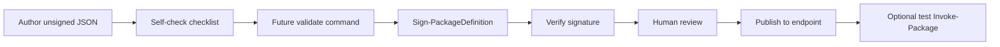

# TODO CATALOG AGENT

## Purpose

Design scratchpad for a future **agent skill** document: `AgentSkills/PackageDefinitionAuthoring.md` inside the PowerShell module (for Cursor, Codex, or other agents — not for the repo coding agent unless explicitly asked).

That file **does not exist yet**. This TODO tracks what it should contain, what the module already provides today, and what stays open until the skill is written and reviewed.

Promotion to [`PROJECT-TODO.md`](PROJECT-TODO.md) happens when the skill is scheduled. **No skill file and no engine changes are implied by this document alone.**

**Separate effort:** deterministic validation cmdlets — [`TODO-CATALOG-VALIDATION.md`](TODO-CATALOG-VALIDATION.md). The future skill should **reference** those steps once shipped; validation implementation is not part of writing the skill.

---

## Product goal (from PROJECT-TODO)

As a maintainer scaling the catalog with AI-generated package definitions, I want a repeatable process so LLM-created or LLM-updated JSON follows schema and product boundaries, is signed correctly, reviewed by humans, and only then trusted for `Invoke-Package`.

**Deliverable when done:** one markdown skill under `src/prj/Eigenverft.Manifested.Package/AgentSkills/PackageDefinitionAuthoring.md`, loadable by external agents, with workflow + checklist + pointers to module artifacts.

---

## Planned deliverable (not written yet)

| Item | Target path | Status |
|------|-------------|--------|
| Agent authoring skill | `src/prj/Eigenverft.Manifested.Package/AgentSkills/PackageDefinitionAuthoring.md` | **Not created** — outline below is draft only |

Optional later: README / module help link; team copy under `.cursor/skills` pointing at module path.

---

## What the module already gives agents (use in the future skill)

These are **resolved facts** — document them in the skill; do not re-invent in prose.

| Mechanism | Role for agents |
|-----------|-----------------|
| `Schema/PackageDefinition/eigenverft-module-package-definition-1.8.schema.json` | Editor contract; read root `description` and `x-eigenverftAgentHint` (draft `kind=unsigned`, sign when stable) |
| `DefinitionSchema.Wire1_8.ps1` | Runtime wire rules; retired names fail with replacement hints |
| `Assert-PackageDefinitionSchema` on definition load | Catches wire/policy when a definition is resolved (invoke path — not a publish-only validate command) |
| `Endpoint/Defaults/Eigenverft/*.json` | Signed canonical examples per install kind |
| `Sign-PackageDefinition` / `Resign-PackageDefinition` | Signing after content final; `-KeepSchemaVersion` for re-sign without schema bump |
| `Verify-PackageDefinitionSignature` / `Verify-PackageDefinitionCatalog` | Trust check without install |
| `New-PackageSigningCertificate` + `Import-PackageTrust` | Team catalog trust setup |
| Endpoint layout `<publisherId>/<definitionId>.json` | Matches shipped defaults |
| [`PRODUCT-BOUNDARY.md`](PRODUCT-BOUNDARY.md) | Declarative JSON, human review before production install, no script sprawl |

**Gap today:** no single “validate file or folder without install” command — see [`TODO-CATALOG-VALIDATION.md`](TODO-CATALOG-VALIDATION.md). Future skill checklist should leave a placeholder step until that exists.

---

## Draft skill outline (open — finalize when writing the file)

Sections to consider for `PackageDefinitionAuthoring.md`; order and depth **not locked**.

1. **When to use** — create/edit package-definition JSON only; not engine code.
2. **Audience** — agents and humans with endpoint or repo access.
3. **Product boundary** — link `PRODUCT-BOUNDARY.md`; declarative, no arbitrary hooks.
4. **What the module already provides** — table from section above (keep short; point at schema + examples).
5. **Workflow**
   - Author unsigned draft (`definitionSignature.kind = unsigned`; never fabricate crypto fields).
   - Self-check checklist (schema sections, dependencies, artifacts/releases alignment, revision bump, no secrets in JSON).
   - **Future:** run catalog validation command (validation TODO).
   - Sign / re-sign (`Sign-PackageDefinition` / `Resign-PackageDefinition`).
   - Verify signature.
   - Human review gate (required before production trust).
   - Publish to endpoint; optional `Invoke-Package` on disposable test machine only after review.
6. **Common mistakes** — retired properties, hand-edited signatures, bad `vendorDownload` shape, duplicate ids on endpoint.
7. **Catalog policy vocabulary (author-facing text only)** — see [Catalog policy authors should know](#catalog-policy-authors-should-know); no resolver architecture in the skill.
8. **Out of scope** — engine changes, fleet manager, npm lock model inside materialized packages.
9. **Related design** — links to `TODO-DEPENDENCY`, `TODO-SUPPLY-CHAIN`, `TODO-CATALOG-VALIDATION`.

---

## Catalog policy authors should know

*For the future skill — product language only. Wire names and resolver design live in [`TODO-DEPENDENCY.md`](TODO-DEPENDENCY.md); static checks in [`TODO-CATALOG-VALIDATION.md`](TODO-CATALOG-VALIDATION.md).*

| Idea | What authors should write in catalog JSON |
|------|-------------------------------------------|
| **Prerequisite** | “Package B must be installed before package A” → use `dependencies[]` on A toward B. |
| **Side-by-side allowed** | “SDK 9 and SDK 10 may both be on the machine” → usually **two `definitionId`s** (e.g. `DotNetSdk9`, `DotNetSdk10`); do **not** use `conflictsWith` between them unless product policy forbids pairing. |
| **Mutual exclusion** | “Only one Node major as default” → when wire exists: `conflictsWith` / `requiresAbsent` or a **mutex group** — not a second copy of the same `definitionId`. |
| **Bundle** | “Install these together” → parent definition with `dependencies[]` listing members; still respect peer policy on children. |
| **Do not guess** | Agents must not invent `conflictsWith` pairs without maintainer intent; ambiguous duplicates (two Node packages) need an explicit policy line, not silent JSON. |
| **PATH / command names** | Coexistence on disk ≠ two packages both owning `node` on PATH — call out in display/summary or separate command discovery when maintainers care. |

When `TODO-DEPENDENCY` policy fields ship, the skill checklist should say: “If this package must not coexist with X, declare it in policy; if coexistence is intentional, use separate `definitionId`s and omit conflict rules.”

---

## Resolved (for the skill effort)

- PROJECT-TODO story is **design + future skill**, not “skill already shipped”.
- Schema 1.8 already embeds agent hints (`x-eigenverftAgentHint`, authoring vs signing in `description`).
- Signing is a **separate maintainer step** from semantic JSON editing.
- Human review before production `Invoke-Package` is a product requirement (`PRODUCT-BOUNDARY`).
- Validation engine work is tracked elsewhere; skill must not duplicate validation design.

---

## Still open (decide before or while writing the skill)

- Exact skill filename and whether `AgentSkills/` is the final module location.
- How much of JSON Schema `description` to repeat vs “read the schema file”.
- Checklist granularity (per install kind vs one generic list).
- Whether skill mentions `catalogTrust.policy` / unsigned publisher allowlists explicitly.
- CI guidance for endpoint PRs (verify-only vs future validate command).
- Discoverability: README, PSGallery notes, Eigenverft online endpoint docs.
- Symlink / copy strategy for Cursor vs Codex vs CI agents.
- Re-validation playbook when schema 1.9+ ships.
- Minimum content length vs link-out to shipped examples only.
- Who approves first published skill version (maintainer sign-off).
- How much peer-policy vocabulary to include in v1 skill vs link-only to schema `description` (after TODO-DEPENDENCY wire exists).

---

## Future implementation checklist (skill only)

Reference only.

1. Agree outline (section above) with package maintainers.
2. Draft `AgentSkills/PackageDefinitionAuthoring.md` from outline + resolved facts table.
3. Cross-link from README or team onboarding (optional).
4. After [`TODO-CATALOG-VALIDATION.md`](TODO-CATALOG-VALIDATION.md) phase 1: add validation step to skill checklist.
5. Dogfood with one agent-generated definition PR; revise mistakes table.

---

## Out of scope

- Implementing validation cmdlets ([`TODO-CATALOG-VALIDATION.md`](TODO-CATALOG-VALIDATION.md)).
- Dependency solver ([`TODO-DEPENDENCY.md`](TODO-DEPENDENCY.md)).
- Release-age policy ([`TODO-SUPPLY-CHAIN.md`](TODO-SUPPLY-CHAIN.md)).
