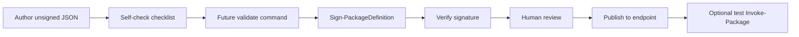

# TODO CATALOG AGENT

## Purpose

Design scratchpad for a future **agent skill** document: `AgentSkills/PackageDefinitionAuthoring.md` inside the PowerShell module (for Cursor, Codex, or other agents — not for the repo coding agent unless explicitly asked).

That file **does not exist yet**. This TODO tracks what it should contain, what the module already provides today, and what stays open until the skill is written and reviewed.

Issue ratings and definitions follow [PROJECT-ISSUE-FRAMEWORK.md](PROJECT-ISSUE-FRAMEWORK.md) (V1.6): vertical ratings; **Option Kind** in each option heading; **💶 Value Assessment** after Options with **✅ Good Result**; **📬 Stakeholder Success Note** after Recommendation; one **Prefer/Choose Option X** per issue with required author and `YYYY-MM-DD HH:mm`. Facts re-verified against `src/prj/Eigenverft.Manifested.Package` on **2026-05-30**.

Open issues in this file are scheduled here. **No skill file and no engine changes are implied by this document alone.**

**Separate effort:** deterministic validation cmdlets — [`TODO-CATALOG-VALIDATION.md`](TODO-CATALOG-VALIDATION.md). The future skill should **reference** those steps once shipped; validation implementation is not part of writing the skill.

---

## Open Issues

Sorted by **Priority** (lower number first), then higher **Benefit**, then lower **Effort** within the same priority.

**Priority 3/6 — Normal**

---
---

## 📌 Publish `PackageDefinitionAuthoring` agent skill (module `AgentSkills/`)

- 🏷 Rating
  - 🚦 Priority: 3/6 Normal ▰▰▰▰▱▱▱
  - 🛠 Effort: 2/4 Moderate ▰▰▱▱
  - 🧠 Complexity: 2/5 Normal ▰▰▱▱▱
  - 🌍 Benefit: 1/4 Producer ▰▱▱▱
  - 📦 Shape: 1/4 Focused ▰▱▱▱
  - 🎯 Quality: 🧭 Usability
  - 🚧 Readiness: 🟢 Ready

### 📝 Statement

Maintainers want a repeatable **external-agent** workflow for LLM-authored package-definition JSON: schema and product boundaries, unsigned draft → sign → verify → human review → publish. The module already has schema, examples, and trust commands, but there is **no** shipped skill file under `AgentSkills/` yet.

### 🧭 Related Context

Related Issues:
- [`TODO-CATALOG-VALIDATION.md`](TODO-CATALOG-VALIDATION.md) — validate-before-publish command (skill should reference when shipped).
- Schema 1.9 dependency policy / [`TODO-SUPPLY-CHAIN.md`](TODO-SUPPLY-CHAIN.md) — policy vocabulary links only in v1 skill.
- [`TODO-OWNERSHIP.md`](TODO-OWNERSHIP.md) — ownership/adoption guide may feed maintainer chapter text.

Affected Areas:
- New `src/prj/Eigenverft.Manifested.Package/AgentSkills/PackageDefinitionAuthoring.md`; optional README / onboarding links.

Dependencies:
- None blocking a v1 skill; validation step can be a placeholder until [`TODO-CATALOG-VALIDATION.md`](TODO-CATALOG-VALIDATION.md) phase 1 lands.

### 🎯 Required Outcome

One markdown skill file agents can load: workflow, self-check checklist, pointers to schema/`x-eigenverftAgentHint`, **18** shipped examples, signing and trust commands, human review gate, and links to related design docs — without duplicating validation or resolver implementation design.

### 🔎 Facts

Known:
- **`AgentSkills/` directory does not exist** in the module project (verified 2026-05-30).
- Schema: `Schema/PackageDefinition/eigenverft-module-package-definition-1.8.schema.json` with root `description` and **`x-eigenverftAgentHint`** (unsigned draft, sign when stable, layout `<publisherId>/<definitionId>.json`).
- Runtime wire: `Package.DefinitionSchema.ps1` + `Package.DefinitionSchema.Wire1_8.ps1` (PowerShell asserts; retired names throw with replacement hints).
- **`Assert-PackageDefinitionSchema`** runs when a definition is loaded for invoke (`Package.Config.Aggregation.ps1`) — not a publish-only validate command.
- Trust/signing (exported): `Sign-PackageDefinition`, `Resign-PackageDefinition` (`-KeepSchemaVersion`), `Verify-PackageDefinitionSignature`, `Verify-PackageDefinitionCatalog`, `New-PackageSigningCertificate`, `Import-PackageTrust` (`Cmd.PackageTrust.ps1`).
- **`Verify-PackageDefinitionCatalog`** scans a file or folder (`*.json` recursive) for **signature/trust per file**; it does **not** run full wire/schema asserts ([`TODO-CATALOG-VALIDATION.md`](TODO-CATALOG-VALIDATION.md)).
- **18** signed examples under `Endpoint/Defaults/Eigenverft/` (`schemaVersion` **1.8**); layout matches `<publisherId>/<definitionId>.json`.
- [`PRODUCT-BOUNDARY.md`](PRODUCT-BOUNDARY.md) requires declarative JSON, human review before production install.

Unknown:
- Final skill path/name; Cursor vs Codex discoverability (symlink vs copy).

---

### 🧩 Options

#### Option A — Ship full skill now with validate placeholder (Implementation Option)

- 🧾 Option Profile
  - 🧭 Resolution: 🟢 Full
  - 🛠 Option Effort: 2/4 Moderate ▰▰▱▱
  - 🧠 Option Complexity: 2/5 Normal ▰▰▱▱▱
  - 🔮 Future Impact: 🟢 -1 Improves
  - ↩️ Reversibility: 🟢 Easy
  - 🧬 Integration: 🟢 Compatible
  - 🤖 Agent Difficulty: 2/4 Guided ▰▰▱▱
  - 🧾 Agent Work: 📝 Writing / Docs

Description:
Create `AgentSkills/PackageDefinitionAuthoring.md` from the draft outline: workflow, self-check, trust verify steps (`Verify-PackageDefinitionSignature` / catalog), human review gate, policy vocabulary (link to schema 1.9 dependency fields for peer policy). Include explicit **future** step for catalog validate command.

Current State:
No module skill file; agents rely on ad hoc schema reading.

Resulting State:
External agents have one canonical authoring playbook; validation command added to checklist when shipped.

Solves:
- Closes agent-authoring backlog without waiting on engine validation.

Leaves Open:
- Checklist gains a real validate step later ([`TODO-CATALOG-VALIDATION.md`](TODO-CATALOG-VALIDATION.md)).

Risks:
- Skill may need revision when validate cmdlet lands.

Later Cost:
- One doc update when validation phase 1 ships.

---

#### Option B — Defer skill until validation phase 1 (Defer Option)

- 🧾 Option Profile
  - 🧭 Resolution: ⚪ Defer
  - 🛠 Option Effort: 1/4 Trivial ▰▱▱▱
  - 🧠 Option Complexity: 1/5 Simple ▰▱▱▱▱
  - 🔮 Future Impact: ⚪ 0 Neutral
  - ↩️ Reversibility: 🟢 Easy
  - 🧬 Integration: 🔵 Local
  - 🤖 Agent Difficulty: 1/4 Routine ▰▱▱▱
  - 🧾 Agent Work: 📝 Writing / Docs

Description:
Wait for [`TODO-CATALOG-VALIDATION.md`](TODO-CATALOG-VALIDATION.md) phase 1 so the skill checklist can call a real validate command on first publish.

Current State:
No skill; validation gap documented only in TODO scratchpads.

Resulting State:
Agents still lack a single module skill until both efforts complete.

Solves:
- Avoids publishing a checklist that immediately goes stale.

Leaves Open:
- No agent playbook during validation implementation.

Risks:
- Slower adoption of agent-authored definitions.

Later Cost:
- Skill work bundles with validation delivery.

---

#### Option C — Minimal skill now plus discoverability pack (Combined Path Option)

- 🧾 Option Profile
  - 🧭 Resolution: 🟡 Partial
  - 🛠 Option Effort: 2/4 Moderate ▰▰▱▱
  - 🧠 Option Complexity: 2/5 Normal ▰▰▱▱▱
  - 🔮 Future Impact: 🟢 -1 Improves
  - ↩️ Reversibility: 🟢 Easy
  - 🧬 Integration: 🟢 Compatible
  - 🤖 Agent Difficulty: 2/4 Guided ▰▰▱▱
  - 🧾 Agent Work: 📝 Writing / Docs

Description:
Ship a **short** in-module skill (workflow + checklist + links) **and** a separate maintainer note for Cursor/Codex/CI on how to reference the module path — without repeating full schema prose.

Current State:
No skill and weak discoverability outside repo readers.

Resulting State:
Agents find the skill; maintainers get copy-paste paths for team setups.

Solves:
- Addresses discoverability gap Option A alone may miss.

Leaves Open:
- Less depth than full outline until expanded.

Risks:
- Two docs to keep in sync.

Later Cost:
- May merge discoverability into README later.

---

### 💶 Value Assessment

- 💎 Value Type: 🧲 Adoption / Retention Improved · 🛟 Support Effort Reduced · 🔎 Better Decision
- 🧭 Value Direction: 🚀 Opportunity / Improvement
- 🧾 Value Mechanism: Gives agents and maintainers one repeatable authoring playbook tied to real module commands and signed examples; reduces malformed JSON and trust mistakes before production `Invoke-Package`.
- ⚖️ Option Value Summary:
  - Option A — Ship full skill now with validate placeholder (Implementation Option)
    - 🧭 Resolution: 🟢 Full
    - 🛠 Option Effort: 2/4 Moderate ▰▰▱▱
    - 🧠 Option Complexity: 2/5 Normal ▰▰▱▱▱
    - 🔮 Future Impact: 🟢 -1 Improves
    - 🤖 Agent Difficulty: 2/4 Guided ▰▰▱▱
    - 🧾 Decision Note: Unblocks agent authoring now; one checklist update when validate ships.
  - Option B — Defer skill until validation phase 1 (Defer Option)
    - 🧭 Resolution: ⚪ Defer
    - 🛠 Option Effort: 1/4 Trivial ▰▱▱▱
    - 🧠 Option Complexity: 1/5 Simple ▰▱▱▱▱
    - 🔮 Future Impact: ⚪ 0 Neutral
    - 🤖 Agent Difficulty: 1/4 Routine ▰▱▱▱
    - 🧾 Decision Note: Cleaner first checklist but delays all agent onboarding until validation exists.
  - Option C — Minimal skill now plus discoverability pack (Combined Path Option)
    - 🧭 Resolution: 🟡 Partial
    - 🛠 Option Effort: 2/4 Moderate ▰▰▱▱
    - 🧠 Option Complexity: 2/5 Normal ▰▰▱▱▱
    - 🔮 Future Impact: 🟢 -1 Improves
    - 🤖 Agent Difficulty: 2/4 Guided ▰▰▱▱
    - 🧾 Decision Note: Best for team discoverability; less reference depth than Option A unless expanded later.
- ✅ Good Result: External agents follow one module skill for unsigned draft → sign → verify → human review → publish, with clear links to schema, examples, and trust commands.

---

### 🏁 Recommendation

- [2026-05-30 16:00 | Author: Composer | Recommendation: Prefer Option A | Support: 2/3 Reasoned ▰▰▱]

Reasoning:
Schema hints, examples, and trust commands already exist; waiting for validation (Option B) leaves agents without a playbook. Option C is useful add-on discoverability but does not replace a full skill body. Add a explicit placeholder step for the future validate command and refresh when [`TODO-CATALOG-VALIDATION.md`](TODO-CATALOG-VALIDATION.md) phase 1 ships.

Required Checks:
- Maintainer sign-off on outline sections and policy vocabulary depth.
- Confirm `AgentSkills/` packaging in module release (`.psd1` / ship layout if needed).

### 📬 Stakeholder Success Note

- 👥 Stakeholder Role: 🔧 Engineering · 🧑‍💼 Product Owner
- 🗣 Communication Lens: 🧑‍💼 Product Summary
- 📬 Success Note: Agent and maintainer authors now have a single module skill for creating and updating package definitions safely. The workflow matches how signing and trust already work in the product. Human review remains required before production installs.

### 🚫 Out of Scope

- Implementing validation cmdlets ([`TODO-CATALOG-VALIDATION.md`](TODO-CATALOG-VALIDATION.md)).
- Dependency resolver or release-age policy design.

---

## Product goal (reference)

As a maintainer scaling the catalog with AI-generated package definitions, I want a repeatable process so LLM-created or LLM-updated JSON follows schema and product boundaries, is signed correctly, reviewed by humans, and only then trusted for `Invoke-Package`.

**Deliverable when done:** one markdown skill under `src/prj/Eigenverft.Manifested.Package/AgentSkills/PackageDefinitionAuthoring.md`, loadable by external agents, with workflow + checklist + pointers to module artifacts.

---

## Planned deliverable (not written yet)

| Item | Target path | Status |
|------|-------------|--------|
| Agent authoring skill | `src/prj/Eigenverft.Manifested.Package/AgentSkills/PackageDefinitionAuthoring.md` | **Not created** — outline below is draft only |

Optional later: README / module help link; team copy under `.cursor/skills` pointing at module path.

---

## What the module already gives agents (use in the future skill)

These are **resolved facts** — document them in the skill; do not re-invent in prose.

| Mechanism | Role for agents |
|-----------|-----------------|
| `Schema/PackageDefinition/eigenverft-module-package-definition-1.8.schema.json` | Editor contract; read root `description` and **`x-eigenverftAgentHint`** (unsigned draft, sign when stable, bump `definitionRevision`) |
| `Package.DefinitionSchema.Wire1_8.ps1` | Runtime wire rules; retired names fail with replacement hints (e.g. `artifactsByTarget` → `targetArtifacts`) |
| `Assert-PackageDefinitionSchema` | Runs on definition load for invoke (`Package.Config.Aggregation.ps1`) — **not** publish-only validate |
| `Endpoint/Defaults/Eigenverft/*.json` | **18** signed canonical examples (`schemaVersion` **1.8**) |
| `Sign-PackageDefinition` / `Resign-PackageDefinition` | Signing after content final; `-KeepSchemaVersion` for re-sign without schema bump |
| `Verify-PackageDefinitionSignature` | Per-file signature + optional trust (`-RequireTrusted`, `-ErrorOnFailure`) |
| `Verify-PackageDefinitionCatalog` | Folder/file recursive `*.json` scan; **signature/trust summary only** (`CheckedCount`, `ValidCount`, `TrustedCount`) — not wire/schema report |
| `New-PackageSigningCertificate` + `Import-PackageTrust` | Team catalog trust setup |
| Endpoint layout `<publisherId>/<definitionId>.json` | Matches shipped defaults under `Endpoint/Defaults/Eigenverft/` |
| [`PRODUCT-BOUNDARY.md`](PRODUCT-BOUNDARY.md) | Declarative JSON, human review before production install, no script sprawl |

**Gap today:** no command that runs **`Assert-PackageDefinitionSchema`** (and folder rules) without install — see [`TODO-CATALOG-VALIDATION.md`](TODO-CATALOG-VALIDATION.md). Future skill checklist should use `Verify-*` for trust today and add validate step when shipped.

---

## Draft skill outline (open — finalize when writing the file)

Sections to consider for `PackageDefinitionAuthoring.md`; order and depth **not locked**.

1. **When to use** — create/edit package-definition JSON only; not engine code.
2. **Audience** — agents and humans with endpoint or repo access.
3. **Product boundary** — link `PRODUCT-BOUNDARY.md`; declarative, no arbitrary hooks.
4. **What the module already provides** — table from section above (keep short; point at schema + examples).
5. **Workflow**
   - Author unsigned draft (`definitionSignature.kind = unsigned`; never fabricate crypto fields).
   - Self-check checklist (schema sections, dependencies, artifacts/releases alignment, revision bump, no secrets in JSON).
   - **Future:** run catalog validation command (validation TODO).
   - Sign / re-sign (`Sign-PackageDefinition` / `Resign-PackageDefinition`).
   - Verify signature.
   - Human review gate (required before production trust).
   - Publish to endpoint; optional `Invoke-Package` on disposable test machine only after review.
6. **Common mistakes** — retired properties, hand-edited signatures, bad `vendorDownload` shape, duplicate ids on endpoint.
7. **Catalog policy vocabulary (author-facing text only)** — see [Catalog policy authors should know](#catalog-policy-authors-should-know); no resolver architecture in the skill.
8. **Out of scope** — engine changes, fleet manager, npm lock model inside materialized packages.
9. **Related design** — links to schema 1.9 dependency policy, `TODO-SUPPLY-CHAIN`, and `TODO-CATALOG-VALIDATION`.

---

## Catalog policy authors should know

*For the future skill — product language only. Wire names live in schema 1.9 and resolver behavior lives in the shipped dependency planner; static checks are tracked in [`TODO-CATALOG-VALIDATION.md`](TODO-CATALOG-VALIDATION.md).*

| Idea | What authors should write in catalog JSON |
|------|-------------------------------------------|
| **Prerequisite** | “Package B must be installed before package A” → use `dependency.requires[]` on A toward B. |
| **Side-by-side allowed** | “Two SDK majors may both be on the machine” → usually **two `definitionId`s** (e.g. separate runtime packages); do **not** use `conflictsWith` between them unless product policy forbids pairing. Shipped catalog today includes **`DotNetSdk10`** only (no `DotNetSdk9` definition). |
| **Mutual exclusion** | “Only one Node major as default” → use `dependency.policy.conflictsWith` / `dependency.policy.requiresAbsent` when product policy forbids pairing — not a second copy of the same `definitionId`. |
| **Bundle** | “Install these together” → parent definition with `dependency.requires[]` listing members; still respect peer policy on children. |
| **Do not guess** | Agents must not invent `conflictsWith` pairs without maintainer intent; ambiguous duplicates (two Node packages) need an explicit policy line, not silent JSON. |
| **PATH / command names** | Coexistence on disk ≠ two packages both owning `node` on PATH — call out in display/summary or separate command discovery when maintainers care. |

For schema 1.9 policy fields, the skill checklist should say: “If this package must not coexist with X, declare it in policy; if coexistence is intentional, use separate `definitionId`s and omit conflict rules.”

---

## Resolved (for the skill effort)

- This backlog story is **design + future skill**, not “skill already shipped”.
- **`AgentSkills/`** path is **not present** in the module tree yet (2026-05-30).
- Schema 1.9 embeds **`x-eigenverftAgentHint`** and authoring vs signing guidance in `description`.
- Signing is a **separate maintainer step** from semantic JSON editing (`Sign-PackageDefinition` / `Resign-PackageDefinition`).
- `Verify-PackageDefinitionCatalog` helps trust checks but **does not** replace schema/wire validation.
- Human review before production `Invoke-Package` is a product requirement (`PRODUCT-BOUNDARY`).
- Validation engine work is tracked elsewhere; skill must not duplicate validation design.

---

## Still open (decide before or while writing the skill)

- Exact skill filename and whether `AgentSkills/` is the final module location.
- How much of JSON Schema `description` to repeat vs “read the schema file”.
- Checklist granularity (per install kind vs one generic list).
- Whether skill mentions `catalogTrust.policy` / unsigned publisher allowlists explicitly.
- CI guidance for endpoint PRs (verify-only vs future validate command).
- Discoverability: README, PSGallery notes, Eigenverft online endpoint docs.
- Symlink / copy strategy for Cursor vs Codex vs CI agents.
- Re-validation playbook for future schema changes after 1.9.
- Minimum content length vs link-out to shipped examples only.
- Who approves first published skill version (maintainer sign-off).
- How much peer-policy vocabulary to include in v1 skill vs link-only to schema 1.9 `description`.

---

## Future implementation checklist (skill only)

Reference only.

1. Agree outline (section above) with package maintainers.
2. Draft `AgentSkills/PackageDefinitionAuthoring.md` from outline + resolved facts table.
3. Cross-link from README or team onboarding (optional).
4. After [`TODO-CATALOG-VALIDATION.md`](TODO-CATALOG-VALIDATION.md) phase 1: add validation step to skill checklist.
5. Dogfood with one agent-generated definition PR; revise mistakes table.

---

## Out of scope

- Implementing validation cmdlets ([`TODO-CATALOG-VALIDATION.md`](TODO-CATALOG-VALIDATION.md)).
- Redesigning the shipped dependency planner.
- Release-age policy ([`TODO-SUPPLY-CHAIN.md`](TODO-SUPPLY-CHAIN.md)).
