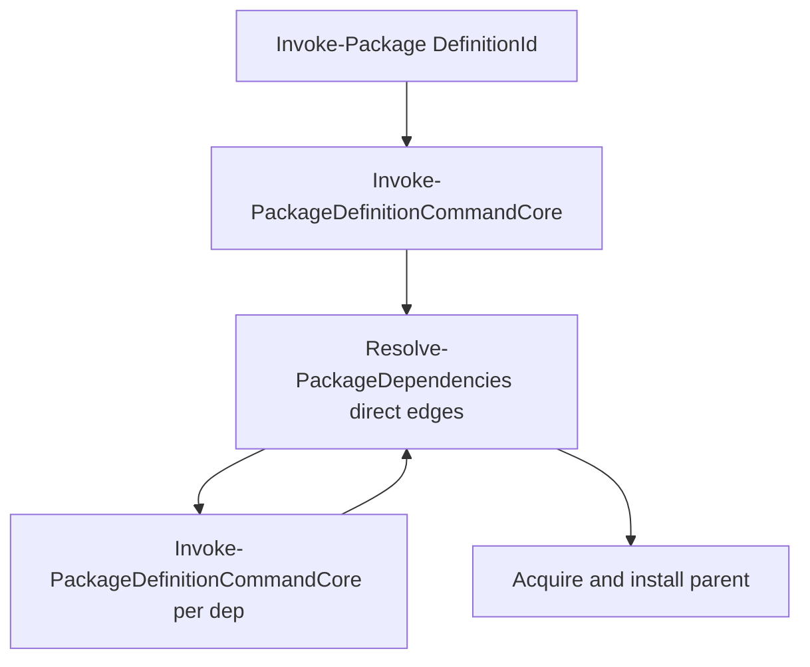

# TODO DEPENDENCY

## Purpose

Design scratchpad for **package-definition dependency resolution**: compatible versions on prerequisite edges, prerequisite tree visibility, batch conflict detection, and saved install plans for automation.

Promotion to [`PROJECT-TODO.md`](PROJECT-TODO.md) happens when implementation is scheduled. **No engine, schema, or catalog changes are implied by this file alone.**

Related: release-age and delayed auto-update on **each package’s own** version selection live in [`TODO-SUPPLY-CHAIN.md`](TODO-SUPPLY-CHAIN.md). Dependency work must compose with that policy on prerequisite nodes, not duplicate it.

**Also related:** catalog authors and agents — [`TODO-CATALOG-AGENT.md`](TODO-CATALOG-AGENT.md) (future skill text for policy vocabulary). Static checks on authored policy — [`TODO-CATALOG-VALIDATION.md`](TODO-CATALOG-VALIDATION.md).

---

## Current engine facts

| Area | Today | Gap |
|------|--------|-----|
| Wire `dependencies[]` | Schema 1.8 `dependency`: `definitionId` + optional `publisherId` only (`eigenverft-module-package-definition-1.8.schema.json`) | No per-edge version range or compatibility constraint |
| Resolver | `Resolve-PackageDependencies` in `Package.Dependencies.ps1` — documented as *minimal direct dependency pass, not a general dependency graph solver* | No unified plan object; no semver satisfaction on edges |
| Recursion | Each direct dependency runs `Invoke-PackageDefinitionCommandCore` with `DependencyStack`; cycle detection throws | Transitive needs only if nested definitions also list `dependencies[]` (e.g. `CodexCli` → `NodeRuntime`, `VisualCppRedistributable`) |
| Dedup | `HashSet` skips duplicate edges on the **same** parent definition | No cross-root dedupe or version negotiation when two top-level packages share a prerequisite |
| Batch install | `Invoke-Package` loops `DefinitionId` values independently; `-FailFast` stops after the first non-success | No pre-flight report when multiple requested packages disagree on a shared dependency version |
| Removal | `Assert-PackageRemovalDependencyDependents` blocks remove when others declare a dependency; coordinated `removeDependencies` not implemented | No uninstall tree planning |
| Tests | `ConfigAndDefinitions.Tests.ps1` (~1437–1546): direct deps, recursive materialize-only deps, cycle failure | No range, batch-conflict, or plan-artifact tests |
| npm graph | `Package.Npm.ps1` lockfile materialization for `npmMaterializedInstallGlobalPackage` | **Separate model** from definition `dependencies[]` — do not conflate |
| Validation without install | `Assert-PackageDefinitionSchema` on definition load; trust/signing commands | No dedicated “validate whole endpoint folder” cmdlet yet (see [`TODO-CATALOG-VALIDATION.md`](TODO-CATALOG-VALIDATION.md)) |
| Peer / coexistence policy | `dependencies[]` = prerequisites only; removal blocks if dependents exist | No `conflictsWith`, `requiresAbsent`, or mutex group on the wire; no assign-time peer check |
| Host compatibility | `packageOperations.policy.compatibility` (OS, CPU, memory) | Machine gates only — not “another package already Assigned” |

**Install path today:** for each package, direct dependencies are ensured in declaration order, each via a full assign/materialize run; only then does the parent acquire and install.

---

## Product goals

Migrated from PROJECT-TODO **P2 Dependency resolution** and **side-by-side runtimes** (design targets, not shipped behavior).

| Goal | User story (short) | Desired outcome |
|------|-------------------|-----------------|
| **Compatible dependency versions** | Package author declares what dependency versions work | Planning shows picked dependency versions; clear failure when none match |
| **Prerequisite tree before install** | Operator sees nested prerequisites early | Readable tree: each node, selected version, status — before machine changes |
| **Batch conflict detection** | User installs multiple packages in one command | Conflicts reported **before** any install when the set disagrees on a shared dependency |
| **Saved resolved plan** | CI/agent needs proof of intent | Archivable plan: package versions, dependency versions, file hashes — without fleet orchestration |
| **Peer coexistence / exclusion** | Runtimes like .NET SDK 9 and 10 should not look like accidental duplicate catalog entries; maintainer declares allow or forbid | Separate `definitionId`s + optional `conflictsWith` / `requiresAbsent`; install-slot naming, update policy, and removal behavior explained in plan/errors — not manual guesswork |

---

## Resolver policy (peer coexistence and exclusion)

**Not the same as `dependencies[]`.** Prerequisites mean “ensure B before A.” **Resolver policy** means “A and B may or may not both be Assigned on this machine” and “this batch request is allowed.”

Today only prerequisites and removal-dependents exist; peer rules are manual (profile discipline, separate `definitionId`s, maintainer docs). The items below are **candidates for schema + a real resolver** — soft lean includes **`conflictsWith`** and **`requiresAbsent`**.

### Policy concepts (product language)

| Concept | Meaning for operators | Example |
|---------|----------------------|---------|
| **`dependencies[]`** | Must be ready before me (stack) | `CodexCli` → `NodeRuntime` |
| **`conflictsWith`** | Must not be Assigned together with these packages (peer mutex) | `DotNetSdk10` conflicts with `DotNetSdk9` when policy is “one default SDK slot” |
| **`requiresAbsent`** | I refuse to assign if these are already Assigned (or in the same batch) | `NodeRuntime22` requires absent `NodeRuntime18` |
| **Mutex group** (name TBD) | At most one member of a named family per machine | `runtimeFamily: node-major` → one winner among `NodeRuntime18`, `NodeRuntime22` |
| **Separate `definitionId`s** | Side-by-side on disk/inventory (parallel roots) | `DotNetSdk9` + `DotNetSdk10` both allowed when not in conflict |
| **Bundle parent** | One invoke pulls many deps (orchestration, not mutex) | Meta-definition depending on both SDKs |
| **In-slot version lock** | `onNewSelectedVersion: fail` — not peer policy | Locks one slot, not “9 vs 10” |
| **Command / PATH surface** | Which `dotnet`/`node` wins | Often still maintainer + discovery naming; policy does not replace shim rules by itself |

**Three questions** side-by-side work must separate (resolver should report each clearly):

1. **Inventory / disk** — Can two package-owned trees exist?
2. **Policy** — May both be Assigned on this machine?
3. **Default CLI** — Which command name wins on PATH?

Dependencies mainly answer (1) for prerequisites. **`conflictsWith` / `requiresAbsent` / mutex groups answer (2).** (3) may need additional catalog conventions (distinct command names) even when (2) allows coexistence.

### Candidate wire fields (draft — finalize in schema pass)

Likely under `packageOperations.policy` (exact path TBD):

| Field (draft) | Role |
|---------------|------|
| `conflictsWith[]` | List of `{ publisherId?, definitionId }` — assign/plan fails if any listed package is already Assigned or in the same batch |
| `requiresAbsent[]` | Same shape — assign/plan fails if any listed package is present |
| `mutexGroup` | String label — at most one Assigned package per group per machine (stronger than pairwise lists for N majors) |
| `onConflict` | `fail` \| `warn` (batch / plan behavior TBD) |

Optional later (lower priority than pairwise conflict):

- **Alternative / optional dependencies** — satisfy one of several edges (solver picks one).
- **`replaces` / `supersedes`** — explicit upgrade path between two definition IDs.
- **`provides` virtual id** — satisfaction by one of several concrete packages (rpm-style; heavy).

**Soft lean:** ship **`conflictsWith`** and **`requiresAbsent`** first; add **`mutexGroup`** when catalog size justifies it.

### Why this belongs in the dependency / resolver effort

- Batch pre-check (“stop before any install”) must evaluate **prerequisite tree + peer policy + version ranges** in one plan.
- Diamond shared deps (two parents, one prerequisite) and “two Node majors” are the same **planner** class of problem: **one resolved graph, one verdict**.
- [`TODO-CATALOG-VALIDATION.md`](TODO-CATALOG-VALIDATION.md) can validate **authored** policy (unknown ids, self-conflict, symmetric pairs) **without** a machine; **runtime** enforcement still needs the resolver here.

### Unified resolver — architectural requirement

Implementing peer policy on top of today’s recursive `Invoke-Package` loop will not stay coherent. A **single planning pipeline** should orchestrate **separate sub-resolvers** with narrow inputs/outputs (no shared mutable “do everything” function):

| Sub-resolver (concept) | Responsibility |
|------------------------|----------------|
| **Graph builder** | Requested roots + transitive `dependencies[]`; cycle detection |
| **Version satisfaction** | Edge ranges + authored releases per node ([`TODO-SUPPLY-CHAIN.md`](TODO-SUPPLY-CHAIN.md) age policy per node) |
| **Peer policy** | `conflictsWith`, `requiresAbsent`, mutex groups vs inventory + batch |
| **Dedup / shared nodes** | One pick per `definitionId`/slot when multiple parents need the same prerequisite |
| **Plan emitter** | Resolved tree, versions, hashes, policy violations — input to install executor |

**Separation rule:** prerequisite expansion must not embed peer checks; peer policy must not re-walk install logic. Install execution remains “run the approved plan” (Option A extended or Option B lockfile — see graph model below).

Without this split, policy bugs will be hard to test and agents will see inconsistent errors between validate-only and invoke.

### Benefits (why introduce policy fields)

| Benefit | Who gains |
|---------|-----------|
| Fail closed before download/install | Operators, CI |
| Catalog documents intent (“9 and 10 OK” vs “not OK”) | Maintainers, reviewers |
| Agents get explicit rules instead of guessing duplicates | [`TODO-CATALOG-AGENT.md`](TODO-CATALOG-AGENT.md) skill text |
| Validator catches impossible pairs on endpoint folder | [`TODO-CATALOG-VALIDATION.md`](TODO-CATALOG-VALIDATION.md) |
| Same plan object feeds saved-plan / automation goal | CI, security review |

### What stays manual without resolver policy

- PATH/shim precedence when two packages expose the same command name.
- Choosing separate `definitionId`s vs one rolling package.
- MSI/global installer adoption semantics (see PROJECT-TODO adoption/removal item).

---

## Soft preferences (not locked)

From design review; treat as direction only.

| Topic | Lean | Caution |
|-------|------|---------|
| Graph model | **Option A** — keep direct `dependencies[]` edges + recursive full invoke per prerequisite; add planning on top | Batch pre-check and shared-dep version agreement need a **planning pass**, not the current per-package loop alone |
| Version on edges | **Semver-style range** per dependency edge (Option B under version constraints) | Parser, validation, and fail-closed messaging must be defined in schema + wire |
| Batch conflicts | **Pre-check entire batch, fail closed** | Requires unified planner: prerequisites + version picks + **peer policy** |
| Peer policy | **`conflictsWith` / `requiresAbsent`** (mutex group later) | Schema + peer sub-resolver; not expressible with `dependencies[]` alone |
| Saved plan artifact | **Open** — no preference yet | |
| Dry-run surface | **Open** — partial validation exists today; lean toward a **catalog validation command** when built (PROJECT-TODO backlog) | `Assert-PackageDefinitionSchema` on load ≠ folder batch validate ≠ install tree preview |

---

## Integration options

### Graph model

#### Option A — Direct edges + recursive install (status quo extended)

- **What it means:** Each package lists only **immediate** prerequisites. The engine runs a full `Invoke-Package` for each edge; deeper prerequisites appear only if those definitions also list dependencies.
- **Fits today:** Exactly `Resolve-PackageDependencies` + `Resolve-PackageDependencyDefinition`.
- **Extend later:** Add a **planning phase** that walks the same edges without changing the machine, then execute the same install path.
- **Risk:** “Stop before any install” and “one version for a shared prerequisite across a batch” are **not** free — they need planning logic on top of this model.

#### Option B — Unified solver / lockfile-first

- **What it means:** Resolve the **whole tree and version picks once**, dedupe shared packages, emit a lock/plan, install from that plan.
- **Fits today:** Poorly — replaces the recursive invoke model.
- **Extend later:** Best for reproducible CI and hard batch conflicts.
- **Risk:** Large jump; overlaps concepts with npm lockfiles inside packages.

#### Option C — Named simple policies on edges (not full semver)

- **What it means:** Small enum per edge (`sameMajor`, `minimumVersion`, …) instead of semver grammar.
- **Fits today:** Easier author UX and validation; weaker expressiveness.
- **Middle ground** between A and B for schema complexity.

**No decision yet.** Soft lean: **A** with a future planner; keep **B** and **C** documented for comparison.

---

### Version constraint on each `dependencies[]` edge

| Style | Author experience | Solver complexity | Fit today |
|-------|-------------------|-------------------|-----------|
| **Exact pin** | “This package needs Node exactly 22.14.0.” | Low — pick one authored release or fail | Not on wire; could use exact version string |
| **Inherit dependency’s own strategy** | “Install Node; let Node’s `latestByVersion` decide.” | Low — no edge constraint (status quo) | Current behavior |
| **Semver range** | “Need Node `>=22.0.0 <23.0.0`.” | Medium — intersect range with authored releases | **Soft lean** |
| **Named policy enum** | “Need Node same major as 22.x.” | Medium-low — fixed rule set | Option C graph companion |

**No decision yet** on wire shape. Soft lean: **semver range** on the edge.

---

### Batch install when `Invoke-Package` gets multiple `DefinitionId` values

| Style | What the user gets | Fit today |
|-------|-------------------|-----------|
| **Pre-check all, fail closed** | Report all conflicts; install nothing until the set is consistent | **Soft lean** — needs planner, not current loop |
| **Per-package only** | Each package runs independently; conflicts may appear mid-batch | Current behavior |
| **Warn and continue** | Soft conflicts as warnings; hard fail only when impossible | Softer CI story; more ambiguous machine state |

---

### Dry-run and tree preview

| Style | What it means | Fit today |
|-------|--------------|-----------|
| **Separate validation command** | Validate endpoint JSON, trust, dependency references, plan shape — no install | Aligns with [`TODO-CATALOG-VALIDATION.md`](TODO-CATALOG-VALIDATION.md) (not shipped as one command) |
| **`Invoke-Package` planning mode** | Same entry point, no acquisition/install/PATH/inventory writes | Not implemented |
| **Logs + `PackageResult.Dependencies` only** | Tree fragments appear during real runs | Partial — dependency records on result after install path runs |

**All open.** Remember: schema assert-on-load and signing checks exist; **folder batch validate** and **install dry-run** are separate backlog items.

---

### Saved resolved plan artifact

| Style | What it means |
|-------|--------------|
| **Export JSON** | Optional `-PlanOut` (name TBD) for CI archives |
| **Operation history** | Embed plan summary in `PackageOperationHistory` |
| **Both** | Export file plus history pointer |
| **Phase 1 logs only** | Structured `[STEP]` / `[STATE]` plus `PackageResult` until a format is chosen |

**Open** — no preference recorded.

---

## Runtime policy today (dependency invoke)

| Behavior | Today |
|----------|--------|
| Parent `-PackageVersion` | Applies to **parent** selection only; dependencies use their own definition `versionSelection` unless future edge constraints say otherwise |
| `Offline` / `MaterializeOnly` | Propagated from parent into `Resolve-PackageDependencyDefinition` |
| Publisher on edge | Optional `publisherId`; omit uses catalog-trust eligible publishers |
| Cycle | `DependencyStack` detects cycles and throws |
| Duplicate edge on same parent | Skipped silently (`HashSet`) |
| Command paths | `Resolve-PackageDependencyCommandPath` resolves installer commands from ready dependency entry points |

When [`TODO-SUPPLY-CHAIN.md`](TODO-SUPPLY-CHAIN.md) lands, each **prerequisite node** still uses its own `versionSelection` / release-age policy unless an edge constraint overrides the picked version.

---

## Schema sketch (draft)

Not final wire names.

| Location | Field (draft) | Notes |
|----------|---------------|--------|
| `dependencies[]` | `versionRange` | Semver range string satisfying authored `artifacts.releases[].version` (soft lean) |
| `dependencies[]` | `versionPolicy` | Alternative: enum if Option C chosen instead of or alongside range |
| `dependencies[]` | `publisherId` | Keep — optional publisher pin |
| `packageOperations.policy` | `conflictsWith[]` | Peer mutex — assign/plan fails if listed package present |
| `packageOperations.policy` | `requiresAbsent[]` | Stricter absence gate (same wire shape as conflicts; semantics differ) |
| `packageOperations.policy` | `mutexGroup` | Optional — one Assigned member per group |
| Plan output (runtime) | `ResolvedPlan` object | Tree nodes + **policy violations[]** + selected versions/hashes — shape TBD |

Parent `dependencies[]` stays **ordered** unless a future spec defines parallel install groups.

---

## Future implementation checklist

Reference only — not started by this document.

1. **Resolver architecture** — planning pipeline + sub-resolvers (graph, versions, **peer policy**, dedup, plan emit); keep install executor separate.
2. **Schema / wire** — edge `versionRange`; `conflictsWith` / `requiresAbsent` (and optional `mutexGroup`); wire validation and author-facing errors.
3. **Planning pass** — full closure without install: versions, cycles, shared-node dedupe, **peer policy** vs inventory + batch.
4. **Version satisfaction** — per-node ranges + supply-chain age policy on prerequisites.
5. **Peer sub-resolver** — evaluate conflicts/absence/mutex; explainable violations in plan output.
6. **`Invoke-Package`** — plan-first / batch pre-check; optional plan export (name TBD).
7. **Projection** — tree + policy violations on `PackageResult` and validation command output.
8. **Tests** — mutual exclusion, requiresAbsent, mutex group, diamond deps, batch fail-closed, compose with release-age on deps.
9. **Catalog** — document side-by-side vs mutex per product (e.g. SDK 9+10 allowed, dual Node major forbidden).
10. **Catalog validation alignment** — static policy checks in [`TODO-CATALOG-VALIDATION.md`](TODO-CATALOG-VALIDATION.md); author rules in future skill per [`TODO-CATALOG-AGENT.md`](TODO-CATALOG-AGENT.md).

### Phased delivery

| Phase | Deliverable |
|-------|-------------|
| 0 | Resolver module boundaries (sub-resolvers + plan object); no peer logic inside recursive invoke |
| 1 | Schema + wire: version ranges + `conflictsWith` / `requiresAbsent` |
| 2 | Planning pass (single root): tree + versions + peer policy verdict |
| 3 | Batch pre-check for multi-`DefinitionId` invoke |
| 4 | Saved plan artifact format + CI export |
| 5 | Catalog validation: static peer-policy checks on endpoint folder |
| 6 | Optional: `mutexGroup`; alternative dependency edges |

---

## Resolved (facts about today)

- Definition-level dependencies are **direct edges only** on the wire (`definitionId`, optional `publisherId`).
- Runtime resolves dependencies by **recursive full invoke**, not a unified lockfile solver.
- **Cycles** are detected via `DependencyStack` and fail with an explicit error.
- **npm** package dependency graphs inside materialization are a **different** mechanism from `dependencies[]`.
- **Batch** `Invoke-Package` does not negotiate versions across the requested set before starting.
- **Removal** blocks when dependents exist; coordinated dependency removal is not implemented.

---

## Still open

- Final graph model: A vs B vs C (soft lean A + planner).
- Final edge constraint: semver range vs named policy vs both (soft lean semver).
- Whether parent `-PackageVersion` may constrain dependency picks or only the root package.
- Diamond dependencies: two parents need the same prerequisite — one install vs two passes vs explicit conflict when ranges disagree.
- Saved plan artifact: file vs history vs both (no preference yet).
- Dry-run: validation command vs `Invoke-Package` planning mode vs both (no preference yet; catalog validation backlog is separate).
- Interaction with release-age policy on prerequisite nodes ([`TODO-SUPPLY-CHAIN.md`](TODO-SUPPLY-CHAIN.md)).
- `removeDependencies` semantics and uninstall tree ordering.
- Minimum fields in a plan artifact (hashes per target artifact vs package version only).
- Wire names and symmetry: must `conflictsWith` be reciprocal, or validator auto-warn?
- `onConflict: warn` vs fail for batch installs.
- Whether peer policy reads **inventory only**, **batch only**, or **union** (recommended: union for plan).
- Mutex group vs pairwise list — catalog authoring ergonomics for agents.

---

## Out of scope

- Fleet-wide package profiles, hold/skip rollout, multi-machine orchestration (manager product — see PROJECT-TODO **Out Of Scope**).
- Replacing npm lockfile resolution inside `npmMaterializedInstallGlobalPackage` packages.
- Central package index or public app-store discovery (separate PROJECT-TODO items).
- Full PATH/shim arbitration engine (may stay catalog + maintainer docs even when peer policy exists).
