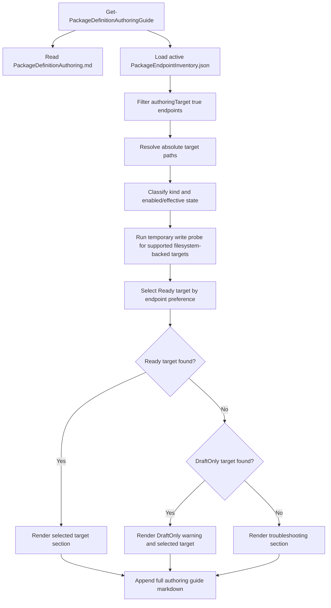
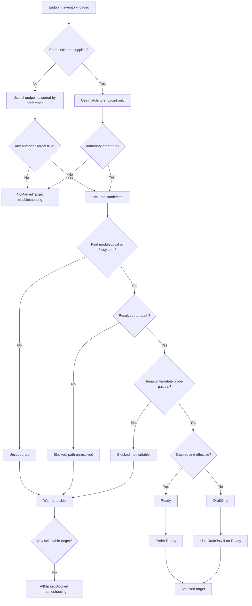

---
---

# 📌 Implementation Decision — Installed Module Authoring Guide Command

Source Issue:
- Title: Installed module should expose package-definition authoring guidance and target endpoint discovery
- Issue File: `src/wrk/Eigenverft.Manifested.Package/ISSUE-AUTHORING-GUIDE-COMMAND.md`
- Issue Recommendation: Prefer Option A — Authoring guide command with `authoringTarget` endpoint intent

Output Artifact:
- Document Type: Implementation Decision
- File Name: `implementation-authoring-guide-command.md`
- Rule: This document is separate from the issue document and must not be appended to it.

- 🏷 Implementation Rating
  - 🚧 Workflow State: 🟢 Ready To Implement
  - 🌊 Churn: 3/4 Structural ▰▰▰▱
  - 🧭 Assessment Depth: 3/4 Broad Mapping ▰▰▰▱
  - ♻️ Reuse Need: 3/4 Broad Reuse Map ▰▰▰▱
  - 🧰 Helper / Generalization Need: 3/4 Likely ▰▰▰▱
  - 🔁 Repetition Risk: 3/4 High ▰▰▰▱
  - 📍 Placement Risk: 3/4 High ▰▰▰▱
  - 🧬 Codebase Alignment: 3/4 Compatible ▰▰▰▱
  - 📏 Growth Pressure: 2/4 Moderate ▰▰▱▱
  - 🧯 Side-Effect Scope: 3/4 Release-Sensitive ▰▰▰▱
  - ⚙️ Post-Implementation Action Need: 2/4 Required ▰▰▱▱
  - 🚀 Ready-State Confidence: 2/4 Conditional ▰▰▱▱
  - 👥 Stakeholder Technical Lens: 🔧 Maintainer / 🧪 Test / 🛟 Support / 📚 Documentation
  - 🧭 Diagram Need: 🧩 Workflow + Logic Tree Useful
  - 🤖 Agent Suitability: 3/4 Strong ▰▰▰▱
  - 🚧 Implementation Readiness: 🟢 Ready

### 📝 Implementation Statement

Implement the issue recommendation by adding an exported installed-module command named `Get-PackageDefinitionAuthoringGuide`. The command prints a task-aware authoring preface, discovers endpoint inventory entries marked with `authoringTarget: true`, resolves absolute target paths, probes whether marked filesystem-backed targets are currently writable, selects the best usable target, and then appends the full module-local `AgentSkills/PackageDefinitionAuthoring.md` body.

The implementation must also make endpoint authoring intent manageable and visible through the existing endpoint command surface. Endpoint inventory entries gain optional `authoringTarget: true`; endpoint summaries show `AuthoringTarget`; endpoint add/set commands can set or clear the flag. The shipped endpoint inventory starts with `authoringTarget: true` on both `moduleDefaults` and the disabled `corpPackageEndpoint`.

Required Outcome:
An agent can run `Get-PackageDefinitionAuthoringGuide -For 'TotalCommander'` from any workspace after importing the installed module and receive:

- A task-specific sentence naming the requested definition id.
- The selected authoring target when one marked target is writable.
- Absolute endpoint paths for marked targets, including `moduleLocal` roots.
- Warnings for marked targets that are disabled, blocked, unsupported, or not writable.
- Troubleshooting text when no endpoint is marked, or when marked endpoints exist but none are writable.
- The complete `PackageDefinitionAuthoring.md` instruction body.

Non-Goals:
- Do not change package-definition schema 1.9.
- Do not change shipped package-definition JSON, signatures, signing defaults, trust policy, dependency planning, package installation, or runtime invocation behavior.
- Do not publish, sign, re-sign, or validate package definitions as part of this command.
- Do not add HTTPS create/update support or authorization.
- Do not infer authoring targets from writability alone.
- Do not add durable package-definition authoring files from the guide command.
- Do not replace `Test-PackageDefinitionCatalog`, `Verify-PackageDefinitionCatalog`, or `PackageDefinitionAuthoring.md`.

### 👥 Stakeholder Technical Requirements

Maintainer / Structure:
- Keep authoring guidance discoverable from an installed module, not only from source-repository search.
- Keep endpoint authoring intent explicit through `authoringTarget: true`.
- Keep endpoint access truth runtime-derived through path resolution and write probing.
- Keep selection and troubleshooting logic in focused helpers instead of growing `Get-PackageDefinitionAuthoringGuide` into a large endpoint engine.

Developer Experience:
- Export `Get-PackageDefinitionAuthoringGuide` in the module manifest.
- Keep the default output as plain text so agents and humans see useful console guidance immediately.
- Add comment-based help with examples for `-For`, endpoint troubleshooting, and endpoint preference.
- Add endpoint management switches so maintainers can set intent without hand-editing JSON.
- Keep `Get-PackageVersion` automatically listing the new command through exported-command enumeration.

Test / QA:
- Add regression tests for command export, command text anchors, endpoint candidate selection, blocked target warnings, no-marked-target troubleshooting, and all-marked-blocked troubleshooting.
- Add endpoint inventory tests proving `authoringTarget` is accepted, surfaced, set, cleared, and shipped in default endpoint inventory.
- Avoid brittle full-text snapshots of the generated guide.

Support / Diagnostics:
- The command must explain the difference between marked candidate intent and current write usability.
- Blocked output must name endpoint name, kind, enabled/effective state, resolved path when available, and skip reason.
- When no usable target exists, the output must tell the agent to explain the endpoint problem to the user.
- Warnings must be emitted for skipped marked endpoints and DraftOnly selection.

Release / Rollout:
- This is a public command and endpoint inventory metadata addition.
- Release notes should mention `Get-PackageDefinitionAuthoringGuide` and `authoringTarget` endpoint metadata.
- The shipped endpoint inventory update is not signed package-definition JSON and does not require `Resign-PackageDefinition`.
- Existing local endpoint inventories without `authoringTarget` remain valid, but the guide command will explain that no authoring target is marked.

Compatibility / Migration:
- Do not break existing endpoint inventory entries that omit `authoringTarget`.
- Treat omitted `authoringTarget` as `$false`.
- Bump the shipped endpoint inventory `inventoryVersion` from `4` to `5` because it introduces a meaningful endpoint metadata concept.
- Do not auto-migrate existing local endpoint inventories in this slice.

Security / Trust:
- Do not use writability as authorization.
- Do not create package definitions, trust signing keys, or bypass catalog trust.
- The write probe may create and remove a temporary marker file only under a resolved marked endpoint root.
- Public `.cer` and `.pem` files remain verification/trust material, not signing material.

Performance / Cost:
- The command reads one endpoint inventory and one markdown file.
- Write probes are limited to marked endpoints and should be quick.
- Avoid recursive JSON catalog scans in this command.

User-Facing Behavior:
- Default command output is a single string rendered to the console.
- `-For '<definitionId>'` inserts the definition id in a short task preface.
- `-EndpointPreference First` chooses the lowest numeric `searchOrder`; `-EndpointPreference Last` chooses the highest numeric `searchOrder`.
- `-EndpointName '<name>'` restricts evaluation to one named endpoint, but still requires it to be marked and writable before it is selected.
- The command does not throw for ordinary no-target or blocked-target states; it returns a guide containing troubleshooting. It throws only for command setup failures such as missing authoring markdown or invalid endpoint inventory.

Documentation / Usage:
- The full `PackageDefinitionAuthoring.md` body remains the canonical guide.
- The new command adds generated endpoint guidance before that body.
- README updates are not required in this pass.
- Comment-based help and release notes are the relevant user-facing documentation touchpoints.

Tooling / Generated Artifacts:
- Update `Eigenverft.Manifested.Package.psd1` `FunctionsToExport`.
- Update `Eigenverft.Manifested.Package.psm1` and `Eigenverft.Manifested.Package.TestImports.ps1` if a new support helper file is added.
- Update shipped `PackageEndpointInventory.json`.
- No generated schema, signed catalog JSON, lockfile, or package-definition signature artifact should change.

### 🧭 Codebase Assessment

Assessment Depth:
- Broad Mapping.

Areas Inspected:
- `src/wrk/Eigenverft.Manifested.Package/PROJECT-IMPLEMENTATION-FRAMEWORK.md`
- `src/wrk/Eigenverft.Manifested.Package/ISSUE-AUTHORING-GUIDE-COMMAND.md`
- `src/prj/Eigenverft.Manifested.Package/Commands/Module/Eigenverft.Manifested.Package.Cmd.Module.ps1`
- `src/prj/Eigenverft.Manifested.Package/Commands/Endpoint/Eigenverft.Manifested.Package.Cmd.PackageEndpoint.ps1`
- `src/prj/Eigenverft.Manifested.Package/Support/Package/Schema/Eigenverft.Manifested.Package.Package.EndpointInventory.Management.ps1`
- `src/prj/Eigenverft.Manifested.Package/Eigenverft.Manifested.Package.psm1`
- `src/prj/Eigenverft.Manifested.Package/Eigenverft.Manifested.Package.psd1`
- `src/prj/Eigenverft.Manifested.Package/Configuration/Internal/PackageEndpointInventory.json`
- `src/prj/Eigenverft.Manifested.Package/AgentSkills/PackageDefinitionAuthoring.md`
- `src/prj/Eigenverft.Manifested.Package.Test/Eigenverft.Manifested.Package.TestImports.ps1`
- `src/prj/Eigenverft.Manifested.Package.Test/Eigenverft.Manifested.Package.Module.TestHelpers.ps1`
- `src/prj/Eigenverft.Manifested.Package.Test/Eigenverft.Manifested.Package.Package.ExportsAndState.Tests.ps1`
- `src/prj/Eigenverft.Manifested.Package.Test/Eigenverft.Manifested.Package.Package.ConfigAndDefinitions.Tests.ps1`

Ownership Signals:
- Module-level orientation commands currently live in `Commands/Module/Eigenverft.Manifested.Package.Cmd.Module.ps1`.
- Endpoint public management commands live in `Commands/Endpoint/Eigenverft.Manifested.Package.Cmd.PackageEndpoint.ps1`.
- Endpoint inventory validation, summary, path resolution, and edit helpers live in `Support/Package/Schema/Eigenverft.Manifested.Package.Package.EndpointInventory.Management.ps1`.
- The module import order dot-sources endpoint inventory support before public commands.
- Exported command surface is explicitly listed in `Eigenverft.Manifested.Package.psd1` and tested in exports/state coverage.
- Test import order mirrors the root module and must be kept in sync when adding support files.
- The authoring guide body already exists in `AgentSkills/PackageDefinitionAuthoring.md`.

Existing Patterns:
- Public commands are small wrappers over support helpers when behavior is more than trivial.
- `Get-PackageVersion` returns plain text for module orientation and lists exported commands.
- `Get-PackageEndpoint` returns summary objects built by `Select-PackageEndpointSummary`.
- Endpoint add/set/remove commands return command result objects and emit warnings through `New-PackageEndpointCommandResult`.
- Endpoint path display already uses `Resolve-PackageEndpointRootForDisplay`.
- Endpoint source validation rejects retired trust fields, validates required fields, and permits additional non-retired properties.
- Test helpers create endpoint inventories with `inventoryVersion = 2`, and shipped inventory currently uses `inventoryVersion = 4`.

Reusable Assets:
- `Get-PackageEndpointInventoryEditInfo` can load and validate endpoint inventory.
- `Get-PackageEndpointSourceEntries` can enumerate endpoint objects.
- `Get-PackageEndpointSourceProperty` can resolve a named endpoint.
- `Resolve-PackageEndpointRootForDisplay` can produce absolute display paths for `moduleLocal` and `filesystem`.
- `Select-PackageEndpointSummary` can be extended to include `AuthoringTarget`.
- `New-PackageFilesystemEndpointSource` can be extended with optional authoring intent.
- `PackageDefinitionAuthoring.md` can be read and appended rather than duplicated.
- Existing exports/state and config/definition test files can host the command and endpoint tests.

Existing Functions / Helpers Checked:
- `Get-PackageVersion`
- `Get-PackageEndpoint`
- `Add-PackageEndpoint`
- `Add-TeamPackageEndpoint`
- `Set-PackageEndpoint`
- `Get-PackageEndpointSummaries`
- `Select-PackageEndpointSummary`
- `Resolve-PackageEndpointRootForDisplay`
- `Resolve-PackageEndpointRootPath`
- `Get-PackageEndpointInventoryInfo`
- `Get-PackageEndpointInventoryEditInfo`
- `Save-PackageEndpointInventoryDocument`
- `New-PackageFilesystemEndpointSource`
- `New-TestEndpointInventoryDocument`

General-Purpose Candidate:
- Yes. Authoring target evaluation should be a focused private helper because the same candidate/status model is needed by the guide command and tests, and may later support endpoint authoring workflows.

Repetition Signals:
- Endpoint path resolution already exists and should not be reimplemented in the module command file.
- Enabled/effective/kind summary logic already exists in `Select-PackageEndpointSummary`.
- Authoring target status branching can become repeated if implemented as inline command text.
- Endpoint command add/set parameter handling already repeats small metadata updates; adding switches locally is acceptable if the property write is straightforward.

Workflow Signals:
- The command flow is sequential: read skill, read endpoint inventory, evaluate marked candidates, select a target, build troubleshooting, append guide.
- Endpoint selection has state transitions that benefit from a workflow diagram.

Logic Signals:
- Branching depends on whether endpoints are marked, whether a specific endpoint was requested, whether the kind is supported, whether the target path resolves, whether the write probe passes, and whether the endpoint is enabled/effective.
- No-marked-target and all-marked-blocked states must produce different troubleshooting.
- Ready vs DraftOnly selection must distinguish enabled/effective scan status from writable authoring storage status.

Side-Effect Signals:
- `FunctionsToExport` must change for the new public command.
- Test import loader must change if a new helper file is added.
- Shipped endpoint inventory must change and likely needs inventory version bump.
- Endpoint command help and tests must change if add/set switches are included.
- Release notes should mention the public command and endpoint metadata.
- No signed package-definition JSON should change.

Alignment Signals:
- A command named `Get-PackageDefinitionAuthoringGuide` fits PowerShell approved verb guidance and existing `Get-*` orientation style.
- A plain-text guide command fits `Get-PackageVersion` and the agent-console use case.
- Endpoint target status belongs near endpoint inventory helpers, not in package install lifecycle.
- `authoringTarget` remains endpoint metadata and does not mix with trust or package-definition schema.

Constraints Found:
- Existing installed users may already have local endpoint inventory files without `authoringTarget`.
- `corpPackageEndpoint` is shipped disabled and may resolve to an unavailable UNC path.
- `httpsCatalog` is present as a reserved endpoint kind but has no executable authoring support.
- A `Get-*` command should avoid durable authoring side effects.
- The module supports Windows PowerShell 5.1 and PowerShell 7.

Debt / Risk Signals:
- Existing endpoint management commands do not expose arbitrary endpoint metadata switches.
- If helper output is only text, tests can become too brittle.
- If command logic directly writes temp files without cleanup, it can leave artifacts in endpoint roots.
- If the command silently chooses disabled endpoints, agents may publish drafts where package commands do not scan.

Unknowns:
- Whether future HTTPS endpoint authoring will use the same command or a separate POST/create workflow.
- Whether a future structured output mode will be needed by agent UIs.
- Whether existing local endpoint inventory migration is needed for a later release.

Assessment Judgement:
The codebase supports the chosen issue path with existing endpoint inventory and module command patterns. The implementation should introduce one focused private authoring endpoint helper file, extend existing endpoint summaries and endpoint commands, and keep the public guide command text-oriented. The main technical risk is not the command body but the branching around endpoint target selection and warning/troubleshooting output.

### ♻️ Reuse Map

Reuse Directly:
- `PackageDefinitionAuthoring.md` as the full guide body.
- `Get-PackageEndpointInventoryEditInfo` for endpoint inventory loading.
- `Get-PackageEndpointSourceEntries` for endpoint enumeration.
- `Get-PackageEndpointSourceProperty` for explicit endpoint lookup.
- `Resolve-PackageEndpointRootForDisplay` for absolute display paths.
- `Select-PackageEndpointSummary` for common endpoint summary fields.
- `Save-PackageEndpointInventoryDocument` for endpoint command edits.
- Exports/state tests for public command export and guide text anchors.
- Config/definition endpoint tests for inventory and endpoint selection behavior.

Extend:
- Extend `Select-PackageEndpointSummary` with `AuthoringTarget`.
- Extend `New-PackageFilesystemEndpointSource` with optional `AuthoringTarget`.
- Extend `Add-PackageEndpoint`, `Add-TeamPackageEndpoint`, and `Set-PackageEndpoint` with authoring target switches.
- Extend `PackageEndpointInventory.json` with `authoringTarget: true`.
- Extend `FunctionsToExport` with `Get-PackageDefinitionAuthoringGuide`.
- Extend test helpers so new endpoint inventory fixtures can include `authoringTarget`.

Compose:
- Compose endpoint target evaluation from endpoint summaries, resolved paths, and a temporary write probe.
- Compose guide text from generated task/endpoint sections plus the markdown body.
- Compose troubleshooting from candidate status objects rather than ad hoc text branches.

Avoid Duplicating:
- Do not duplicate schema or signing instructions inside the generated preface.
- Do not duplicate endpoint path resolution logic in `Cmd.Module.ps1`.
- Do not duplicate endpoint validation rules in the guide command.
- Do not duplicate command export tests in multiple files.

Not Suitable:
- `Resolve-PackageEndpointRootPath`
  Reason: It throws for disabled endpoints, but authoring guidance must inspect disabled marked endpoints and report DraftOnly or Blocked status.
- `Get-PackageEndpoint` alone
  Reason: It does not run a write probe or select an authoring target.
- Catalog validation helpers
  Reason: This command does not validate package-definition JSON.
- Package lifecycle or dependency helpers
  Reason: Authoring guidance is not runtime install behavior.

Reuse Judgement:
The implementation should reuse endpoint inventory loading, source enumeration, path display, and public endpoint command patterns. A new focused helper is justified for authoring-target selection because the status model is specific, branching-heavy, and likely to grow later for HTTPS or UI structured output.

### 🧰 Shared Helper / Generalization Check

Existing Functions Checked:
- `Resolve-PackageEndpointRootForDisplay`
  Result: Extend usage. It already resolves display paths for module-local and filesystem endpoints without rejecting disabled endpoints.
- `Select-PackageEndpointSummary`
  Result: Extend. It is the natural place to surface `AuthoringTarget`.
- `New-PackageFilesystemEndpointSource`
  Result: Extend. It creates endpoint inventory objects for add commands.
- `Get-PackageEndpointSummaries`
  Result: Reuse. It already loads endpoint inventory and computes application-root-aware summaries.

Support Helpers Checked:
- `Read-PackageJsonDocument`
  Result: Reuse indirectly through endpoint inventory helpers.
- `Resolve-ConfiguredPath`, `Resolve-PackageConfiguredPath`, `Resolve-PackagePathValue`
  Result: Reuse through existing endpoint path helpers rather than direct calls.
- `New-PackageEndpointCommandResult`
  Result: Reuse for endpoint command warnings and result objects.
- `New-TestEndpointInventoryDocument`
  Result: Extend for test fixture convenience if needed.

General-Purpose Function Candidate:
- Yes.

Candidate Responsibility:
- Resolve marked authoring endpoints, classify each candidate, probe write access, choose a selected target, and return structured candidate status for text rendering and tests.

Candidate Location:
- New private support file: `src/prj/Eigenverft.Manifested.Package/Support/Package/Schema/Eigenverft.Manifested.Package.Package.EndpointAuthoring.ps1`.

Why Generalize:
- Keeps endpoint status rules testable without snapshotting the entire command output.
- Avoids embedding path resolution, target filtering, status classification, and write probe cleanup in `Cmd.Module.ps1`.
- Leaves a natural future extension point for HTTPS create/update authorization support.

Why Keep Local:
- The final string rendering can stay local to `Get-PackageDefinitionAuthoringGuide` because it is command-specific presentation.

Decision:
- Create focused helper.

Neutrality Note:
- A helper adds one support file and import-loader changes, but it prevents a public command from becoming the owner of endpoint selection policy.

### 🔁 Repetition Check

Repeated Logic Found:
- Endpoint path resolution and summary state already exist.
- Endpoint command metadata mutation exists in add/set functions.
- Agent guide text anchors are already in `PackageDefinitionAuthoring.md`.
- Tests already centralize public export assertions and endpoint inventory fixtures.

Potential Duplicate Implementation:
- Inline command implementation could duplicate endpoint summary, enabled/effective status, path resolution, and skip-reason formatting.
- Copying authoring instructions into command help or generated text would duplicate the skill.

Second-Time / Third-Time Rule:
- Endpoint resolution is already a shared concern and this would be at least a second consumer.
- Authoring target selection is first occurrence but complex enough to justify a focused helper.

Recommended Handling:
- Extract helper for endpoint authoring target evaluation.
- Keep guide text rendering command-local.
- Reuse the existing authoring markdown body instead of copying it.

Reason:
The repeated endpoint facts are already centralized. The new logic should add a small owner for authoring-specific classification and leave existing endpoint scan behavior unchanged.

---

### 🧩 Implementation Options

#### Option A — Guide command with authoring-target helper (Combined Path Option)

- 🧾 Implementation Option Profile
  - 🧭 Resolution: 🟢 Full
  - 🛠 Option Effort: 2/4 Moderate ▰▰▱▱
  - 🧠 Option Complexity: 3/4 Complex ▰▰▰▱
  - ♻️ Reuse Fit: 3/4 Strong ▰▰▰▱
  - 🧰 Helper Fit: 3/4 Strong ▰▰▰▱
  - 🔁 Repetition Control: 3/4 Strong ▰▰▰▱
  - 🧬 Codebase Alignment: 4/4 Native ▰▰▰▰
  - 📏 Growth Impact: 2/4 Moderate ▰▰▱▱
  - 🔮 Future Impact: 🟢 Improves
  - 🧯 Side-Effect Scope: 3/4 Release-Sensitive ▰▰▰▱
  - ⚙️ Post-Implementation Action Need: 2/4 Required ▰▰▱▱
  - 🚀 Ready-State Confidence: 3/4 Ready for Test ▰▰▰▱
  - 🧭 Diagram Need: 🧩 Workflow + Logic Tree Useful
  - 🗺 Workflow Clarity: 4/4 Diagram-Clear ▰▰▰▰
  - 🌳 Logic Tree Clarity: 4/4 Tree-Clear ▰▰▰▰
  - 📍 Placement Fit: 4/4 Native ▰▰▰▰
  - 👥 Stakeholder Fit: 🟢 Satisfied
  - ↩️ Reversibility: 🟢 Easy
  - 🤖 Agent Difficulty: 3/4 Strong ▰▰▰▱

Description:
Add `Get-PackageDefinitionAuthoringGuide`, add a private endpoint-authoring helper, expose `authoringTarget` through endpoint summaries and endpoint management switches, and update shipped endpoint inventory. The command stays text-first, but endpoint selection is backed by structured helper objects.

Codebase Basis:
The module already has `Get-PackageVersion` for text orientation, endpoint inventory helpers for source discovery and path display, and endpoint command tests for public command behavior.

Placement:
- Public guide command: `Commands/Module/Eigenverft.Manifested.Package.Cmd.Module.ps1`
- Private authoring target helper: `Support/Package/Schema/Eigenverft.Manifested.Package.Package.EndpointAuthoring.ps1`
- Endpoint command switches: `Commands/Endpoint/Eigenverft.Manifested.Package.Cmd.PackageEndpoint.ps1`
- Endpoint summary metadata: `Support/Package/Schema/Eigenverft.Manifested.Package.Package.EndpointInventory.Management.ps1`
- Shipped metadata: `Configuration/Internal/PackageEndpointInventory.json`

Reuse:
Reuses endpoint inventory loading, source enumeration, path display, endpoint command result/warning patterns, the existing authoring markdown file, and existing export/config test structure.

Helper / Generalization:
A focused helper should own candidate classification, write probing, and target selection. Rendering stays in the command.

Repetition Control:
Centralizes authoring target status and write-probe logic so endpoint commands, guide rendering, and tests do not reimplement the same conditions.

Workflow / Logic Model:
- 🧭 Diagram Need: 🧩 Workflow + Logic Tree Useful
- 🗺 Workflow Clarity: 4/4 Diagram-Clear ▰▰▰▰
- 🌳 Logic Tree Clarity: 4/4 Tree-Clear ▰▰▰▰

Workflow:

Logic Tree:

Codebase Alignment:
- 🧬 Codebase Alignment: 4/4 Native ▰▰▰▰

Alignment Reason:
This option follows existing command folders, endpoint helper ownership, manifest export patterns, and tests. It does not mix authoring guidance with runtime install flow.

Growth and Future Impact:
- 📏 Growth Impact: 2/4 Moderate ▰▰▱▱
- 🔮 Future Impact: 🟢 Improves

Impact Reason:
The new helper adds structure now and gives future HTTPS authoring work a natural extension point. Growth is moderate because endpoint commands, manifest, tests, and shipped endpoint inventory all change.

Side Effects and Follow-Up Updates:
- 🧯 Side-Effect Scope: 3/4 Release-Sensitive ▰▰▰▱
- ⚙️ Post-Implementation Action Need: 2/4 Required ▰▰▱▱

Touchpoints:
- Module manifest export list.
- Root module and test import loader.
- Endpoint command help and tests.
- Shipped endpoint inventory metadata.
- Release notes.
- No package-definition schema or signed JSON.

Side-Effect Reason:
The change adds public command surface and endpoint metadata. It does not affect package-definition wire shape or signed catalog files.

Repository Ready-State:
- 🚀 Ready-State Confidence: 3/4 Ready for Test ▰▰▰▱

Ready-State Reason:
After targeted tests, full Pester, and diff checks pass, the repository is ready for test branch movement. Prerelease readiness still depends on release-note inclusion and packaging confirmation.

Stakeholder Technical Fit:
Maintainers get an installed-module self-orientation command, agents get actionable endpoint guidance, and support receives explicit troubleshooting output instead of ambiguous source-search failure.

Solves:
- Installed-module discovery of package-definition authoring instructions.
- Explicit authoring target intent.
- Runtime write usability checks.
- No-marked-target and blocked-target troubleshooting.
- Local test/prerelease endpoint visibility.

Leaves Open:
- Future structured output mode.
- Future HTTPS authoring create/update authorization.
- Existing local endpoint inventory migration.

Risks:
- A `Get-*` command that probes write access may surprise if not documented clearly.
- Text output could be less useful for future agent UIs.
- Existing users with local inventories may need to mark endpoints manually.

Later Cost:
- Structured output and HTTPS authoring support can be added later without replacing this command.

---

#### Option B — Text command with inline endpoint logic (Narrow Command Option)

- 🧾 Implementation Option Profile
  - 🧭 Resolution: 🟡 Partial
  - 🛠 Option Effort: 1/4 Low ▰▱▱▱
  - 🧠 Option Complexity: 2/4 Normal ▰▰▱▱
  - ♻️ Reuse Fit: 2/4 Good ▰▰▱▱
  - 🧰 Helper Fit: 1/4 Weak ▰▱▱▱
  - 🔁 Repetition Control: 1/4 Weak ▰▱▱▱
  - 🧬 Codebase Alignment: 2/4 Acceptable ▰▰▱▱
  - 📏 Growth Impact: 2/4 Moderate ▰▰▱▱
  - 🔮 Future Impact: 🟠 Adds Debt
  - 🧯 Side-Effect Scope: 2/4 Touchpoints Likely ▰▰▱▱
  - ⚙️ Post-Implementation Action Need: 2/4 Required ▰▰▱▱
  - 🚀 Ready-State Confidence: 2/4 Conditional ▰▰▱▱
  - 🧭 Diagram Need: 🗺 Workflow Useful
  - 🗺 Workflow Clarity: 3/4 Clear ▰▰▰▱
  - 🌳 Logic Tree Clarity: 2/4 Understandable ▰▰▱▱
  - 📍 Placement Fit: 2/4 Acceptable ▰▰▱▱
  - 👥 Stakeholder Fit: 🟡 Partial
  - ↩️ Reversibility: 🟢 Easy
  - 🤖 Agent Difficulty: 2/4 Guided ▰▰▱▱

Description:
Add only `Get-PackageDefinitionAuthoringGuide` in `Cmd.Module.ps1`, inline endpoint discovery and write probing in that command, update manifest exports, and update shipped endpoint inventory. Endpoint add/set commands would not gain authoring-target switches in the first slice.

Codebase Basis:
`Get-PackageVersion` is already a text command in `Cmd.Module.ps1`, so a small text command is easy to add there.

Placement:
The command would live in `Cmd.Module.ps1`, but endpoint selection policy would also live there.

Reuse:
It could still call endpoint inventory functions, path display helpers, and the authoring markdown file.

Helper / Generalization:
No helper would be created.

Repetition Control:
Weak. The command would likely duplicate endpoint status and write-probe branches later needed by endpoint tools or tests.

Workflow / Logic Model:
- 🧭 Diagram Need: 🗺 Workflow Useful
- 🗺 Workflow Clarity: 3/4 Clear ▰▰▰▱
- 🌳 Logic Tree Clarity: 2/4 Understandable ▰▰▱▱

Workflow:
Same high-level command flow as Option A, but implemented inline.

Logic Tree:
Not applicable as a separate helper contract.

Codebase Alignment:
- 🧬 Codebase Alignment: 2/4 Acceptable ▰▰▱▱

Alignment Reason:
This option fits the simplest command style but weakens endpoint ownership boundaries.

Growth and Future Impact:
- 📏 Growth Impact: 2/4 Moderate ▰▰▱▱
- 🔮 Future Impact: 🟠 Adds Debt

Impact Reason:
The command file would grow with branch-heavy endpoint logic, and future structured output would require extraction.

Side Effects and Follow-Up Updates:
- 🧯 Side-Effect Scope: 2/4 Touchpoints Likely ▰▰▱▱
- ⚙️ Post-Implementation Action Need: 2/4 Required ▰▰▱▱

Touchpoints:
- Manifest exports.
- Shipped endpoint inventory.
- Command tests.
- Release notes.

Side-Effect Reason:
Public command and inventory metadata still change, but endpoint command management stays incomplete.

Repository Ready-State:
- 🚀 Ready-State Confidence: 2/4 Conditional ▰▰▱▱

Ready-State Reason:
The repository could be ready for local test, but future endpoint management cleanup would remain likely.

Stakeholder Technical Fit:
Agents get the installed guide, but maintainers still lack clean command-line management for `authoringTarget`.

Solves:
- Installed guide discovery.
- Basic endpoint target text.

Leaves Open:
- Endpoint authoring metadata management.
- Reusable selection helper.

Risks:
- Command becomes the wrong owner for endpoint target policy.
- Tests may overfit text instead of structured status.

Later Cost:
- Later extraction likely.

---

#### Option C — Endpoint metadata and management first (Staged Infrastructure Option)

- 🧾 Implementation Option Profile
  - 🧭 Resolution: 🟡 Partial
  - 🛠 Option Effort: 2/4 Moderate ▰▰▱▱
  - 🧠 Option Complexity: 2/4 Normal ▰▰▱▱
  - ♻️ Reuse Fit: 3/4 Strong ▰▰▰▱
  - 🧰 Helper Fit: 2/4 Good ▰▰▱▱
  - 🔁 Repetition Control: 2/4 Good ▰▰▱▱
  - 🧬 Codebase Alignment: 3/4 Good ▰▰▰▱
  - 📏 Growth Impact: 1/4 Small ▰▱▱▱
  - 🔮 Future Impact: 🟡 Improves Slowly
  - 🧯 Side-Effect Scope: 2/4 Touchpoints Likely ▰▰▱▱
  - ⚙️ Post-Implementation Action Need: 2/4 Required ▰▰▱▱
  - 🚀 Ready-State Confidence: 2/4 Conditional ▰▰▱▱
  - 🧭 Diagram Need: 🌳 Logic Tree Useful
  - 🗺 Workflow Clarity: 2/4 Understandable ▰▰▱▱
  - 🌳 Logic Tree Clarity: 3/4 Clear ▰▰▰▱
  - 📍 Placement Fit: 3/4 Good ▰▰▰▱
  - 👥 Stakeholder Fit: 🟡 Partial
  - ↩️ Reversibility: 🟢 Easy
  - 🤖 Agent Difficulty: 2/4 Guided ▰▰▱▱

Description:
Add `authoringTarget` metadata, endpoint summaries, endpoint command switches, and helper tests first, but defer the installed-module guide command.

Codebase Basis:
Endpoint ownership is clear and could be improved independently.

Placement:
Endpoint changes stay in endpoint support and endpoint command files.

Reuse:
Reuses endpoint inventory patterns strongly.

Helper / Generalization:
A helper may still be created for authoring target evaluation.

Repetition Control:
Good for endpoint logic, but it does not address authoring markdown rendering.

Workflow / Logic Model:
- 🧭 Diagram Need: 🌳 Logic Tree Useful
- 🗺 Workflow Clarity: 2/4 Understandable ▰▰▱▱
- 🌳 Logic Tree Clarity: 3/4 Clear ▰▰▰▱

Workflow:
Not applicable to the installed guide because it is deferred.

Logic Tree:
Endpoint classification tree from Option A applies.

Codebase Alignment:
- 🧬 Codebase Alignment: 3/4 Good ▰▰▰▱

Alignment Reason:
Endpoint metadata belongs in endpoint support, but deferring the command leaves the main issue unresolved.

Growth and Future Impact:
- 📏 Growth Impact: 1/4 Small ▰▱▱▱
- 🔮 Future Impact: 🟡 Improves Slowly

Impact Reason:
It prepares a needed concept, but does not complete the agent workflow.

Side Effects and Follow-Up Updates:
- 🧯 Side-Effect Scope: 2/4 Touchpoints Likely ▰▰▱▱
- ⚙️ Post-Implementation Action Need: 2/4 Required ▰▰▱▱

Touchpoints:
- Endpoint command tests.
- Shipped endpoint inventory.
- Release notes if metadata is public.

Side-Effect Reason:
It changes endpoint metadata but avoids a new exported command.

Repository Ready-State:
- 🚀 Ready-State Confidence: 2/4 Conditional ▰▰▱▱

Ready-State Reason:
The repository could be ready for endpoint metadata tests, but not ready for the issue's installed-module discovery outcome.

Stakeholder Technical Fit:
Maintainers get endpoint metadata support, but agents still lack the cross-workspace guide command.

Solves:
- Authoring target configuration.
- Endpoint target visibility.

Leaves Open:
- Installed-module authoring guide discovery.

Risks:
- The core user workflow remains broken.

Later Cost:
- A second public-command pass is still required.

---

### 💶 Implementation Fit Assessment

- 💎 Fit Type: 🛟 Diagnostics Improved
- 🧭 Fit Direction: 🚀 Capability / Improvement
- 🧾 Fit Mechanism: The options differ mainly in whether endpoint selection policy is centralized and whether the installed-module guide is delivered in the same pass as authoring-target metadata. The best-fitting path should give agents a working command while keeping endpoint status logic reusable and testable.
- ⚖️ Option Fit Summary:
  - Option A — Guide command with authoring-target helper (Combined Path Option)
    - 🧭 Resolution: 🟢 Full
    - 🛠 Option Effort: 2/4 Moderate ▰▰▱▱
    - 🧠 Option Complexity: 3/4 Complex ▰▰▰▱
    - ♻️ Reuse Fit: 3/4 Strong ▰▰▰▱
    - 🧰 Helper Fit: 3/4 Strong ▰▰▰▱
    - 🔁 Repetition Control: 3/4 Strong ▰▰▰▱
    - 🧬 Codebase Alignment: 4/4 Native ▰▰▰▰
    - 📏 Growth Impact: 2/4 Moderate ▰▰▱▱
    - 🔮 Future Impact: 🟢 Improves
    - 🧯 Side-Effect Scope: 3/4 Release-Sensitive ▰▰▰▱
    - ⚙️ Post-Implementation Action Need: 2/4 Required ▰▰▱▱
    - 🚀 Ready-State Confidence: 3/4 Ready for Test ▰▰▰▱
    - 🧭 Diagram Need: 🧩 Workflow + Logic Tree Useful
    - 🗺 Workflow Clarity: 4/4 Diagram-Clear ▰▰▰▰
    - 🌳 Logic Tree Clarity: 4/4 Tree-Clear ▰▰▰▰
    - 📍 Placement Fit: 4/4 Native ▰▰▰▰
    - 👥 Stakeholder Fit: 🟢 Satisfied
    - 🤖 Agent Difficulty: 3/4 Strong ▰▰▰▱
    - 🧾 Decision Note: Strong issue coverage and codebase alignment, with moderate touchpoint cost.
  - Option B — Text command with inline endpoint logic (Narrow Command Option)
    - 🧭 Resolution: 🟡 Partial
    - 🛠 Option Effort: 1/4 Low ▰▱▱▱
    - 🧠 Option Complexity: 2/4 Normal ▰▰▱▱
    - ♻️ Reuse Fit: 2/4 Good ▰▰▱▱
    - 🧰 Helper Fit: 1/4 Weak ▰▱▱▱
    - 🔁 Repetition Control: 1/4 Weak ▰▱▱▱
    - 🧬 Codebase Alignment: 2/4 Acceptable ▰▰▱▱
    - 📏 Growth Impact: 2/4 Moderate ▰▰▱▱
    - 🔮 Future Impact: 🟠 Adds Debt
    - 🧯 Side-Effect Scope: 2/4 Touchpoints Likely ▰▰▱▱
    - ⚙️ Post-Implementation Action Need: 2/4 Required ▰▰▱▱
    - 🚀 Ready-State Confidence: 2/4 Conditional ▰▰▱▱
    - 🧭 Diagram Need: 🗺 Workflow Useful
    - 🗺 Workflow Clarity: 3/4 Clear ▰▰▰▱
    - 🌳 Logic Tree Clarity: 2/4 Understandable ▰▰▱▱
    - 📍 Placement Fit: 2/4 Acceptable ▰▰▱▱
    - 👥 Stakeholder Fit: 🟡 Partial
    - 🤖 Agent Difficulty: 2/4 Guided ▰▰▱▱
    - 🧾 Decision Note: Lower initial effort, but weaker placement and likely future extraction.
  - Option C — Endpoint metadata and management first (Staged Infrastructure Option)
    - 🧭 Resolution: 🟡 Partial
    - 🛠 Option Effort: 2/4 Moderate ▰▰▱▱
    - 🧠 Option Complexity: 2/4 Normal ▰▰▱▱
    - ♻️ Reuse Fit: 3/4 Strong ▰▰▰▱
    - 🧰 Helper Fit: 2/4 Good ▰▰▱▱
    - 🔁 Repetition Control: 2/4 Good ▰▰▱▱
    - 🧬 Codebase Alignment: 3/4 Good ▰▰▰▱
    - 📏 Growth Impact: 1/4 Small ▰▱▱▱
    - 🔮 Future Impact: 🟡 Improves Slowly
    - 🧯 Side-Effect Scope: 2/4 Touchpoints Likely ▰▰▱▱
    - ⚙️ Post-Implementation Action Need: 2/4 Required ▰▰▱▱
    - 🚀 Ready-State Confidence: 2/4 Conditional ▰▰▱▱
    - 🧭 Diagram Need: 🌳 Logic Tree Useful
    - 🗺 Workflow Clarity: 2/4 Understandable ▰▰▱▱
    - 🌳 Logic Tree Clarity: 3/4 Clear ▰▰▰▱
    - 📍 Placement Fit: 3/4 Good ▰▰▰▱
    - 👥 Stakeholder Fit: 🟡 Partial
    - 🤖 Agent Difficulty: 2/4 Guided ▰▰▱▱
    - 🧾 Decision Note: Good endpoint fit, but does not satisfy the installed-module discovery workflow.
- ✅ Good Implementation Result: Agents can run one exported command from any workspace, receive the full authoring guide plus endpoint target status, and understand exactly what endpoint configuration problem to explain when no usable target exists. The implementation reuses endpoint helpers, avoids runtime install changes, and leaves the repository ready for test after targeted and full verification.

---

### 🏁 Implementation Recommendation

- [2026-06-03 20:43 | Author: Codex | Recommendation: Choose Option A | Support: 3/3 Well Supported ▰▰▰]

Reasoning:
Option A directly satisfies the issue's chosen direction while keeping the branch-heavy endpoint target logic out of the public command body. It adds the installed-module guide, explicit authoring intent, write-probe-based selection, endpoint command manageability, and troubleshooting in one coherent slice. The tradeoff is more touchpoints than a text-only command, but those touchpoints are the natural owners of the new behavior.

Required Checks:
- Confirm `Get-PackageDefinitionAuthoringGuide` is exported and importable in both Windows PowerShell 5.1 and PowerShell 7 compatible module contexts.
- Confirm `PackageDefinitionAuthoring.md` can be resolved from installed module layout.
- Confirm write probe creates no durable files and cleans temporary markers on failure.
- Confirm disabled but writable marked endpoints are reported as `DraftOnly`, not `Ready`.
- Confirm `httpsCatalog` marked targets are `Unsupported` until an authorization/create/update model exists.

Side-Effect Requirement:
Update manifest exports, root/test import loaders, endpoint command parameters, shipped endpoint inventory metadata, tests, and release notes. Do not change signed package-definition JSON or schema files.

Ready-State Statement:
After the implementation, targeted tests, full module Pester, ScriptAnalyzer assessment, and diff checks pass, the repository is ready for test branch movement because the new public command and endpoint metadata are covered, runtime package execution is untouched, and no signing/catalog side effects are pending. Prerelease readiness additionally requires release-note coverage for the new command and endpoint metadata.

### 📍 Final Placement Decision

Chosen Placement:
- `src/prj/Eigenverft.Manifested.Package/Commands/Module/Eigenverft.Manifested.Package.Cmd.Module.ps1` for `Get-PackageDefinitionAuthoringGuide`.
- `src/prj/Eigenverft.Manifested.Package/Support/Package/Schema/Eigenverft.Manifested.Package.Package.EndpointAuthoring.ps1` for authoring target helper functions.
- `src/prj/Eigenverft.Manifested.Package/Support/Package/Schema/Eigenverft.Manifested.Package.Package.EndpointInventory.Management.ps1` for endpoint summary and source creation extensions.
- `src/prj/Eigenverft.Manifested.Package/Commands/Endpoint/Eigenverft.Manifested.Package.Cmd.PackageEndpoint.ps1` for endpoint command switches.
- `src/prj/Eigenverft.Manifested.Package/Configuration/Internal/PackageEndpointInventory.json` for shipped authoring target metadata.
- `src/prj/Eigenverft.Manifested.Package/Eigenverft.Manifested.Package.psd1`, `Eigenverft.Manifested.Package.psm1`, and test import loader for public/export/import wiring.

Reason:
The command is module orientation behavior, the target selection is endpoint inventory support behavior, and the metadata belongs to endpoint inventory. This placement follows the existing command/support split.

Rejected Placement:
- Package lifecycle files.
  Reason: The guide command does not install, remove, resolve dependencies, or mutate package state.
- Trust command files.
  Reason: Authoring guidance mentions signing/trust in markdown, but endpoint selection is not trust verification.
- `PackageDefinitionAuthoring.md` only.
  Reason: The problem is installed-module discoverability and endpoint target discovery, not only guide wording.
- Inline-only implementation in `Cmd.Module.ps1`.
  Reason: It would put endpoint selection policy in a presentation command and make tests brittle.

New Files:
- Yes.

New File Reason:
`EndpointAuthoring.ps1` gives the authoring target status model a focused owner and avoids growth in the endpoint inventory management file or module command file.

### 🌊 Churn and Growth Control

Churn Classification:
- Structural.

Growth Watch:
- `Cmd.Module.ps1` should not absorb endpoint selection policy.
- `EndpointInventory.Management.ps1` should not grow into all future authoring behavior.
- `Cmd.PackageEndpoint.ps1` should only add small switch plumbing.
- Test output assertions should avoid large text snapshots.

Extraction Trigger:
- If target selection needs more than simple Ready/DraftOnly/Blocked/Unsupported states, keep that logic in `EndpointAuthoring.ps1`.
- If command output gains structured object mode, add a formatting helper rather than expanding the public command body.
- If HTTPS endpoints require authorization or create/update semantics, split that into a new issue.

Allowed Growth:
- One focused support file for authoring endpoint status.
- Comment-based help for the new command.
- Small endpoint command switch additions.
- Focused tests for exported command, guide output anchors, endpoint metadata, and target selection states.

Not Allowed:
- Runtime install changes.
- Package-definition schema changes.
- Signed catalog JSON changes.
- Persistent package-definition file creation.
- Broad endpoint redesign.
- Automatic local endpoint inventory migration.

### 🧯 Side Effects, Touchpoints, and Follow-Up Updates

Purpose:
This section is about possible side effects of the implementation, not about the issue itself.

Side-Effect Scope:
- Release-Sensitive.

Documentation Touchpoints:
- README: Not needed.
- User Docs: Update needed through comment-based help.
- Developer Docs: Not needed.
- Internal Docs: Update needed only if `PackageDefinitionAuthoring.md` needs one small installed-module discovery sentence after implementation review.
- API / CLI Examples: Update needed in command help.
- Changelog / Release Notes: Update needed before prerelease.

Repository Touchpoints:
- Tests / Fixtures / Snapshots: Update needed.
- Generated Files / Schemas: Not needed.
- Build Tools / Task Runners: Not needed.
- Package Metadata / Manifests / Lockfiles: Update needed for `FunctionsToExport`.
- CI / Workflow Configuration: Not needed.
- Migration / Compatibility Notes: Update needed in release notes because existing local endpoint inventories will not auto-gain `authoringTarget`.

Internal Post-Implementation Actions:
- Run targeted Pester for exports/state and endpoint/config behavior.
- Run full module Pester.
- Run `git diff --check`.
- Run ScriptAnalyzer as assessment.
- Confirm no package-definition JSON signatures changed.

Side-Effect Notes:
- The command addition is public module surface.
- Endpoint metadata is optional and additive for existing local inventories.
- The shipped endpoint inventory changes, but it is not a signed package-definition catalog artifact.
- No generated schema or package-definition signing action is required.

Required Follow-Up Updates:
- Add release-note entry for `Get-PackageDefinitionAuthoringGuide` and `authoringTarget` endpoint metadata before prerelease.

Deferred Follow-Up Updates:
- Structured output mode for the guide command.
  Reason: Plain text is the current agent-console need, and helper objects keep future structured output possible.
- HTTPS authoring create/update authorization.
  Reason: Endpoint HTTPS create/update is a broader design issue tracked by endpoint work.
- Existing local endpoint inventory migration.
  Reason: No migration path exists today, and the command can explain missing `authoringTarget` state.

Side-Effect Readiness:
- Ready after named updates.

### ⚙️ Post-Implementation Actions

Required Actions After Code Change:
- Run targeted Pester tests for exports/state and endpoint/config coverage.
- Run full module Pester.
- Run `git diff --check`.
- Run ScriptAnalyzer as assessment.
- Add or confirm release-note coverage before prerelease.

Action Order:
1. Implement support helper, command, endpoint switches, manifest/import wiring, and shipped endpoint inventory metadata.
2. Add targeted tests.
3. Run targeted Pester.
4. Run full module Pester.
5. Run `git diff --check`.
6. Run ScriptAnalyzer assessment.
7. Confirm release-note requirement before prerelease.

Action Owner:
- Agent for code, tests, and local verification.
- Maintainer or release owner for final release-note placement and prerelease decision.

Blocking Actions:
- Failing targeted or full Pester.
- Missing exported command.
- Guide command cannot find `PackageDefinitionAuthoring.md` in module layout.
- Write probe leaves files behind or selects blocked targets.

Action Verification:
- Pester passes and asserts command/export behavior.
- Diff check passes.
- Manual `git diff` confirms no signed package-definition JSON was modified.
- Release-note touchpoint is recorded before prerelease.

No-Action Reason:
- No signing action is required because no package-definition JSON is changed.

### 🧪 Verification Plan

Automated Checks:
- `Invoke-Pester -Path src/prj/Eigenverft.Manifested.Package.Test/Eigenverft.Manifested.Package.Package.ExportsAndState.Tests.ps1`
- `Invoke-Pester -Path src/prj/Eigenverft.Manifested.Package.Test/Eigenverft.Manifested.Package.Package.ConfigAndDefinitions.Tests.ps1`
- Full module Pester suite.
- `git diff --check`
- ScriptAnalyzer assessment.

Manual Checks:
- Run `Get-PackageDefinitionAuthoringGuide -For 'TotalCommander'` after importing the module from the repo path and confirm output contains the task preface, selected endpoint or troubleshooting, and the full `PackageDefinitionAuthoring` header.
- Confirm `Get-PackageEndpoint` shows `AuthoringTarget`.
- Confirm `PackageEndpointInventory.json` has `authoringTarget: true` on `moduleDefaults` and `corpPackageEndpoint`.
- Confirm no package-definition JSON files changed or require signing.

Regression Coverage:
- Existing `Get-PackageVersion` behavior and export list remain valid.
- Existing endpoint add/set/remove behavior remains valid when authoring switches are not used.
- Existing endpoint scan and package-definition resolution behavior still ignores disabled endpoints for runtime package scans.
- Existing package-definition validation, dependency planning, trust, signing, and install flows remain untouched.

Side-Effect Verification:
- Manifest export test includes `Get-PackageDefinitionAuthoringGuide`.
- Endpoint summary tests include `AuthoringTarget`.
- Shipped endpoint inventory test includes both expected authoring targets.
- Diff review confirms schema and signed catalog files are not changed.

Ready-State Verification:
- Targeted Pester and full module Pester pass.
- `git diff --check` passes.
- ScriptAnalyzer produces no new dependency-scope or authoring-command blockers.
- Release-note item is prepared before prerelease.

Not Verified:
- Real enterprise UNC authoring write access is environment-specific and should be manually validated by maintainers.
- HTTPS authoring targets are not implemented.
- Installed-module package layout after publishing should be confirmed during packaging/prerelease, especially that `AgentSkills/PackageDefinitionAuthoring.md` ships with the module.

### 🚀 Repository Ready-State and Release Readiness

Ready-State Target:
- Ready for test branch.

Ready-State Confidence:
- Ready for Test.

Why This Issue Reaches Ready State:
The issue is self-contained once the command, endpoint metadata, helper, tests, and manifest wiring are complete. The implementation adds an authoring guide surface and target diagnostics without changing install/runtime behavior, schema wire shape, or signed package definitions. Tests can prove the public command, endpoint metadata, target selection, and warning/troubleshooting states.

Required Before Test Branch:
- Targeted Pester for exports/state and config/definition endpoint behavior.
- Full module Pester.
- `git diff --check`.
- Confirm no package-definition JSON signing is required.

Required Before Prerelease Branch:
- Release-note entry for the new command and `authoringTarget` endpoint metadata.
- Packaging confirmation that `AgentSkills/PackageDefinitionAuthoring.md` is included.
- ScriptAnalyzer assessment reviewed.

Known Release Blockers:
- None known for local test.
- Prerelease is blocked if the guide markdown is not included in the packaged module.

Release / Prerelease Notes:
- Mention new `Get-PackageDefinitionAuthoringGuide` command.
- Mention endpoint inventory `authoringTarget: true` metadata and endpoint command switches.
- Mention existing local endpoint inventories may need authoring targets marked manually.

Rollback / Reversal Notes:
- Remove the exported command and manifest entry.
- Remove the helper file and import-loader entries.
- Revert endpoint command switch additions and `AuthoringTarget` summary property.
- Revert shipped endpoint inventory `authoringTarget` fields and inventory version bump.

Final Ready-State Statement:
After the implementation, verification, required touchpoint updates, and post-implementation actions listed above are complete, the repository is ready for a test branch because agents can discover authoring instructions through the installed module, endpoint target status is explicit and tested, and runtime package execution and signed catalog artifacts remain unchanged.

### 🛠 Implementation Plan

Steps:
1. Add `Support/Package/Schema/Eigenverft.Manifested.Package.Package.EndpointAuthoring.ps1`.
2. In that helper, implement structured authoring target evaluation with fields such as `EndpointName`, `Kind`, `SearchOrder`, `Enabled`, `Effective`, `AuthoringTarget`, `ResolvedRootPath`, `Status`, `Writable`, `Selected`, `SkipReason`, `Warnings`, and `Notes`.
3. Implement a temporary write/delete probe for supported `moduleLocal` and `filesystem` endpoints. The probe must use a unique marker name and clean up in `finally`.
4. Implement target selection rules: skip unmarked endpoints, skip Blocked and Unsupported, prefer Ready over DraftOnly, sort by `SearchOrder` ascending for `First` and descending for `Last`, and honor `-EndpointName` by limiting candidates before selection.
5. Dot-source the new helper after endpoint inventory management in `Eigenverft.Manifested.Package.psm1` and `Eigenverft.Manifested.Package.TestImports.ps1`.
6. Extend `Select-PackageEndpointSummary` with `AuthoringTarget`.
7. Extend `New-PackageFilesystemEndpointSource` with optional authoring target metadata.
8. Extend `Add-PackageEndpoint` and `Add-TeamPackageEndpoint` with `-AuthoringTarget`.
9. Extend `Set-PackageEndpoint` with mutually exclusive `-AuthoringTarget` and `-NoAuthoringTarget`.
10. Add `Get-PackageDefinitionAuthoringGuide` to `Cmd.Module.ps1` with parameters `-For`, `-EndpointName`, and `-EndpointPreference First|Last`.
11. Add comment-based help for the new command.
12. Add `Get-PackageDefinitionAuthoringGuide` to `FunctionsToExport`.
13. Update shipped `Configuration/Internal/PackageEndpointInventory.json` to `inventoryVersion: 5` and add `authoringTarget: true` to `moduleDefaults` and `corpPackageEndpoint`.
14. Add or update tests for exported command surface and guide text anchors.
15. Add or update tests for endpoint summary metadata, add/set switches, target selection, blocked target warnings, no-marked-target troubleshooting, and all-marked-blocked troubleshooting.

Touchpoint Steps:
1. Confirm README remains untouched in this pass.
2. Add release-note follow-up before prerelease.
3. Confirm no package-definition JSON, schema, or signature files changed.

Stop Conditions:
- Stop if `PackageDefinitionAuthoring.md` cannot be resolved reliably from an installed module layout.
- Stop if the write probe would need durable directory creation to satisfy tests.
- Stop if endpoint inventory validation requires a schema/migration redesign.
- Stop if implementation touches package runtime install behavior.
- Stop if signed package-definition JSON changes appear in the diff.

### 🤖 Agent Instructions

Do:
- Use the Project Implementation Framework V0.8.
- Keep the implementation focused on Option A from `ISSUE-AUTHORING-GUIDE-COMMAND.md`.
- Read the issue, this implementation document, endpoint command files, endpoint inventory helpers, module manifest, import loaders, and authoring skill before coding.
- Reuse existing endpoint inventory path resolution and summary helpers.
- Keep the guide command text-first and console-friendly.
- Return troubleshooting text instead of silently continuing when no usable target exists.
- Emit warnings for skipped marked endpoints and DraftOnly selection.
- Preserve Windows PowerShell 5.1 compatibility.

Do Not:
- Do not change package-definition schema 1.9.
- Do not change signed shipped package-definition JSON or re-sign definitions.
- Do not change dependency planner, package install, trust policy, or `Invoke-Package` behavior.
- Do not infer authoring target intent from writability alone.
- Do not add HTTPS create/update support.
- Do not leave temporary write-probe files behind.
- Do not snapshot the entire generated guide output in tests.

Before Coding:
- Check current `git status --short`.
- Confirm the authoring skill file exists.
- Confirm module and test import loader load order.
- Confirm endpoint command tests and helper tests locations.

During Coding:
- Add helper functions before expanding command code.
- Keep endpoint command switch plumbing small.
- Use existing JSON helpers or structured PowerShell object editing for endpoint inventory changes.
- Keep unsupported endpoint kinds explicit.
- Keep no-marked-target and all-marked-blocked messages distinct.

After Coding:
- Run targeted Pester for exports/state and config/definition endpoint tests.
- Run full module Pester.
- Run `git diff --check`.
- Run ScriptAnalyzer assessment.
- Review diff for unintended schema, signed package-definition JSON, signing, or runtime install changes.

Review Notes:
- Reviewers should check that `authoringTarget` is only intent, not a trust or write authorization bypass.
- Reviewers should check that disabled endpoints are not presented as active scan targets.
- Reviewers should check that the command output gives agents user-facing words for endpoint configuration problems.
- Reviewers should check that the helper status model is easy to extend for future HTTPS authoring.

### 🌱 Extracted Work

Follow-Up Issue Candidates:
- Add structured output mode such as `Get-PackageDefinitionAuthoringGuide -AsObject`.
- Add HTTPS authoring create/update endpoint support with authorization.
- Add endpoint inventory migration or repair command for existing local inventories.
- Add packaging/prerelease check that confirms `AgentSkills/PackageDefinitionAuthoring.md` ships in gallery layout.

Deferred Cleanup:
- README discoverability link.
- Automatic local endpoint inventory upgrade.
- Endpoint authoring UI.

Reason Deferred:
The current issue is about installed-module guide discovery and endpoint target diagnostics. Structured output, HTTPS authoring, migration, and UI work are separate product decisions that should not be hidden inside this implementation.
