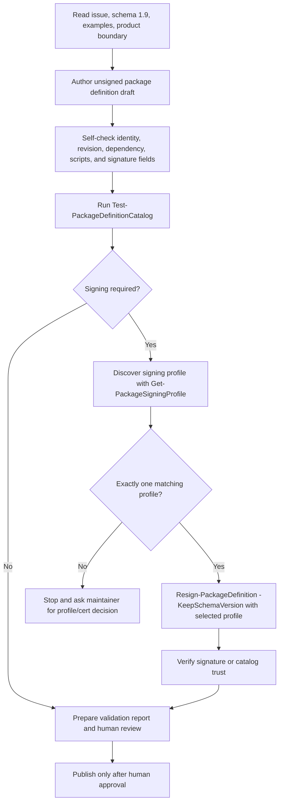
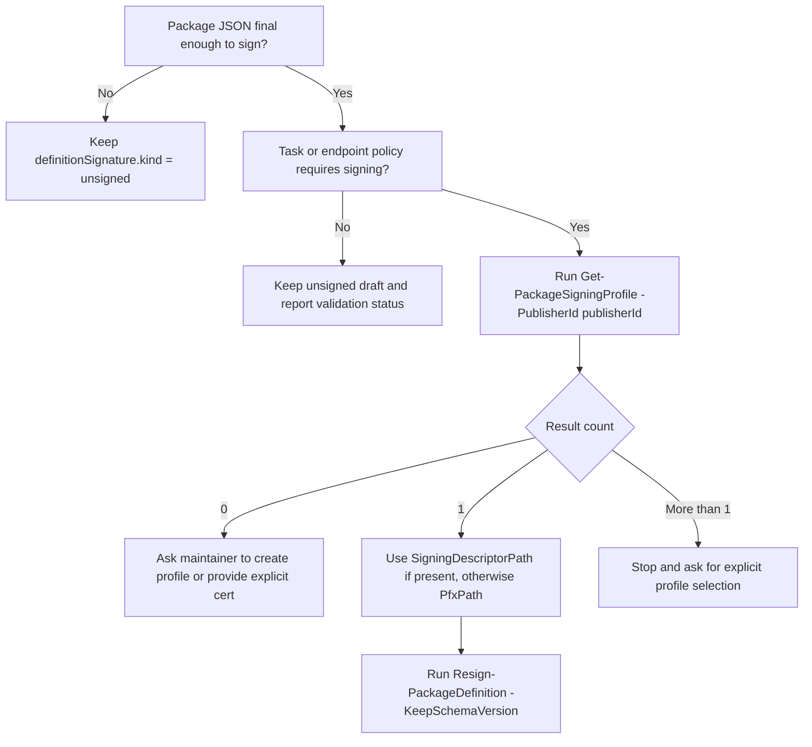
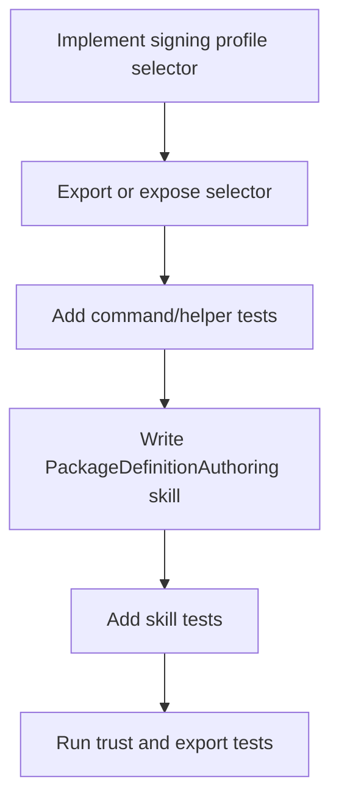
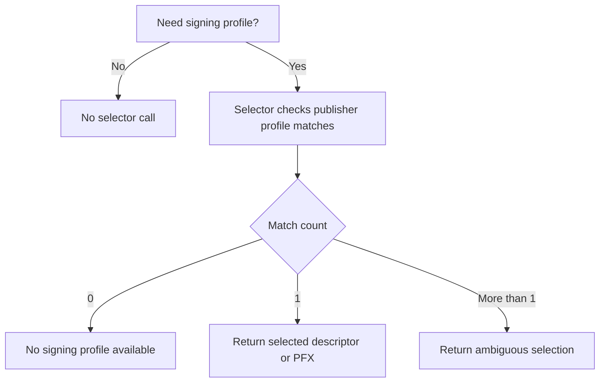

---
---

# 📌 Implementation Decision — Publish `PackageDefinitionAuthoring` Agent Skill

Source Issue:
- Title: Publish `PackageDefinitionAuthoring` agent skill (module `AgentSkills/`)
- Issue File: `src/wrk/Eigenverft.Manifested.Package/ISSUE-CATALOG-AGENT.md`
- Issue Recommendation: Prefer Option A — Ship full skill now with validation command

Output Artifact:
- Document Type: Implementation Decision
- File Name: `implementation-catalog-agent.md`
- Rule: This document is separate from the issue document and must not be appended to it.

- 🏷 Implementation Rating
  - 🚧 Workflow State: 🟢 Ready To Implement
  - 🌊 Churn: 2/4 Normal ▰▰▱▱
  - 🧭 Assessment Depth: 2/4 Focused Mapping ▰▰▱▱
  - ♻️ Reuse Need: 2/4 Explicit ▰▰▱▱
  - 🧰 Helper / Generalization Need: 2/4 Check Useful ▰▰▱▱
  - 🔁 Repetition Risk: 2/4 Watch ▰▰▱▱
  - 📍 Placement Risk: 2/4 Watch ▰▰▱▱
  - 🧬 Codebase Alignment: 4/4 Native ▰▰▰▰
  - 📏 Growth Pressure: 1/4 Small ▰▱▱▱
  - 🧯 Side-Effect Scope: 2/4 Touchpoints Likely ▰▰▱▱
  - ⚙️ Post-Implementation Action Need: 1/4 Check ▰▱▱▱
  - 🚀 Ready-State Confidence: 2/4 Conditional ▰▰▱▱
  - 👥 Stakeholder Technical Lens: 🔧 Maintainer / 🧪 Test / 📚 Documentation / 🔐 Security
  - 🧭 Diagram Need: 🗺 Workflow Useful
  - 🤖 Agent Suitability: 2/4 Guided ▰▰▱▱
  - 🚧 Implementation Readiness: 🟢 Ready

### 📝 Implementation Statement

Implement the issue recommendation by shipping a module-local external-agent skill at:

```text
src/prj/Eigenverft.Manifested.Package/AgentSkills/PackageDefinitionAuthoring.md
```

The skill teaches external agents how to author package-definition JSON safely: create unsigned drafts, self-check the schema and product boundary, run `Test-PackageDefinitionCatalog`, sign or request signing, verify signature/catalog trust, require human review, and publish only reviewable artifacts. It must reinforce the product boundary: agents create reviewable package-definition artifacts, while the engine executes trusted artifacts.

Required Outcome:
One markdown skill file under the module project, plus focused tests proving the file exists and contains the critical workflow anchors. The skill must reference schema 1.9, shipped examples, `PRODUCT-BOUNDARY.md`, validation commands, signing/trust commands, signing-profile discovery through `Get-PackageSigningProfile`, and a human review gate.

Non-Goals:
- Do not add a new signing-discovery command unless existing repo facts prove `Get-PackageSigningProfile` cannot support the required workflow.
- Do not modify dependency planner behavior, package schema, endpoint JSON, signing defaults, trust policy, catalog files, or runtime install behavior.
- Do not re-sign shipped package-definition JSON.
- Do not add README/onboarding links unless packaging or review proves the module-local skill is insufficient for this first slice.
- Do not teach agents to auto-trust unknown keys, fabricate signatures, bypass validation, or rely on runtime `-AcceptUnknownSigningKey` as a publication workflow.

### 👥 Stakeholder Technical Requirements

Maintainer / Structure:
- Provide one canonical module-local playbook for external agents that edit package-definition JSON.
- Keep signing, trust, and publication authority explicit and maintainable.
- Keep the skill in a stable project location that can be shipped with the module.

Developer Experience:
- The skill must be directly readable as markdown and command-oriented enough for an agent or maintainer to follow.
- The workflow must name the relevant commands: `Test-PackageDefinitionCatalog`, `Get-PackageSigningProfile`, `Sign-PackageDefinition`, `Resign-PackageDefinition`, `Verify-PackageDefinitionSignature`, and `Verify-PackageDefinitionCatalog`.
- The skill must state clear stop conditions instead of encouraging guessing.

Test / QA:
- Add targeted tests for file presence and critical content anchors.
- Avoid brittle tests that duplicate the entire skill text.
- Keep existing export, trust, catalog validation, and dependency behavior untouched.

Support / Diagnostics:
- The skill must guide agents toward validation reports and trust verification output before human review.
- The signing-discovery section must explain zero, one, and multiple profile results.
- Failure guidance should direct agents to ask for maintainer input when signing state is ambiguous.

Release / Rollout:
- The change should be isolated to a module documentation artifact plus tests.
- Public release notes can mention the shipped authoring skill if release notes are prepared.
- The change should be reversible by removing the skill file and its tests.

Compatibility / Migration:
- No public API, schema, or JSON wire change is expected.
- Existing schema 1.9 and signed catalog definitions remain authoritative.
- Module packaging should include the new folder without changing manifest exports unless verification proves otherwise.

Security / Trust:
- The skill must not weaken package trust boundaries.
- Agents must not fabricate signatures, hand-edit signature values, auto-trust unknown signing keys, or use public `.cer` / `.pem` files as signing certificates.
- If signing is required and no explicit `-Cert` is supplied, the skill must require `Get-PackageSigningProfile -PublisherId <publisherId>` discovery first.
- If exactly one matching signing profile is found, the skill may instruct use of `SigningDescriptorPath` when present, otherwise `PfxPath`, with `Resign-PackageDefinition -KeepSchemaVersion`.
- If zero or multiple matching signing profiles are found, the skill must stop and ask for maintainer selection or profile creation.

Performance / Cost:
- No runtime performance impact is expected.
- Validation and signing guidance should remain command-level and local; no remote service or long-running agent workflow is introduced.

User-Facing Behavior:
- No runtime package install behavior changes.
- The new visible artifact is the `PackageDefinitionAuthoring.md` skill file.
- Agent-authored package definitions should become easier to review and validate.

Documentation / Usage:
- The skill itself is the primary documentation update.
- It should reference schema 1.9 and shipped examples instead of copying the whole schema.
- README discoverability is deferred unless review requires it before release.

Tooling / Generated Artifacts:
- No generated schema, lockfile, catalog JSON, or signature artifact should change.
- No formatter or generator is expected for markdown.
- Tests should verify important content without snapshotting the full file.

### 🧭 Codebase Assessment

Assessment Depth:
- Focused Mapping.

Areas Inspected:
- `src/wrk/Eigenverft.Manifested.Package/ISSUE-CATALOG-AGENT.md`
- `src/wrk/Eigenverft.Manifested.Package/PRODUCT-BOUNDARY.md`
- `src/wrk/Eigenverft.Manifested.Package/IDEA-AGENT-SCALES-PRODUCT.md`
- `src/prj/Eigenverft.Manifested.Package/Eigenverft.Manifested.Package.psd1`
- `src/prj/Eigenverft.Manifested.Package/Schema/PackageDefinition/eigenverft-module-package-definition-1.9.schema.json`
- `src/prj/Eigenverft.Manifested.Package/Commands/Trust/Eigenverft.Manifested.Package.Cmd.PackageTrust.ps1`
- `src/prj/Eigenverft.Manifested.Package/Support/Package/Schema/Eigenverft.Manifested.Package.Package.Trust.ps1`
- `src/prj/Eigenverft.Manifested.Package.Test/Eigenverft.Manifested.Package.Package.ExportsAndState.Tests.ps1`
- `src/prj/Eigenverft.Manifested.Package/Endpoint/Defaults/Eigenverft/*.json`

Ownership Signals:
- Public signing/trust command ownership sits in `Commands/Trust/Eigenverft.Manifested.Package.Cmd.PackageTrust.ps1`.
- Signing-profile discovery internals sit in `Support/Package/Schema/Eigenverft.Manifested.Package.Package.Trust.ps1`.
- Package-definition authoring examples live in shipped endpoint JSON and schema 1.9.
- Module packaging/export surface is tested in `Eigenverft.Manifested.Package.Package.ExportsAndState.Tests.ps1`.
- `AgentSkills/` does not exist yet, so the issue-created folder would become the owner for shipped agent playbooks.

Existing Patterns:
- Public commands are exported through the module manifest and import loaders.
- Signing/trust commands already have public command names suitable for documentation.
- Tests commonly assert public surface and module state in exports/state coverage.
- Schema 1.9 already includes agent-facing hints at the root level.
- Signed JSON is not hand-edited; signing commands own signature updates.

Reusable Assets:
- `Get-PackageSigningProfile` can be reused as the signing-profile discovery function.
- `Test-PackageDefinitionCatalog` can be reused as the pre-publication validation command.
- `Sign-PackageDefinition` and `Resign-PackageDefinition` can be reused for signing instructions.
- `Verify-PackageDefinitionSignature` and `Verify-PackageDefinitionCatalog` can be reused for post-signing verification instructions.
- Schema 1.9 and shipped Eigenverft package-definition JSON can be reused as examples.

Existing Functions / Helpers Checked:
- `Get-PackageSigningProfile`
- `Get-PackageSigningProfileSummaries`
- `Resolve-PackageSigningCertificateReference`
- `Sign-PackageDefinition`
- `Resign-PackageDefinition`
- `Verify-PackageDefinitionSignature`
- `Verify-PackageDefinitionCatalog`
- `Test-PackageDefinitionCatalog`

General-Purpose Candidate:
- A new general-purpose signing discovery function is not currently justified because `Get-PackageSigningProfile` already exposes the needed profile discovery state.
- A future helper or command could be reconsidered if user workflows need deterministic automatic profile selection beyond documentation.

Repetition Signals:
- Schema rules, signing/trust semantics, and validation details already exist in schema files, command help, and tests.
- The skill could drift if it repeats full schema or trust implementation details.
- The signing-discovery decision tree needs enough specificity to avoid unsafe agent behavior, but not a second implementation of signing logic.

Workflow Signals:
- The authoring flow has a clear sequence: draft, validate, discover signer, sign or stop, verify, review, publish.
- The signing-profile branch has meaningful zero/one/multiple result behavior and benefits from a logic tree.

Logic Signals:
- Signing is conditional on task/policy needs.
- Profile discovery result count controls whether the agent can proceed.
- Ambiguous signing profile state must stop instead of guessing.

Side-Effect Signals:
- Tests need a small update.
- README/onboarding discoverability might be a later touchpoint.
- Module manifest changes are not expected but should be checked.
- No generated files, schema, signed catalog JSON, or runtime commands should change.

Alignment Signals:
- The issue aligns with `PRODUCT-BOUNDARY.md`, which supports LLM-maintained package JSON with validation and human review before trust/install.
- Existing command names already map well to a safe authoring workflow.
- Keeping the skill inside `src/prj/Eigenverft.Manifested.Package/` matches the issue's shipped-module intent.

Constraints Found:
- Signing material may not exist on every maintainer or CI machine, so the skill must include stop conditions rather than assume local private keys.
- Public `.cer` / `.pem` files are verification/trust material, not signing material.
- `Invoke-Package -AcceptUnknownSigningKey` is a runtime trust escape hatch and should not be promoted as an authoring or publication path.
- Existing signed catalog JSON should not be touched in this task.

Debt / Risk Signals:
- Agent skill discoverability outside the module project is not solved yet.
- There is no existing `AgentSkills/` convention in the module, so a small placement test is useful.
- If the skill becomes too broad, it may duplicate schema and command documentation.

Unknowns:
- Whether release packaging automatically includes non-code markdown under the module project has not been verified in this implementation document.
- Whether external agent environments will discover module-local skills without a README or symlink strategy remains outside this first slice.

Assessment Judgement:
The codebase already has the core validation, signing, trust, and signing-profile discovery commands needed for the skill. The implementation can stay as a documentation artifact plus focused tests. The main care point is to keep the skill precise enough for safe agent behavior while avoiding duplicated schema or signing implementation prose.

### ♻️ Reuse Map

Reuse Directly:
- `Get-PackageSigningProfile` for signing-profile discovery.
- `Test-PackageDefinitionCatalog` for pre-signing and pre-publication validation.
- `Sign-PackageDefinition` and `Resign-PackageDefinition` for signing instructions.
- `Verify-PackageDefinitionSignature` and `Verify-PackageDefinitionCatalog` for verification instructions.
- `PRODUCT-BOUNDARY.md` for the engine/agent responsibility boundary.
- Schema 1.9 and shipped Eigenverft JSON as examples.

Extend:
- Extend exports/state test coverage with skill file presence and content-anchor assertions.
- Extend the module project tree with a new `AgentSkills/` folder.

Compose:
- Compose an authoring workflow from existing validation, signing-profile discovery, signing, verification, and human review steps.
- Compose signing guidance from `Get-PackageSigningProfile` output fields and `Resign-PackageDefinition -KeepSchemaVersion`.

Avoid Duplicating:
- Do not duplicate full JSON schema rules in the skill.
- Do not duplicate signing or catalog verification implementation details.
- Do not duplicate future supply-chain policy work from `TODO-SUPPLY-CHAIN.md`.
- Do not create a second signing-profile discovery surface unless a real gap is found.

Not Suitable:
- `Invoke-Package -AcceptUnknownSigningKey`
  Reason: It is runtime trust handling, not safe authoring or publication guidance.
- Public certificate files such as `.cer` or `.pem` as signing material
  Reason: They cannot sign package definitions and should not be presented as signing inputs.
- New catalog maintenance commands
  Reason: They are idea-level future work and not required for this skill slice.

Reuse Judgement:
The repo has enough reusable command surface to implement the skill without new runtime code. Reuse should be documentation-level composition: name existing commands, define safe decision points, and link to authoritative schema/examples.

### 🧰 Shared Helper / Generalization Check

Existing Functions Checked:
- `Get-PackageSigningProfile`
  Result: Reuse.
- `Resign-PackageDefinition`
  Result: Reuse.
- `Test-PackageDefinitionCatalog`
  Result: Reuse.
- `Verify-PackageDefinitionCatalog`
  Result: Reuse.

Support Helpers Checked:
- `Get-PackageSigningProfileSummaries`
  Result: Reuse indirectly through the public command.
- `Resolve-PackageSigningCertificateReference`
  Result: Reuse indirectly through signing commands.
- Schema 1.9 root agent hints
  Result: Reuse by reference rather than copying.

General-Purpose Function Candidate:
- No.

Candidate Responsibility:
- If future evidence requires one, a helper could own deterministic signing-profile selection for a publisher and emit zero/one/multiple-match verdicts. That helper is not needed in this first implementation because the public discovery command already exposes the data.

Candidate Location:
- Future signing-profile selection logic would naturally belong near signing profile support in `Support/Package/Schema/Eigenverft.Manifested.Package.Package.Trust.ps1`, with a public wrapper only if a user-facing command is justified.

Why Generalize:
- Generalization would help only if multiple commands need the same profile-selection decision tree or if agents repeatedly misuse raw profile output.

Why Keep Local:
- The current implementation is a markdown skill. The decision tree can be stated locally without creating new command surface or behavior.

Decision:
- Reuse existing.

Neutrality Note:
- A dedicated selector could reduce ambiguity later, but adding it now would expand API surface without proving that `Get-PackageSigningProfile` is insufficient.

### 🔁 Repetition Check

Repeated Logic Found:
- Validation command names and signing command names are already documented in command help and tests.
- Schema 1.9 contains authoring hints.
- Shipped JSON examples already demonstrate current package-definition shape.

Potential Duplicate Implementation:
- The skill could duplicate full schema constraints, trust internals, or signing-file resolution rules if written too broadly.

Second-Time / Third-Time Rule:
- This is the first module-local agent skill. It should establish a concise pattern but not extract a generalized skill framework yet.

Recommended Handling:
- Reuse existing documentation and command surfaces by reference.
- Keep the skill focused and avoid reproducing long schema or signing internals.
- Add focused content-anchor tests instead of full text snapshots.

Reason:
Small local repetition of command names is acceptable because the skill is a workflow playbook. Repeating authoritative schema and signing implementation details would create maintenance drift and should be avoided.

---

### 🧩 Implementation Options

#### Option A — Ship Full Skill Using Existing Signing Discovery (Direct Implementation Option)

- 🧾 Implementation Option Profile
  - 🧭 Resolution: 🟢 Full
  - 🛠 Option Effort: 2/4 Moderate ▰▰▱▱
  - 🧠 Option Complexity: 2/4 Moderate ▰▰▱▱
  - ♻️ Reuse Fit: 4/4 Strong ▰▰▰▰
  - 🧰 Helper Fit: 3/4 Existing Helper ▰▰▰▱
  - 🔁 Repetition Control: 3/4 Controlled ▰▰▰▱
  - 🧬 Codebase Alignment: 4/4 Native ▰▰▰▰
  - 📏 Growth Impact: 1/4 Small ▰▱▱▱
  - 🔮 Future Impact: 2/4 Helpful ▰▰▱▱
  - 🧯 Side-Effect Scope: 2/4 Touchpoints Likely ▰▰▱▱
  - ⚙️ Post-Implementation Action Need: 1/4 Check ▰▱▱▱
  - 🚀 Ready-State Confidence: 2/4 Conditional ▰▰▱▱
  - 🧭 Diagram Need: 🗺 Workflow Useful
  - 🗺 Workflow Clarity: 3/4 Clear ▰▰▰▱
  - 🌳 Logic Tree Clarity: 3/4 Clear ▰▰▰▱
  - 📍 Placement Fit: 4/4 Native ▰▰▰▰
  - 👥 Stakeholder Fit: 3/4 Strong ▰▰▰▱
  - ↩️ Reversibility: 4/4 Easy ▰▰▰▰
  - 🤖 Agent Difficulty: 2/4 Guided ▰▰▱▱

Description:
Create `AgentSkills/PackageDefinitionAuthoring.md` and write the full authoring workflow now. The skill uses existing validation, signing, trust, and signing-profile discovery commands. It explicitly documents how agents should discover signing profiles before calling `Resign-PackageDefinition`, including the single-match rule. Tests verify the file and critical workflow anchors.

Codebase Basis:
The repository already exports `Get-PackageSigningProfile`, `Test-PackageDefinitionCatalog`, `Resign-PackageDefinition`, and catalog verification commands. Schema 1.9 and shipped signed Eigenverft examples already exist. The module does not yet have an `AgentSkills/` folder, so the implementation can add one cleanly.

Placement:
The skill goes in `src/prj/Eigenverft.Manifested.Package/AgentSkills/PackageDefinitionAuthoring.md` because the issue requests a shipped module-local skill. Tests go in `src/prj/Eigenverft.Manifested.Package.Test/Eigenverft.Manifested.Package.Package.ExportsAndState.Tests.ps1` because this is module surface/packaging content, not runtime execution behavior.

Reuse:
This option reuses `Get-PackageSigningProfile` as the existing discovery function and references current validation and trust commands. It reuses schema 1.9 and shipped package definitions as authoritative examples.

Helper / Generalization:
No new helper is needed. The skill should describe a decision tree around existing command output. A future selector helper remains possible if several code paths later need the same automatic profile selection.

Repetition Control:
The skill names commands and workflow stages but avoids copying full schema definitions or signing internals. Tests assert critical anchors rather than snapshotting the whole document.

Workflow / Logic Model:
- 🧭 Diagram Need: 🗺 Workflow Useful
- 🗺 Workflow Clarity: 3/4 Clear ▰▰▰▱
- 🌳 Logic Tree Clarity: 3/4 Clear ▰▰▰▱

Workflow:



Logic Tree:



Codebase Alignment:
- 🧬 Codebase Alignment: 4/4 Native ▰▰▰▰

Alignment Reason:
This option follows the current command surface and module organization. It creates a documentation artifact without changing runtime, schema, signing, or catalog behavior. It uses the existing public signing profile discovery command instead of adding overlapping API surface.

Growth and Future Impact:
- 📏 Growth Impact: 1/4 Small ▰▱▱▱
- 🔮 Future Impact: 2/4 Helpful ▰▰▱▱

Impact Reason:
The only growth is one markdown skill and a small test. Future impact is positive because external agents get a bounded workflow that can later be linked from README or copied into agent-specific locations.

Side Effects and Follow-Up Updates:
- 🧯 Side-Effect Scope: 2/4 Touchpoints Likely ▰▰▱▱
- ⚙️ Post-Implementation Action Need: 1/4 Check ▰▱▱▱

Touchpoints:
- New `AgentSkills/` folder.
- Exports/state tests.
- Optional future README/onboarding link.
- Possible release note mention.

Side-Effect Reason:
The implementation adds a shipped documentation artifact and verification tests. It does not require command, schema, signed JSON, or generated artifact changes. Discoverability outside the module remains a follow-up decision.

Repository Ready-State:
- 🚀 Ready-State Confidence: 2/4 Conditional ▰▰▱▱

Ready-State Reason:
The repository can be ready for local test after the skill file is added, targeted tests pass, and `git diff --check` passes. Public release readiness also needs normal full-suite/release packaging checks and maintainer wording review.

Stakeholder Technical Fit:
This option gives maintainers a canonical agent playbook, gives agents actionable command guidance, keeps trust boundaries explicit, and adds test coverage for the shipped artifact.

Solves:
- Creates the requested module-local skill.
- Documents validation before signing or publication.
- Documents signing-profile discovery with `Get-PackageSigningProfile`.
- Keeps agents inside the product boundary.
- Adds focused regression coverage for skill presence and core anchors.

Leaves Open:
- README or PSGallery discoverability.
- Agent-environment copy/symlink strategy.
- Future catalog maintenance commands.

Risks:
- Skill wording could drift from commands over time.
- Module packaging of non-code markdown should be verified before release.
- External agents may not discover the skill without future onboarding links.

Later Cost:
- If several agent skills are added later, a shared `AgentSkills/README.md` or packaging convention may become useful.

---

#### Option B — Add New Signing Discovery Command Before The Skill (Discovery Option)

- 🧾 Implementation Option Profile
  - 🧭 Resolution: 🟡 Partial
  - 🛠 Option Effort: 3/4 Large ▰▰▰▱
  - 🧠 Option Complexity: 3/4 Complex ▰▰▰▱
  - ♻️ Reuse Fit: 2/4 Some ▰▰▱▱
  - 🧰 Helper Fit: 2/4 New Helper Likely ▰▰▱▱
  - 🔁 Repetition Control: 2/4 Watch ▰▰▱▱
  - 🧬 Codebase Alignment: 2/4 Compatible ▰▰▱▱
  - 📏 Growth Impact: 3/4 Heavy ▰▰▰▱
  - 🔮 Future Impact: 2/4 Unclear ▰▰▱▱
  - 🧯 Side-Effect Scope: 3/4 Cross-Cutting ▰▰▰▱
  - ⚙️ Post-Implementation Action Need: 3/4 Required ▰▰▰▱
  - 🚀 Ready-State Confidence: 1/4 Low ▰▱▱▱
  - 🧭 Diagram Need: 🗺 Workflow Useful
  - 🗺 Workflow Clarity: 2/4 Moderate ▰▰▱▱
  - 🌳 Logic Tree Clarity: 3/4 Clear ▰▰▰▱
  - 📍 Placement Fit: 2/4 Watch ▰▰▱▱
  - 👥 Stakeholder Fit: 2/4 Mixed ▰▰▱▱
  - ↩️ Reversibility: 2/4 Moderate ▰▰▱▱
  - 🤖 Agent Difficulty: 3/4 Needs Care ▰▰▰▱

Description:
Add a new command or helper that wraps signing-profile discovery and returns a deterministic sign-or-stop verdict, then write the skill against that new surface. This could make the agent workflow more explicit but expands the command/support layer before the skill is created.

Codebase Basis:
The codebase already has signing-profile inventory and certificate reference resolution internals. A new helper could compose those pieces, but `Get-PackageSigningProfile` already exposes enough information for the documented workflow.

Placement:
A private helper would belong near signing profile support in `Support/Package/Schema/Eigenverft.Manifested.Package.Package.Trust.ps1`; a public command would belong near existing trust commands in `Commands/Trust/Eigenverft.Manifested.Package.Cmd.PackageTrust.ps1`.

Reuse:
This option would reuse profile inventory internals and signing command behavior, but it would create a new wrapper around existing discovery output.

Helper / Generalization:
A general-purpose selector helper may make sense later if multiple runtime or authoring commands need identical profile-selection logic. For a skill-only slice, it is not proven necessary.

Repetition Control:
The command could centralize the zero/one/multiple profile decision tree, but it risks duplicating `Get-PackageSigningProfile` concepts and tests.

Workflow / Logic Model:
- 🧭 Diagram Need: 🗺 Workflow Useful
- 🗺 Workflow Clarity: 2/4 Moderate ▰▰▱▱
- 🌳 Logic Tree Clarity: 3/4 Clear ▰▰▰▱

Workflow:



Logic Tree:



Codebase Alignment:
- 🧬 Codebase Alignment: 2/4 Compatible ▰▰▱▱

Alignment Reason:
The helper could fit near existing trust code, but it would add command/support surface before the need is demonstrated. That is less aligned than using the existing exported discovery command.

Growth and Future Impact:
- 📏 Growth Impact: 3/4 Heavy ▰▰▰▱
- 🔮 Future Impact: 2/4 Unclear ▰▰▱▱

Impact Reason:
This option adds code, command/help/export tests, and trust behavior coverage. Future benefit depends on whether multiple workflows need a selector rather than raw profile discovery.

Side Effects and Follow-Up Updates:
- 🧯 Side-Effect Scope: 3/4 Cross-Cutting ▰▰▰▱
- ⚙️ Post-Implementation Action Need: 3/4 Required ▰▰▰▱

Touchpoints:
- Trust command file.
- Trust support helper file.
- Module manifest exports if public.
- Import loaders if public.
- Command help/tests.
- Agent skill file/tests.

Side-Effect Reason:
Adding a command or helper changes more than documentation. It can affect public command surface, tests, and release notes, so it needs broader verification than the issue requires.

Repository Ready-State:
- 🚀 Ready-State Confidence: 1/4 Low ▰▱▱▱

Ready-State Reason:
The repository could be ready after broader trust/export/full-suite testing, but this path increases risk and delays the actual agent skill.

Stakeholder Technical Fit:
It may help agents by simplifying profile selection, but it adds maintainer burden and more public behavior before confirming the existing command is inadequate.

Solves:
- Could centralize signing-profile selection.
- Could give agents a single command for sign-or-stop decisions.

Leaves Open:
- Still needs the skill document.
- Still needs discoverability decisions.
- Still needs tests for both new behavior and skill content.

Risks:
- Duplicates existing discovery semantics.
- Adds avoidable public API surface.
- Requires broader release notes and compatibility thinking.

Later Cost:
- Maintaining two discovery concepts may confuse users and tests if both remain public.

---

#### Option C — Minimal Skill With Deferred Signing Discovery (Defer Option)

- 🧾 Implementation Option Profile
  - 🧭 Resolution: 🟡 Partial
  - 🛠 Option Effort: 1/4 Small ▰▱▱▱
  - 🧠 Option Complexity: 1/4 Simple ▰▱▱▱
  - ♻️ Reuse Fit: 2/4 Some ▰▰▱▱
  - 🧰 Helper Fit: 1/4 Not Needed ▰▱▱▱
  - 🔁 Repetition Control: 2/4 Watch ▰▰▱▱
  - 🧬 Codebase Alignment: 3/4 Compatible ▰▰▰▱
  - 📏 Growth Impact: 1/4 Small ▰▱▱▱
  - 🔮 Future Impact: 1/4 Limited ▰▱▱▱
  - 🧯 Side-Effect Scope: 1/4 Local ▰▱▱▱
  - ⚙️ Post-Implementation Action Need: 1/4 Check ▰▱▱▱
  - 🚀 Ready-State Confidence: 2/4 Conditional ▰▰▱▱
  - 🧭 Diagram Need: 📝 Optional
  - 🗺 Workflow Clarity: 2/4 Moderate ▰▰▱▱
  - 🌳 Logic Tree Clarity: 1/4 Simple ▰▱▱▱
  - 📍 Placement Fit: 3/4 Compatible ▰▰▰▱
  - 👥 Stakeholder Fit: 1/4 Weak ▰▱▱▱
  - ↩️ Reversibility: 4/4 Easy ▰▰▰▰
  - 🤖 Agent Difficulty: 1/4 Easy ▰▱▱▱

Description:
Create a short skill that names validation and signing commands but defers detailed signing-profile discovery guidance. The implementation would be very small, but it would not address the user's requested discovery behavior for `Resign-PackageDefinition`.

Codebase Basis:
The module can easily host a markdown skill and tests. Existing commands can be named without deeper guidance.

Placement:
The skill still belongs under `src/prj/Eigenverft.Manifested.Package/AgentSkills/`, with a small exports/state test.

Reuse:
This option lightly reuses existing command names but does not leverage profile discovery enough.

Helper / Generalization:
No helper is needed.

Repetition Control:
The document stays short, but it avoids only by omitting important workflow detail.

Workflow / Logic Model:
- 🧭 Diagram Need: 📝 Optional
- 🗺 Workflow Clarity: 2/4 Moderate ▰▰▱▱
- 🌳 Logic Tree Clarity: 1/4 Simple ▰▱▱▱

Workflow:
Not applicable.

Logic Tree:
Not applicable.

Codebase Alignment:
- 🧬 Codebase Alignment: 3/4 Compatible ▰▰▰▱

Alignment Reason:
The placement and test pattern fit the codebase, but the content would be weaker than the issue recommendation and user clarification.

Growth and Future Impact:
- 📏 Growth Impact: 1/4 Small ▰▱▱▱
- 🔮 Future Impact: 1/4 Limited ▰▱▱▱

Impact Reason:
The immediate code growth is small. Future impact is limited because signing ambiguity would remain and likely require another edit.

Side Effects and Follow-Up Updates:
- 🧯 Side-Effect Scope: 1/4 Local ▰▱▱▱
- ⚙️ Post-Implementation Action Need: 1/4 Check ▰▱▱▱

Touchpoints:
- New skill file.
- Minimal test.
- Likely follow-up issue for signing-profile discovery wording.

Side-Effect Reason:
This option touches fewer files but leaves a known workflow gap, so the side effect is future churn rather than current code churn.

Repository Ready-State:
- 🚀 Ready-State Confidence: 2/4 Conditional ▰▰▱▱

Ready-State Reason:
The repository can pass tests, but the issue outcome would be incomplete because the skill would not guide safe signing discovery.

Stakeholder Technical Fit:
This option is easy to implement but weak for maintainers and agents because it leaves a known signing workflow ambiguity.

Solves:
- Creates a module-local skill file.
- Provides minimal validation/signing command references.

Leaves Open:
- Signing-profile discovery guidance.
- Zero/one/multiple profile behavior.
- Practical `Resign-PackageDefinition` input selection.

Risks:
- Agents may guess signing material.
- Public `.cer` files may be confused with signing certs.
- Another documentation fix will be needed soon.

Later Cost:
- Follow-up edits will need to revisit the same skill and tests.

---

### 💶 Implementation Fit Assessment

- 💎 Fit Type: Reuse / Extension Fit
- 🧭 Fit Direction: Prefer the path that composes existing command surfaces into an agent-safe workflow without adding new runtime behavior.
- 🧾 Fit Mechanism: The best-fitting implementation creates a small module-local skill, reuses `Get-PackageSigningProfile` as the discovery surface, avoids duplicated signing logic, and adds tests for the shipped artifact.
- ⚖️ Option Fit Summary:
  - Option A — Ship Full Skill Using Existing Signing Discovery (Direct Implementation Option)
    - 🧭 Resolution: 🟢 Full
    - 🛠 Option Effort: 2/4 Moderate ▰▰▱▱
    - 🧠 Option Complexity: 2/4 Moderate ▰▰▱▱
    - ♻️ Reuse Fit: 4/4 Strong ▰▰▰▰
    - 🧰 Helper Fit: 3/4 Existing Helper ▰▰▰▱
    - 🔁 Repetition Control: 3/4 Controlled ▰▰▰▱
    - 🧬 Codebase Alignment: 4/4 Native ▰▰▰▰
    - 📏 Growth Impact: 1/4 Small ▰▱▱▱
    - 🔮 Future Impact: 2/4 Helpful ▰▰▱▱
    - 🧯 Side-Effect Scope: 2/4 Touchpoints Likely ▰▰▱▱
    - ⚙️ Post-Implementation Action Need: 1/4 Check ▰▱▱▱
    - 🚀 Ready-State Confidence: 2/4 Conditional ▰▰▱▱
    - 🧭 Diagram Need: 🗺 Workflow Useful
    - 🗺 Workflow Clarity: 3/4 Clear ▰▰▰▱
    - 🌳 Logic Tree Clarity: 3/4 Clear ▰▰▰▱
    - 📍 Placement Fit: 4/4 Native ▰▰▰▰
    - 👥 Stakeholder Fit: 3/4 Strong ▰▰▰▱
    - 🤖 Agent Difficulty: 2/4 Guided ▰▰▱▱
    - 🧾 Decision Note: Strong fit because it implements the issue outcome, uses existing discovery, and keeps trust boundaries explicit with low code churn.
  - Option B — Add New Signing Discovery Command Before The Skill (Discovery Option)
    - 🧭 Resolution: 🟡 Partial
    - 🛠 Option Effort: 3/4 Large ▰▰▰▱
    - 🧠 Option Complexity: 3/4 Complex ▰▰▰▱
    - ♻️ Reuse Fit: 2/4 Some ▰▰▱▱
    - 🧰 Helper Fit: 2/4 New Helper Likely ▰▰▱▱
    - 🔁 Repetition Control: 2/4 Watch ▰▰▱▱
    - 🧬 Codebase Alignment: 2/4 Compatible ▰▰▱▱
    - 📏 Growth Impact: 3/4 Heavy ▰▰▰▱
    - 🔮 Future Impact: 2/4 Unclear ▰▰▱▱
    - 🧯 Side-Effect Scope: 3/4 Cross-Cutting ▰▰▰▱
    - ⚙️ Post-Implementation Action Need: 3/4 Required ▰▰▰▱
    - 🚀 Ready-State Confidence: 1/4 Low ▰▱▱▱
    - 🧭 Diagram Need: 🗺 Workflow Useful
    - 🗺 Workflow Clarity: 2/4 Moderate ▰▰▱▱
    - 🌳 Logic Tree Clarity: 3/4 Clear ▰▰▰▱
    - 📍 Placement Fit: 2/4 Watch ▰▰▱▱
    - 👥 Stakeholder Fit: 2/4 Mixed ▰▰▱▱
    - 🤖 Agent Difficulty: 3/4 Needs Care ▰▰▰▱
    - 🧾 Decision Note: Possible later if discovery proves insufficient, but too broad for the current skill-centered issue.
  - Option C — Minimal Skill With Deferred Signing Discovery (Defer Option)
    - 🧭 Resolution: 🟡 Partial
    - 🛠 Option Effort: 1/4 Small ▰▱▱▱
    - 🧠 Option Complexity: 1/4 Simple ▰▱▱▱
    - ♻️ Reuse Fit: 2/4 Some ▰▰▱▱
    - 🧰 Helper Fit: 1/4 Not Needed ▰▱▱▱
    - 🔁 Repetition Control: 2/4 Watch ▰▰▱▱
    - 🧬 Codebase Alignment: 3/4 Compatible ▰▰▰▱
    - 📏 Growth Impact: 1/4 Small ▰▱▱▱
    - 🔮 Future Impact: 1/4 Limited ▰▱▱▱
    - 🧯 Side-Effect Scope: 1/4 Local ▰▱▱▱
    - ⚙️ Post-Implementation Action Need: 1/4 Check ▰▱▱▱
    - 🚀 Ready-State Confidence: 2/4 Conditional ▰▰▱▱
    - 🧭 Diagram Need: 📝 Optional
    - 🗺 Workflow Clarity: 2/4 Moderate ▰▰▱▱
    - 🌳 Logic Tree Clarity: 1/4 Simple ▰▱▱▱
    - 📍 Placement Fit: 3/4 Compatible ▰▰▰▱
    - 👥 Stakeholder Fit: 1/4 Weak ▰▱▱▱
    - 🤖 Agent Difficulty: 1/4 Easy ▰▱▱▱
    - 🧾 Decision Note: Low churn but leaves the exact signing-discovery concern unresolved.
- ✅ Good Implementation Result: The module ships a concise agent authoring skill that tells agents how to validate, discover signing profiles, sign safely, verify trust, stop on ambiguity, and require human review, with tests proving the artifact and critical workflow language exist.

---

### 🏁 Implementation Recommendation

- [2026-06-03 00:00 | Author: Codex | Recommendation: Choose Option A — Ship Full Skill Using Existing Signing Discovery | Support: 3/3 Well Supported ▰▰▰]

Reasoning:
Option A implements the issue recommendation while matching the repo facts found during assessment. The repository already has the requested discovery function: `Get-PackageSigningProfile`. The skill should teach agents to use it before `Resign-PackageDefinition`, including the single-result rule. Adding a new signing discovery command now would duplicate the existing surface without evidence that the current command is insufficient. A minimal skill would leave the user's signing-discovery concern open.

Required Checks:
Before implementation starts, confirm `AgentSkills/` still does not exist or can be created cleanly, confirm `Get-PackageSigningProfile` is still exported, and confirm the exports/state test file remains the right test placement. Before completion, run targeted exports/state tests and `git diff --check`.

Side-Effect Requirement:
Confirm no manifest export, schema, signed JSON, signing default, or runtime install diff is introduced. Add only the skill artifact and focused tests unless verification proves package metadata needs an update.

Ready-State Statement:
Completing Option A, targeted tests, diff check, and maintainer wording review leaves the repository ready for local test. Public release readiness should also include normal full-suite and packaging verification because this is a shipped module artifact.

### 📍 Final Placement Decision

Chosen Placement:
- `src/prj/Eigenverft.Manifested.Package/AgentSkills/PackageDefinitionAuthoring.md`
- `src/prj/Eigenverft.Manifested.Package.Test/Eigenverft.Manifested.Package.Package.ExportsAndState.Tests.ps1`

Reason:
The skill belongs in the module project because the issue asks for a shipped `AgentSkills/` artifact. Exports/state tests are the nearest existing module-surface tests and can verify the artifact without mixing the change into runtime behavior tests.

Rejected Placement:
- `src/wrk/Eigenverft.Manifested.Package/`
  Reason: Work docs are not shipped with the module and would not satisfy the issue's module-local skill requirement.
- `README.md`
  Reason: README discoverability can link to the skill later, but it is not the artifact owner.
- `Commands/Trust/`
  Reason: No new command is needed in the selected first slice.

New Files:
- Yes.

New File Reason:
A new skill file is the requested artifact. The `AgentSkills/` folder does not exist yet, so a new folder/file is appropriate and keeps the skill separate from runtime PowerShell code.

### 🌊 Churn and 📏 Growth Control

Churn Classification:
- Normal.

Growth Watch:
- `AgentSkills/PackageDefinitionAuthoring.md` could grow too broad if it copies schema or trust internals.
- `Eigenverft.Manifested.Package.Package.ExportsAndState.Tests.ps1` should not become a full markdown snapshot test.

Extraction Trigger:
- Stop and propose a separate task if implementing the skill requires a new public signing command, manifest packaging changes, schema updates, or catalog JSON changes.
- Stop and propose a shared `AgentSkills/README.md` only if multiple skills are added or discoverability becomes a release requirement.

Allowed Growth:
- One new markdown skill file.
- One focused test context or assertions for file existence and critical anchors.
- Optional release note text after implementation if the release process asks for it.

Not Allowed:
- New runtime signing behavior.
- New schema or catalog JSON changes.
- Full schema duplication inside the skill.
- Auto-selection among multiple signing profiles.
- Trust bypass or unknown-key acceptance guidance for publication.

### 🧯 Side Effects, Touchpoints, and Follow-Up Updates

Purpose:
This section is about possible side effects of the implementation, not about the issue itself.

Side-Effect Scope:
- Touchpoints Likely.

Documentation Touchpoints:
- README: Not needed.
- User Docs: Update needed.
- Developer Docs: Not needed.
- Internal Docs: Not needed.
- API / CLI Examples: Not needed.
- Changelog / Release Notes: Unknown.

Repository Touchpoints:
- Tests / Fixtures / Snapshots: Update needed.
- Generated Files / Schemas: Not needed.
- Build Tools / Task Runners: Not needed.
- Package Metadata / Manifests / Lockfiles: Unknown.
- CI / Workflow Configuration: Not needed.
- Migration / Compatibility Notes: Not needed.

Internal Post-Implementation Actions:
- Run targeted exports/state Pester tests.
- Run `git diff --check`.
- Confirm no unintended schema, endpoint JSON, or signing diffs exist.

Side-Effect Notes:
The skill is user-facing documentation for agents and should be tested as a shipped artifact. README and release note updates are useful but not required for the first implementation slice. Package metadata is expected to need no change because the manifest uses an empty `FileList`, but release packaging should verify the file is included before public release.

Required Follow-Up Updates:
- Add or update tests that verify the skill file exists and contains critical workflow anchors.

Deferred Follow-Up Updates:
- README or PSGallery discoverability link.
  Reason: The issue marks module-local skill shipping as the required artifact; discoverability links can follow after the first skill lands.
- Cursor/Codex/team copy strategy for external agent skill discovery.
  Reason: The module artifact should exist first; agent-environment distribution is a separate decision.

Side-Effect Readiness:
- Ready after named test updates and verification checks.

### ⚙️ Post-Implementation Actions

Required Actions After Code Change:
- Run targeted Pester for exports/state tests.
- Run `git diff --check`.
- Run full module Pester before public release or prerelease movement.

Action Order:
1. Create the `AgentSkills/PackageDefinitionAuthoring.md` file.
2. Add focused exports/state tests.
3. Run targeted exports/state Pester tests.
4. Run `git diff --check`.
5. Run full module Pester if preparing a prerelease or public release.

Action Owner:
- Agent for implementation and initial verification.
- Maintainer for final wording review and release packaging/release note decisions.

Blocking Actions:
- Targeted tests must pass before this implementation is considered complete.
- Full suite and packaging verification block public release readiness, not local implementation completion.

Action Verification:
- Pester output verifies tests.
- `git diff --check` verifies whitespace.
- `git diff --name-only` verifies only intended files changed.

No-Action Reason:
- No generator, schema signer, catalog re-signing, package-definition migration, or build asset refresh is needed because this slice adds a markdown skill and tests only.

### 🧪 Verification Plan

Automated Checks:
- `Invoke-Pester -Path src/prj/Eigenverft.Manifested.Package.Test/Eigenverft.Manifested.Package.Package.ExportsAndState.Tests.ps1`
- `git diff --check`

Manual Checks:
- Read the skill end to end for unsafe agent guidance.
- Confirm the signing-discovery recipe uses `Get-PackageSigningProfile`.
- Confirm the skill stops on zero or multiple signing-profile matches.
- Confirm the skill says agents must not fabricate signatures, hand-edit signatures, auto-trust unknown keys, or use public `.cer` / `.pem` files as signing certs.

Regression Coverage:
- Existing command export surface remains unchanged.
- Existing signing/trust commands remain unchanged.
- Existing catalog validation behavior remains unchanged.
- Existing schema 1.9 and shipped package-definition JSON remain unchanged.

Side-Effect Verification:
- Confirm no schema or signed JSON diff exists.
- Confirm no `FunctionsToExport` update is needed.
- Confirm tests cover the new skill file's existence and core anchors.
- Confirm release packaging includes the skill before public release.

Ready-State Verification:
- Targeted tests pass.
- `git diff --check` passes.
- Worktree contains only the intended skill/test files for the implementation pass.
- Full module Pester passes before release/prerelease movement.

Not Verified:
- External Cursor/Codex automatic skill discovery is not verified in this slice because the selected artifact is a module-local markdown file.
- Release packaging inclusion is not verified by this planning document and should be checked during implementation or release preparation.

### 🚀 Repository Ready-State and Release Readiness

Ready-State Target:
- Ready for local test.

Ready-State Confidence:
- Conditional.

Why This Issue Reaches Ready State:
The implementation is a contained module documentation artifact plus focused tests. It does not change runtime behavior, schema, signing defaults, or shipped catalog JSON. Once the artifact exists, tests verify critical anchors, and diff checks pass, the repository remains coherent for local test. Public release readiness depends on the normal full-suite and packaging checks.

Required Before Test Branch:
- Targeted exports/state test passes.
- `git diff --check` passes.
- Maintainer accepts the skill wording.

Required Before Prerelease Branch:
- Full module Pester suite passes.
- Release packaging check confirms `AgentSkills/PackageDefinitionAuthoring.md` is included in the module artifact.
- Release notes mention the new skill if the release process requires user-facing notes.

Known Release Blockers:
- None known for local test.
- Public release should wait for full-suite and packaging verification.

Release / Prerelease Notes:
- Mention that the module now ships a `PackageDefinitionAuthoring` agent skill for safe package-definition JSON authoring, validation, signing, and review.

Rollback / Reversal Notes:
- Remove `src/prj/Eigenverft.Manifested.Package/AgentSkills/PackageDefinitionAuthoring.md` and its test assertions.

Final Ready-State Statement:
After the implementation, verification, required touchpoint updates, and post-implementation actions listed above are complete, the repository is ready for local test because the change is isolated to a module-local agent skill and tests verify its presence and safety-critical workflow anchors.

### 🛠 Implementation Plan

Steps:
1. Confirm `src/prj/Eigenverft.Manifested.Package/AgentSkills/` does not already contain a conflicting skill.
2. Create `src/prj/Eigenverft.Manifested.Package/AgentSkills/PackageDefinitionAuthoring.md`.
3. Include sections for when to use the skill, product boundary, required inputs to read, authoring workflow, validation workflow, signing-profile discovery, signing, verification, human review, publish/test guidance, common mistakes, and out-of-scope work.
4. In the signing section, require `Get-PackageSigningProfile -PublisherId <publisherId>` when signing is required and no explicit `-Cert` was provided.
5. State that exactly one profile can be used for `Resign-PackageDefinition -KeepSchemaVersion`, preferring `SigningDescriptorPath` when present and `PfxPath` otherwise.
6. State that zero profiles or multiple profiles require stopping for maintainer input.
7. Add targeted tests in `Eigenverft.Manifested.Package.Package.ExportsAndState.Tests.ps1` for file presence and critical anchors.
8. Run targeted tests.
9. Run `git diff --check`.

Touchpoint Steps:
1. Confirm no schema, signed JSON, signing default, or runtime install file changed.
2. Confirm no manifest update is needed unless package inclusion verification proves otherwise.
3. Defer README and external agent distribution links unless the reviewer requires them for this release.

Stop Conditions:
- Stop if `Get-PackageSigningProfile` is missing, unexported, or does not expose enough information for the documented single-match rule.
- Stop if packaging verification shows `AgentSkills/` cannot ship without a manifest or build-system change.
- Stop if writing the skill reveals that signing behavior must change rather than only be documented.

### 🤖 Agent Instructions

Do:
- Keep the skill concise, command-oriented, and safe for external agents.
- Reuse repo vocabulary: package definition, endpoint, depot, catalog trust, signing profile, definitionRevision.
- Refer to schema 1.9 and shipped examples instead of copying the full schema.
- Include the signing-discovery single-match rule using `Get-PackageSigningProfile`.
- Make human review mandatory before production trust/install.
- Add focused tests that verify the artifact and critical anchors.

Do Not:
- Do not add a new signing discovery command in this slice.
- Do not change `Resign-PackageDefinition`.
- Do not change schema 1.9.
- Do not edit shipped signed JSON or re-sign catalog files.
- Do not tell agents to auto-accept unknown signing keys for publication.
- Do not include generic pre/post install script guidance.
- Do not add release-age policy details beyond naming it as future supply-chain work.

Before Coding:
- Confirm `AgentSkills/` still does not contain the target file.
- Confirm `Get-PackageSigningProfile` is still exported.
- Confirm `Test-PackageDefinitionCatalog`, `Resign-PackageDefinition`, and `Verify-PackageDefinitionCatalog` remain available.
- Confirm target test file remains the best placement.

During Coding:
- Keep the implementation as markdown plus tests.
- Avoid environment-specific private paths, credentials, certificate passwords, or machine-local assumptions.
- Prefer exact command names and explicit stop conditions.
- Keep tests resilient by checking critical anchors, not full-document snapshots.

After Coding:
- Run targeted exports/state tests.
- Run `git diff --check`.
- Report whether full Pester was run.
- Report whether any release packaging check remains.

Review Notes:
- Reviewer should check that the skill empowers agents without weakening signing/trust boundaries.
- Reviewer should check that the signing-discovery recipe is practical and does not silently choose among multiple keys.
- Reviewer should check that the skill does not duplicate large schema or trust implementation details.

### 🌱 Extracted Work

Follow-Up Issue Candidates:
- README or PSGallery discoverability link for `AgentSkills/PackageDefinitionAuthoring.md`.
- Cursor/Codex/team copy strategy for external agent skill discovery.
- Catalog Maintenance Workbench commands from `IDEA-AGENT-SCALES-PRODUCT.md`.
- Deeper validation rules in `Test-PackageDefinitionCatalog`.
- Release-age authoring guidance after `TODO-SUPPLY-CHAIN.md` is implemented.
- Dedicated signing-profile selector helper only if repeated workflows prove `Get-PackageSigningProfile` is insufficient.

Deferred Cleanup:
- Do not remove or close `ISSUE-CATALOG-AGENT.md` in this pass.
- Do not add a general `AgentSkills/README.md` until a second skill or discoverability requirement appears.

Reason Deferred:
The issue should remain open until the skill is actually implemented and verified. Discoverability and future helper extraction are separate from producing the implementation decision document.
